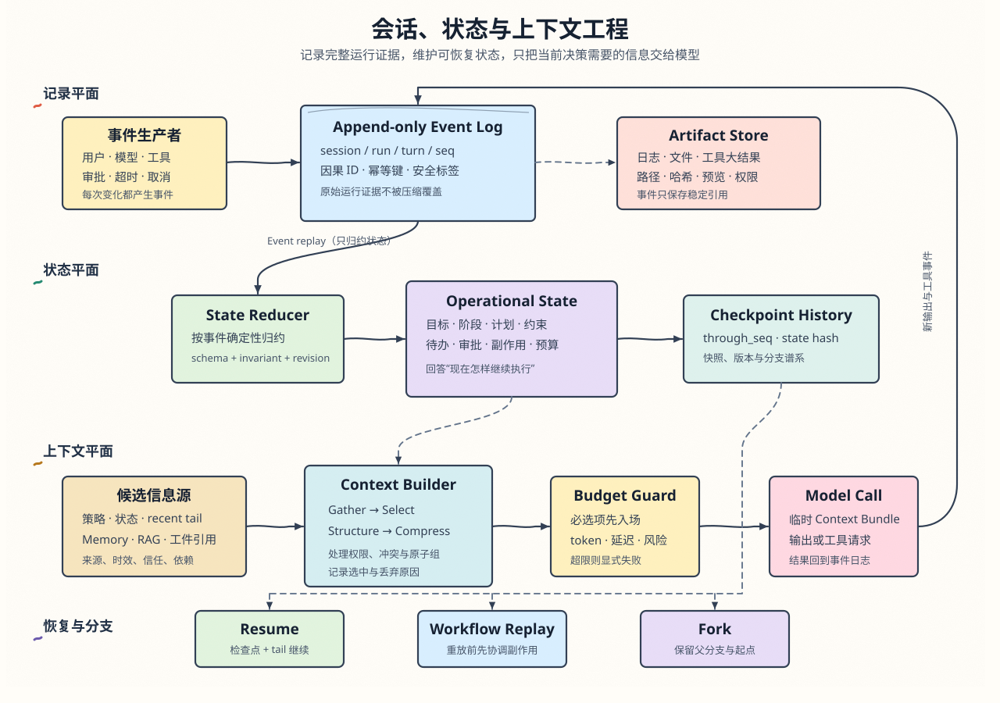

# 第 6 章：会话、状态与上下文工程

> 本章目标：建立一套能支撑长任务的运行时信息架构。读完后，你应该能区分会话记录、执行状态、模型上下文与长期记忆；能用事件日志和检查点恢复任务；能按预算构造高信号上下文；也能解释压缩、回放、分叉和提示缓存之间的约束。

## 6.1 五个相邻概念，五种不同责任

很多 Agent 原型只维护一个 `messages` 数组。它既保存聊天记录，又充当任务状态，还会原样发送给模型。这个设计能完成短对话，一旦任务持续几十轮，就会同时遇到三个问题：数组越来越大，任务进度难以可靠恢复，模型输入中混入大量无关内容。

先把五个概念拆开。

| 概念 | 回答的问题 | 典型内容 | 生命周期 |
| --- | --- | --- | --- |
| 会话 Session | 这项工作属于哪个容器？ | 标识、参与者、作用域、状态、父分支 | 从创建到结束或归档 |
| 运行记录 Transcript / Event Log | 运行中发生过什么？ | 用户消息、模型输出、工具调用、审批、错误 | 在会话内持续追加 |
| 执行状态 Operational State | 现在处于什么状态？ | 目标、阶段、计划、已完成项、待处理项、预算 | 随事件演进，可做检查点 |
| 模型上下文 Model Context | 这一次推理要让模型看到什么？ | 指令、当前任务、状态、证据、近期交互、工具定义 | 每次模型调用重新构造 |
| 长期记忆 Long-term Memory | 哪些知识跨会话仍值得保留？ | 用户偏好、项目约定、稳定经验 | 跨会话维护与召回 |

本章讲前四项。长期记忆在第 7 章单独展开，RAG 与外部知识系统在第 8 章展开。本章只说明它们怎样向上下文提供候选信息。

不同框架会交换使用 `session`、`thread`、`conversation` 等名字。与其背名词，不如先看一次真实任务怎样留下记录。

假设用户向编码 Agent 提出：“修复登录失败，并运行相关测试。”系统会经历下面的过程：

```text
Session s_7：围绕“修复登录失败”建立的工作容器

Turn t_1：用户第一次提出修复要求
  Run r_1：Agent 开始执行这次要求
    Model Step m_1：模型读取要求，决定先查看错误日志
    Tool Call c_1：read_log
      Events：tool_requested -> tool_started -> tool_succeeded
    Model Step m_2：模型根据日志决定修改 auth.py
    Tool Call c_2：edit_file
      Events：tool_requested -> tool_started -> tool_succeeded
    Tool Call c_3：run_tests
      Events：tool_requested -> tool_started -> tool_interrupted

  Run r_2：系统按本章约定创建新 Run，恢复 r_1，没有新的用户输入
    Tool Call c_4：查询上次测试状态
    Model Step m_3：模型确认需要重新运行测试
    Tool Call c_5：run_tests
      Events：tool_requested -> tool_started -> tool_succeeded
    Event：run_completed，记录 r_2 已完成
    Event：assistant_message，向用户交付结果

Turn t_2：用户继续说“再补一个回归测试”
  Run r_3：Agent 执行这项新要求
```

这段时间线中的概念分别回答不同问题：

| 概念 | 它标识什么 | 在例子里怎样理解 |
| --- | --- | --- |
| Session / Thread | 一整项可以持续、暂停和恢复的工作 | `s_7` 包含修复、恢复和后续追问 |
| Turn | 用户发起的一轮新交互 | `t_1` 是首次要求，`t_2` 是后续要求 |
| Run | Agent 的一次执行尝试 | `r_1` 中断后，系统用 `r_2` 接着执行 |
| Model Step | 一次模型请求与响应 | 模型看完日志后产生下一步决定 |
| Tool Call | 一次具体的工具调用 | `c_3` 表示这次运行测试的调用 |
| Event | 日志中一条不可再分的事实记录 | 工具请求、工具开始、工具失败、运行完成 |

Model Step 和 Tool Call 描述运行时动作，Event 则负责把这些动作写进日志。一次 Model Step 或 Tool Call 通常对应多个 Event，例如请求、开始、成功和失败。并行工具调用可以通过各自的 `call_id` 关联到同一个 `model_step_id`，不需要再发明一个含义模糊的“工具组”。

这不是一棵永远固定的树。用户输入通常同时创建一个 Turn 和一个 Run；Cron 或系统事件可以直接触发 Run，此时根本没有 Turn。本章选择在自动恢复时创建新 Run，并用 `resumes_run_id` 指向被中断的运行，例如 `r_2.resumes_run_id = r_1`，这样能明确区分两次执行尝试。其他系统也可以保留原 `run_id`，再用 `attempt_id` 或恢复次数区分执行尝试；关键是明确记录关联关系，不能把恢复伪装成新的用户输入。

系统给这些对象分配稳定 ID，是为了在崩溃、并发和恢复后仍能回答：某个工具结果属于哪次调用，某次执行为什么启动，它是在处理用户的新要求，还是在恢复上一次执行。仅靠“第几条消息”无法可靠回答这些问题。

## 6.2 三个平面：记录、状态与上下文

可靠系统可以拆成三个信息平面。

### 6.2.1 记录平面：保存运行证据

记录平面接收用户、模型、工具、权限系统和运行时产生的事件，并以追加方式持久化。它服务于审计、调试、恢复和评测。日志证明“系统收到、生成或观察过什么”，不保证模型判断和工具内容符合外部现实；经过验证的结论进入状态时仍要保留来源与验证状态。

一条工具调用至少产生两类事件：模型请求执行什么，以及工具实际返回什么。用户审批、超时和取消也应作为事件保存，因为它们会改变后续行为。

### 6.2.2 状态平面：解释当前进度

状态平面把事件归约为当前可操作状态。它不需要重复每一句对话，只需要回答：目标是什么，系统做到哪一步，哪些事实已确认，哪些动作已提交，下一步能做什么。

```text
state_n = reduce(state_n-1, event_n)
```

这里的 `reduce` 应由确定性代码实现。让模型自由阅读全部历史并猜测当前状态，会把恢复正确性建立在概率输出上。

### 6.2.3 上下文平面：为一次推理生成视图

上下文平面从系统指令、当前状态、近期事件、外部知识和长期记忆中选择信息，构造本次模型调用。它是一张临时视图，不是事实数据库。

这个拆分带来一个重要结果：

```text
可追溯性属于记录平面
一致性属于状态平面
相关性属于上下文平面
```

三个平面可以使用不同存储和数据结构。事件日志可能是 JSONL 或数据库；状态可能是结构化对象；上下文最终表现为模型 API 接受的消息、工具定义和附件。

### 6.2.4 认知工作空间是状态投影，不是第四个平面

复杂 Agent 常把当前任务表示、活跃假设、中间发现、证据质量、已尝试策略和注意力信号放进一个共享对象，供感知、规划、执行和评估模块读写。可以把它称为“认知工作空间”，但这个名字不应制造新的数据类别。它本质上是状态平面中的一份任务级投影，并为不同模块生成各自的上下文视图。

```text
追加事件
  -> 确定性归约得到可恢复状态
  -> 投影出当前认知工作空间
       任务理解 / 活跃策略 / 证据 / 置信信号 / 失败路径
  -> 按模块裁剪上下文
       规划器看到目标、约束和证据
       执行器看到当前步骤和授权工具
       评估器看到产物、证据和验收标准
```

这项设计有四条边界：

1. **它不是完整事件日志。** 若一个字段会影响恢复和审计，必须能追溯到事件或权威工件，不能只保存在共享内存里。
2. **它不是长期记忆。** 工作空间通常随当前 Run 或任务结束而失效。只有经过验证、归一化和写入门控的经验，才进入第 7 章的长期记忆。
3. **它不是模型上下文的同义词。** 每个模块只接收完成当前决策所需的投影；把整个工作空间注入所有调用，会重新制造上下文膨胀和权限泄露。
4. **它不是外层 Loop Engineering。** 工作空间协调当前任务内部的认知步骤；跨 Run 的目标维护、恢复、终止和人的控制权属于第 15 章。

工作空间中的 `confidence`、`stagnation` 或 `contradiction` 应被视为控制信号，而不是事实。置信度至少结合证据质量、结果一致性和可执行验证，并用历史评测校准；模型自报“我有 90% 把握”不能单独触发高风险动作。

## 6.3 会话记录不等于聊天记录

### 6.3.1 追加式事件流

最小实现可以用 append-only JSONL：

```jsonl
{"id":"e_101","session_id":"s_7","seq":101,"run_id":"r_3","turn_id":"t_9","actor":"user","type":"user_message","payload":{"text":"修复登录失败"},"ts":"2026-07-15T10:00:00Z"}
{"id":"e_102","session_id":"s_7","seq":102,"run_id":"r_3","turn_id":"t_9","actor":"model","type":"tool_requested","payload":{"call_id":"c_12","name":"run_tests","args":{"target":"auth"}},"ts":"2026-07-15T10:00:06Z"}
{"id":"e_103","session_id":"s_7","seq":103,"run_id":"r_3","turn_id":"t_9","actor":"tool:run_tests","type":"tool_completed","payload":{"call_id":"c_12","output_ref":"artifacts/c_12.txt","status":"failed"},"ts":"2026-07-15T10:00:19Z"}
```

事件结构至少要包含：

| 字段 | 作用 |
| --- | --- |
| `id` | 幂等写入、去重和追踪 |
| `session_id` | 标识工作容器 |
| `seq` | 在单个会话内提供单调、唯一的提交顺序 |
| `run_id` / `turn_id` | 区分运行边界和用户轮次 |
| `type` | 让归约器按明确规则解释事件 |
| `actor` | 标识 user、model、tool、runtime 或 approver |
| `payload` | 保存结构化事实或内容引用 |
| `ts` | 超时判断和审计；不承担权威提交顺序 |
| `causation_id` / `correlation_id` | 表达事件因果与同一操作链 |
| `idempotency_key` | 防止重试重复产生状态或副作用 |
| `security_label` | 标记敏感度、租户与可见范围 |
| `schema_version` | 支持事件结构演进 |

事件应描述已经发生的事实。`tool_requested` 不能代表工具成功；只有收到 `tool_completed` 并记录结果后，状态才能把动作标记为已完成。

### 6.3.2 为什么使用追加写

追加写让系统保留因果顺序，并降低崩溃时整份会话损坏的概率。它还允许系统重放事件，检查某个状态是怎样形成的。

追加写并不自动保证可靠。生产实现仍需处理原子写入、重复事件、并发顺序、损坏尾行和模式升级。同一 session 可以串行写入，也可以使用 `expected_revision` 做乐观并发控制；两个写入者基于同一旧版本提交时，只允许一个成功。文件型存储需要明确 flush 与校验边界；数据库实现则应使用事务、唯一键和明确的排序列。

### 6.3.3 会话生命周期

会话本身也有状态，例如 `active`、`paused`、`awaiting_approval`、`completed` 和 `archived`。生命周期事件应说明谁触发了暂停、为什么中断、恢复入口在哪里。结束会话与删除数据是两件事：结束禁止继续追加业务动作，保留策略再决定事件、检查点和工件何时归档或清除。

会话键还常承担隔离与并发边界。`hello-claw` 的案例表明，同一 session 的消息应串行处理，不同 session 才能并行；渠道身份、用户身份和上下文隔离也不能混成一个维度。入站请求应先按消息 ID 去重，再创建 Run，否则重复投递可能启动两份相同任务。具体路由与渠道配置属于第 13、14 章，本章只保留这条可迁移约束。

### 6.3.4 不可变历史与派生视图

界面可以隐藏旧消息，上下文管理器可以压缩工具结果，搜索索引也可以重建，但这些操作不应悄悄改写原始事实。需要撤销或修正时，追加一条新事件：

```text
e_210: decision_recorded("使用方案 A")
e_228: decision_superseded(target=e_210, replacement="改用方案 B")
```

这样，当前视图只显示方案 B，审计仍能解释为什么方向发生变化。

## 6.4 状态是可继续执行的协议

聊天摘要倾向于讲“讨论了什么”，执行状态必须讲“接下来怎样继续”。一个通用状态对象可以包含：

```yaml
goal: 修复登录失败并补回归测试
phase: verification
constraints:
  - 不修改数据库结构
plan:
  - id: inspect
    status: done
  - id: patch
    status: done
  - id: verify
    status: running
artifacts:
  - path: src/auth/service.py
    revision: sha256:...
pending_actions:
  - call_id: c_18
    kind: test
decisions:
  - id: d_4
    text: 保留现有公共接口
budgets:
  input_tokens_remaining: 42000
  wall_time_remaining_s: 900
last_committed_seq: 227
```

### 6.4.1 状态模式要表达约束

状态字段不是备忘录。它们应带有可检查的约束：

- 已完成步骤不能同时出现在待处理队列。
- 一个工具调用只能从 `requested` 进入 `running`，再进入 `completed`、`failed` 或 `cancelled`。
- `last_committed_seq` 必须对应当前会话中已经提交的事件。
- 文件工件要带版本、哈希或修改时间，恢复后才能识别环境漂移。
- 预算不能由模型输出直接增加。
- 状态更新必须基于预期 revision；冲突时重新读取和归约，不能覆盖较新的状态。

这些约束让状态成为运行时协议，而不是一段看似结构化的自然语言。

### 6.4.2 检查点不是摘要

检查点是某一事件边界上的结构化状态快照。摘要是面向模型的有损表述。两者可以一起保存，但不能互相替代。

| 对比项 | 检查点 Checkpoint | 上下文摘要 Summary |
| --- | --- | --- |
| 主要读者 | 运行时 | 模型和人 |
| 数据形态 | 结构化、可验证 | 文本或半结构化 |
| 是否允许有损 | 原则上不允许破坏恢复语义 | 允许删除低价值细节 |
| 主要用途 | 恢复、回放、分叉 | 降低上下文体积 |

系统可以在每个关键提交点建立检查点，也可以每隔若干事件建立快照。恢复时先加载最近检查点，再归约其后的事件，从而避免每次都从头重放。

## 6.5 上下文工程比提示词工程多了什么

提示词工程主要研究指令的措辞、结构、示例和输出约束。上下文工程研究一次推理中全部输入 token 的选择、组织、来源和生命周期。系统提示词是上下文的一部分，工具定义、任务状态、检索证据、近期消息和图片同样占用模型的注意力与窗口。

Anthropic 将上下文工程概括为：在模型推理前维护一组最有助于产生期望行为的 token。这个目标可以写成一个受约束的选择问题：

```text
选择 packets 的子集，使任务效用最大

约束：
  总 token <= 输入预算
  延迟 <= 任务时限
  不违反权限与数据边界
  必选约束、工具契约和当前任务状态必须存在
```

因此，“窗口还没满”不代表上下文质量合格。大量过时日志、冲突规则和无关证据会稀释注意力。长窗口提高容量，却没有消除选择责任。

## 6.6 GSSC：把上下文构造变成流水线

Hello-Agents 使用 GSSC 描述上下文构造：Gather、Select、Structure、Compress。这套划分适合作为主线，但生产实现需要给候选信息补充来源与约束元数据。

### 6.6.1 Gather：汇集候选信息

Gather 只负责创建候选集合，不急着把所有内容发送给模型。候选源包括：

- 稳定的系统策略与工具契约。
- 当前用户请求和任务目标。
- 结构化运行状态与未完成动作。
- 最近完整交互和早期会话摘要。
- 工具结果、文件工件及其轻量引用。
- 长期记忆和 RAG 返回的候选证据。
- 人工审批、风险标记和输出协议。

每个候选项可以统一为 `ContextPacket`：

```python
@dataclass
class ContextPacket:
    id: str
    content_or_ref: str
    kind: str
    tokens: int
    source: str
    authority: int
    relevance: float
    freshness: float
    trust: float
    required: bool = False
    conflict_key: str | None = None
    depends_on: tuple[str, ...] = ()
```

相关性和新近性不够用。用户本轮明确约束可能不“新”，却必须保留；一条高度相关的网页内容也不能覆盖系统策略。`authority`、`trust`、`required` 和 `conflict_key` 让选择器知道哪些内容不能按相似度统一排序。

### 6.6.2 Select：先满足硬约束，再优化效用

选择可以分四步：

1. 放入系统策略、当前任务、输出契约等必选项。
2. 检查来源权限、数据隔离和依赖关系，剔除不可用项。
3. 对同一事实的冲突候选执行优先级、时效和证据规则。
4. 在剩余预算内按任务价值与 token 成本选择可选项。

简单的“按分数降序贪心”适合教学原型，但会偏爱短碎片，也可能漏掉成组信息。工具调用与工具结果、结论与证据、代码片段与文件版本都应作为原子组选择。若必选项本身已经超出预算，构造器应返回 `RequiredContextOverflow` 一类明确错误，请求缩短工具定义、任务输入或切换模型，不能静默删除约束。

### 6.6.3 Structure：固定骨架，动态内容

结构化的上下文便于模型识别边界，也便于调试：

```text
[Role & Policies]  稳定策略、权限和行为边界
[Task]             当前目标与验收标准
[State]            阶段、进度、待处理动作和预算
[Evidence]         带来源与时效的证据
[Recent Interaction] 最近完整交互
[References]       可按需读取的文件和工具结果
[Output Contract]  输出格式与停止条件
```

不要把不可信网页或工具输出直接拼进策略区。清楚标记来源、引用边界和可信等级，可以降低外部内容冒充指令的风险。

### 6.6.4 Compress：在信息保全后减小体积

Compress 处理已经选择但仍超出预算的内容。它不应重新定义任务，也不应凭空补充事实。压缩结果要保留来源范围，让系统能够回到原始事件或工件核对。

## 6.7 四类上下文风险

Hello-Agents Extra02 汇总了四类常见风险。它们比“token 是否超限”更能解释 Agent 为什么在长任务中变差。

| 风险 | 表现 | 运行时对策 |
| --- | --- | --- |
| Context Poisoning | 恶意或错误内容进入上下文并影响决策 | 标记来源和信任边界；外部内容只进证据区；高风险事实交叉验证 |
| Context Distraction | 大量低价值内容稀释任务重点 | 预算、去重、按需读取、分离子任务上下文 |
| Context Confusion | 无关信息让模型选错规则或工具 | 按任务阶段筛选；明确分区；删除失效工具和旧状态 |
| Context Clash | 多条规则、事实或版本互相冲突 | 设置权威顺序、时效规则和冲突组；将未解决冲突显式呈现 |

压缩只能缓解其中一部分。污染内容被摘要后可能更难识别来源，冲突内容被融合后也可能制造一个从未存在的“折中事实”。因此，压缩前要先完成信任和冲突处理。

## 6.8 即时上下文与渐进式披露

把整个代码库、知识库或日志提前塞进模型，既昂贵又容易过时。即时上下文采用轻量引用，让 Agent 根据当前决策按需展开：

```text
预加载：项目规则、目录地图、当前任务相关文件列表
按需读取：具体文件片段、搜索结果、测试日志区段
继续探索：根据新线索决定下一次查询
```

引用本身需要足够信息：

```json
{
  "ref": "artifacts/test-run-c18.log",
  "kind": "test_log",
  "size": 184320,
  "sha256": "...",
  "created_at": "2026-07-15T10:12:00Z",
  "preview": "3 failed, 128 passed...",
  "read_hint": "先读取 failure summary，再按测试名定位"
}
```

路径、哈希和时间戳帮助模型判断内容用途，也帮助运行时检测引用是否失效。混合策略通常更实用：预先放入少量高价值信息，再提供搜索、读取和过滤工具。纯预加载响应快但容易膨胀；纯运行时探索节省窗口，却增加工具延迟和走错路径的概率。

## 6.9 Token 预算从调用前开始

上下文窗口需要同时容纳输入和输出。可靠系统先扣除固定成本与安全余量，再分配动态内容：

```text
动态输入预算
  = 模型上下文窗口
  - 最大输出预留
  - 稳定系统前缀与工具定义
  - 当前任务必选内容
  - 计数误差与突发工具结果缓冲
```

动态预算还要细分，例如：近期交互、状态、检索证据和工具结果分别设置上限。单个结果没有超限，不代表一轮并行工具结果的总和安全。

Token 计数可以采用两层策略：

- 请求前用 provider tokenizer 或保守估算做准入控制。
- 请求后用 API 返回的 usage 校准估算和阈值。

图片、PDF、结构化工具定义和不同语言的 token 密度各不相同，固定“字符除以四”只能作为粗略回退。预压缩应留下安全余量，API 的 `prompt_too_long` 错误则触发一次有限的应急恢复。

## 6.10 工具大结果要落盘，但不能失联

搜索结果、日志和文件内容常是上下文膨胀的主因。工具层应在结果进入消息前执行预算守卫：

```text
工具返回原始结果
  -> 计算单结果和本轮累计体积
  -> 超限时持久化原文
  -> 生成路径、哈希、摘要和预览
  -> 把轻量引用写入事件与上下文
```

轻量引用要回答五个问题：工具执行过吗，结果成功吗，完整内容在哪里，预览揭示了什么，怎样读取剩余部分。只写一句“内容已截断”会丢失可恢复性。

工具请求和结果必须保持配对。裁剪时留下孤立的 `tool_use` 或 `tool_result`，可能违反模型 API 的消息协议。并行调用还需要通过 `call_id` 关联，不能依赖相邻位置。

落盘也带来安全责任。系统要限制路径范围、文件权限、保留期限和敏感信息；引用文件被删除、修改或越权时，读取工具应返回明确错误，不能让模型把失效引用当作仍然可用的证据。

## 6.11 分层压缩：先保全，再缩减

压缩策略应从确定、便宜、可逆的方法开始，再进入语义摘要。

| 层次 | 方法 | 是否调用模型 | 主要损失 |
| --- | --- | --- | --- |
| L0 | 限制工具输出、分页、查询收敛 | 否 | 无或很低 |
| L1 | 去重、删除失效候选、规范化结构 | 否 | 很低 |
| L2 | 大结果落盘，保留引用和预览 | 否 | 上下文内失去全文 |
| L3 | 旧工具结果微压缩、保留近期结果 | 否 | 旧观察细节 |
| L4 | 按消息原子组裁剪中段历史 | 否 | 早期探索过程 |
| L5 | 生成高保真结构化摘要 | 是 | 措辞、顺序和部分细节 |
| L6 | 新上下文窗口接续任务 | 是 | 依赖摘要和外部状态恢复 |

实用顺序通常是：先把原始大结果落盘，再去重和微压缩，仍超限时裁剪，最后才做语义摘要。如果先用占位符覆盖工具结果，后续就无法保存原始内容。

压缩时要保护四类锚点：

- 用户目标、验收标准和硬约束。
- 当前状态、未完成动作和最近完整交互。
- 已确认决策、失败原因和不可重复副作用。
- 工件路径、版本、来源和验证结果。

## 6.12 高保真摘要是一份交接包

自由散文式摘要容易遗漏恢复所需字段。把摘要写成稳定协议：

```markdown
## 当前目标与验收标准
## 不可违反的约束
## 当前阶段与任务状态
## 已完成工作及验证结果
## 关键决策与依据
## 工件、路径和版本
## 失败尝试与排除项
## 未解决问题和风险
## 下一步可执行动作
## 摘要来源范围
```

`摘要来源范围` 应记录被压缩的事件区间和工件引用，例如 `e_101..e_227`。这使摘要成为可核对的派生物。若摘要与原始事件冲突，事实记录优先；运行时应重新生成状态和摘要，而不是悄悄采用摘要。

摘要器要使用独立提示词，禁止调用普通工具，并设置互斥锁、超时和重试上限。否则可能出现压缩调用再次触发压缩的递归，或多个压缩器同时改写同一上下文版本。

### 6.12.1 压缩不是一次性的改写

长任务会经历多次压缩。每次压缩都可能累积误差。系统应保留：

- 当前摘要版本及来源事件范围。
- 上一个摘要与新事件的边界。
- 不能被摘要覆盖的结构化状态。
- 抽样回查原始事件的评测结果。

反复把“旧摘要 + 新消息”再总结，成本较低，却会逐渐失去低频关键信息。高风险任务应定期从原始事件和结构化状态重新生成摘要。

压缩时机也会影响恢复质量。相比每轮都总结一次，在需求澄清完成、方案确定、实现结束或验证完成等 **阶段里程碑** 后生成交接包，通常更容易保留阶段目标、决策依据和完成证据。容量阈值仍然负责兜底，但不应成为唯一触发条件。

如果 Provider 支持持久化模型推理项或其他连续性元数据，恢复时可以在目标、关键假设和优先级仍然成立的前提下复用。它不是长期事实：任务发生转向、证据推翻假设或权限边界改变后，应使旧推理失效或降权，否则模型可能被锚定在已经过时的方案上。

## 6.13 触发策略与失败恢复

压缩触发可以分三条路径。

**调用前触发**：根据估算 token、输出预留和缓冲判断是否压缩。这是常规路径。

**响应后触发**：使用 provider 返回的实际 usage 更新计数，在下一轮前提前整理。实际用量比本地估算更可靠。

**错误后触发**：API 返回上下文过长时，执行更激进的压缩并有限重试。这是安全网，不应成为日常主路径。

压缩系统至少需要：

- `is_compacting` 或租约，防止并发与递归。
- 输入上下文版本号，避免基于旧版本提交摘要。
- 最大重试次数和熔断器。
- 摘要失败时的确定性裁剪回退。
- 压缩前后的 token、耗时、保留率和恢复质量指标。

频繁走错误后触发，说明预算、估算或工具输出守卫存在缺陷。把重试次数调高只会增加成本，并掩盖真正原因。

## 6.14 Resume、Replay 与 Fork

先区分两种常被同译为 Replay 的操作：

- **Event replay** 只把历史事件重新交给归约器，用于重建或验证状态。它不能调用工具，也不能产生外部副作用。
- **Workflow replay** 从某个检查点重新执行工作流节点。节点可能再次运行，因此必须处理幂等与副作用协调。

“恢复会话”涉及三种运行时操作。

| 操作 | 目的 | 从哪里继续 | 是否创建新历史 |
| --- | --- | --- | --- |
| Resume | 崩溃或暂停后继续原任务 | 最后一个已提交检查点之后 | 通常延续原分支 |
| Workflow Replay | 从旧状态重新执行工作流路径 | 指定检查点 | 可能重做后续步骤 |
| Fork | 从旧状态尝试另一条路径 | 指定检查点 | 创建新分支与谱系 |

### 6.14.1 一条可靠的恢复流程

```text
1. 读取会话元数据和最近完整检查点
2. 校验检查点版本、工件引用和环境指纹
3. 归约检查点之后的事件
4. 找出 requested 但没有终态的工具调用
5. 查询外部系统或标记为 unknown，禁止直接假定失败
6. 构造恢复摘要 + 当前状态 + recent tail
7. 追加 session_resumed 事件后继续运行
```

恢复不能只把全部历史重新发送给模型。完整 transcript 用于重建和审计；当前状态、摘要与近期交互用于继续工作。

### 6.14.2 外部副作用与幂等性

工作流回放会重新执行检查点之后的节点。`easy-langent` 中基于 LangGraph 的中断案例就需要防止节点恢复后重复追加状态。读取文件通常可以重复，发送邮件、扣款、发布内容和写数据库则可能造成重复副作用。运行时应给外部动作分配幂等键，并维护行动日志：

```text
action_id: pay_order_42
intent_recorded: true
external_receipt: provider_tx_8831
completion_recorded: true
```

如果崩溃发生在外部系统成功之后、完成事件写入之前，恢复时应先用 `action_id` 或回执查询结果。直接重试会把“状态未知”变成“双重执行”。

### 6.14.3 分叉要保留谱系

Fork 不应覆盖旧会话。新分支需要记录 `parent_session_id`、`fork_checkpoint_id` 和原因。这样，两个方案可以独立推进，评测系统也能比较它们从同一状态开始后的差异。

## 6.15 提示缓存与上下文稳定性

Provider 的提示缓存通常依赖相同前缀。频繁重排系统策略、工具定义和早期消息，会降低缓存命中率。一个缓存友好的上下文结构通常把稳定内容放在前面，把易变内容放在后面：

```text
稳定前缀：核心策略 -> 工具定义 -> 项目固定规则
动态后缀：当前任务 -> 状态 -> 证据 -> recent tail
```

缓存优化不能凌驾于正确性。策略更新、安全修复和过时状态必须及时生效。运行时应把前缀版本写入会话元数据，并观测缓存读写 token、命中率和压缩后的前缀变化。

会话 SDK 还常提供服务端历史管理。使用这类能力时，要明确谁拥有历史真相。客户端 session 与服务端 `conversation_id` 同时自动补历史，可能把同一批消息发送两遍。

某些 API 还要求在历史回放时保留 assistant message 的 phase 等语义字段。运行时不能把这些字段当作普通展示元数据随意删除；是否保留、怎样迁移应遵循具体 Provider 的消息协议，并通过回放测试验证。

## 6.16 一条最小实现路径

第一版不需要先做向量检索或复杂数据库。可以依次完成五个组件。

### 6.16.1 EventStore

提供 `append(event, expected_revision)`、`read_after(session_id, after_seq)` 和 `stream(session_id)`。`seq` 是会话内的权威顺序；事件 ID 用于去重，工具请求与结果用 `call_id` 关联。

### 6.16.2 StateReducer

用纯函数把事件归约为 `OperationalState`。同一事件序列重复归约应得到同一状态。状态迁移失败要产生明确错误，不能让模型自行修复数据。

### 6.16.3 CheckpointStore

在关键提交点保存状态、`through_seq`、状态模式版本和环境指纹。加载后先校验，再归约尾部事件。

### 6.16.4 ContextBuilder

实现 GSSC，输入当前状态、近期事件和外部候选，输出一次模型调用的结构化上下文，同时保存一份 context manifest：

```json
{
  "context_id": "ctx_33",
  "session_id": "s_7",
  "state_checkpoint": "cp_12",
  "packet_ids": ["policy_v4", "task_t9", "state_cp12", "event_e225_e227"],
  "dropped": [{"packet_id": "log_c11", "reason": "lower_utility_than_selected_set"}],
  "estimated_input_tokens": 38120,
  "context_hash": "sha256:...",
  "builder_version": "2"
}
```

Manifest 让你能够复现“模型当时看到了什么”，也能把输出错误追溯到选择器、摘要器还是模型。

### 6.16.5 Compactor

先实现确定性层：工具结果落盘、去重、原子组裁剪。再添加结构化摘要器和错误后回退。压缩器只生成派生数据，不删除原始事件。

完整调用链如下：

```text
接收输入 -> 追加事件 -> 归约状态 -> 必要时建检查点
         -> Gather -> Select -> Structure -> Compress
         -> 保存 context manifest -> 调用模型
         -> 记录模型与工具事件 -> 再次归约状态
```

## 6.17 生产约束、测试与观测

### 6.17.1 必须守住的不变量

1. 原始事件只追加，不被上下文压缩覆盖。
2. 每个有外部副作用的动作都有唯一 `action_id` 和终态记录。
3. 工具请求与结果按 ID 配对，裁剪时作为原子组处理。
4. 检查点明确指向最后已提交事件，摘要明确指向来源范围。
5. 恢复时不把 `unknown` 动作自动当作失败并重试。
6. 必选策略、当前目标和未完成动作不能被评分器挤出上下文。
7. 外部证据携带来源、时间和信任边界。
8. 同一上下文版本最多有一个压缩器提交结果。

### 6.17.2 测试矩阵

| 测试 | 验证内容 |
| --- | --- |
| 事件重放测试 | 从空状态重放和从检查点恢复得到相同状态 |
| 崩溃注入测试 | 在工具执行前、执行后、记录完成前中断，恢复不重复副作用 |
| 消息结构测试 | 并行工具调用经裁剪后仍保持合法配对 |
| 预算性质测试 | 任意候选组合都不会超过输入预算，必选项始终存在 |
| 摘要保真测试 | 目标、约束、决策、工件和待办在多次压缩后仍可恢复 |
| 冲突测试 | 新旧规则或多来源事实冲突时执行预定优先级 |
| 环境漂移测试 | 文件或外部资源变化后，恢复流程要求重读或重新验证 |
| 隔离测试 | A 会话的事件、记忆和工具结果不会进入 B 会话 |

### 6.17.3 需要观测什么

至少记录这些指标：每次调用的输入和输出 token、各分区占比、工具结果持久化量、压缩次数和耗时、摘要保留率、恢复成功率、未决动作数量、缓存命中 token、上下文过长错误和冲突候选数量。

质量指标不能只看压缩率。把 100K token 压到 2K 很容易，难的是 Agent 能否在压缩后继续完成同一任务。评测应比较压缩前后的下一步决策、约束遵守、工件定位和最终任务成功率。

## 6.18 与相邻章节的边界

| 主题 | 本章负责 | 相邻章节负责 |
| --- | --- | --- |
| Prompt | 接收第 4 章生成的指令包，并选择运行态动态内容 | 第 4 章讲指令权威顺序、覆盖与追加、模板、工具 Schema 顺序和缓存断点 |
| 模型运行时 | 使用第 5 章提供的窗口、usage 和错误信号分配上下文 | 第 5 章讲 provider、路由、token 计数、重试和调用可靠性 |
| 长期记忆 | 接收召回候选并执行上下文选择 | 第 7 章讲写入、巩固、召回、遗忘和用户画像 |
| RAG | 接收带来源的检索结果 | 第 8 章讲切分、索引、检索、重排和证据回答 |
| Agent 框架 | 定义框架无关的状态、检查点与恢复语义 | 第 9 章讲 LangGraph State、Reducer、Checkpointer、Interrupt 等具体 API |
| 多 Agent | 为子 Agent 提供隔离上下文和交接包 | 第 16 章讲任务分解、协作、合并与并行隔离 |
| Loop Engineering | 提供跨运行的状态与检查点基础 | 第 15 章讲目标、反馈、验证、停止和人的控制权 |

结构化笔记也需要按用途归属。当前任务的阶段、待办和阻塞项属于执行状态；跨任务稳定有效的用户偏好属于长期记忆；可复用工作流程更适合 Skill。不要因为它们都存成 Markdown，就把它们视为同一种数据。

## 6.19 系统地图



这张图中的主循环是：所有参与者先把运行记录写入记录平面，归约器生成执行状态，Context Builder 再把状态与外部候选投影成一次模型上下文。检查点、Resume、Workflow Replay 和 Fork 作用于状态历史；长期记忆和 RAG 只作为外部候选源进入本章边界。

可编辑版本：[Draw.io 源文件](assets/ch06/session-state-context-system-map.drawio)

## 6.20 共同结论

既有九个来源工程的侧重点不同。`claw0`、Hermes 和 Claude Code 分析提供会话持久化与恢复案例；`easy-langent` 提供 thread、checkpoint 和中断重跑案例；`hello-claw` 提供会话隔离、串行化和入站去重案例；`learn-claude-code`、Harness Engineering 和 Alice 提供预算与分层压缩；Hello-Agents 提供 GSSC、即时上下文和风险分类。第十个来源《AI Agents in Action（第二版）》补充了共享认知工作空间的结构参考，本章将它收敛为状态投影，而没有新增第四个信息平面。

下面九条并非所有工程逐项一致实现。前三条和 Resume 幂等采用事件归约、revision 与行动日志，是本课程根据多个案例补出的统一生产方案；其余内容来自各来源可互相印证的设计主线。

1. 会话记录、执行状态和模型上下文需要独立建模。
2. 完整历史用于重建与审计，模型每次只接收当前决策所需的投影。
3. 状态由确定性事件归约产生，摘要只承担有损交接。
4. 上下文工程先处理来源、权限和冲突，再处理相关性与 token。
5. 工具大结果应先落盘并保留可读取引用，再执行微压缩和摘要。
6. Resume、Replay 与 Fork 有不同语义，外部副作用要求幂等与行动日志。
7. 压缩质量要用任务延续能力评估，不能只看压缩率。
8. 缓存、成本和长窗口属于优化条件，不能替代正确的状态与上下文边界。
9. 认知工作空间是任务级状态投影；它既不是长期记忆，也不承担跨运行循环的控制责任。

## 本章自检

1. 为什么 `messages` 数组不能同时承担会话、状态和上下文三种责任？
2. Event、Turn、Run 与 Session 的层级怎样划分？
3. 检查点和上下文摘要有什么区别？
4. 为什么状态归约器应使用确定性代码？
5. GSSC 的四步各自改变什么？
6. 相关性和新近性为什么不足以决定上下文选择？
7. 工具结果落盘后，轻量引用至少应包含哪些字段？
8. 分层压缩为什么要先保存原始大结果？
9. Resume、Replay 与 Fork 的副作用风险有何不同？
10. 怎样证明一次压缩保留了任务连续性？
11. 认知工作空间、可恢复状态和模型上下文之间是什么关系？

## 开放性问题

1. 如果事件日志是事实来源，但外部世界已经变化，恢复后的状态应怎样表达“历史正确、当前已过时”？
2. 一条信息很相关却来自不可信网页，另一条可信却较旧，Context Builder 应如何决策？这个规则应该交给模型还是运行时？
3. 高风险动作在外部系统成功后、本地完成事件写入前崩溃，恢复协议需要外部系统提供哪些能力？
4. 多次摘要会累积信息损失。你会怎样设计一项自动评测，判断何时必须从原始事件重建摘要？
5. 提示缓存鼓励稳定前缀，安全策略更新要求立即生效。系统该如何在成本与正确性之间处理版本切换？
6. 当子 Agent 返回一份结论时，主 Agent 应接收自由文本摘要、结构化状态差异，还是可追溯事件子集？各自会损失什么？

## 原文入口

### 本地来源

- [《AI Agents in Action（第二版）》第 10 章：认知与元认知 Agent](../../source/ai-agents-in-action-2nd-edition-cn/cn-book/10.探索会思考、监控和适应的认知智能体.md)
- [第 10 章代码：认知工作空间结构参考](../../source/ai-agents-in-action-2nd-edition-cn/code/chapter_10/01_cognitive_workspace.py)
- [learn-claude-code s08：Context Compact](../../source/learn-claude-code/s08_context_compact/README.md)
- [learn-claude-code：工具调用配对测试](../../source/learn-claude-code/tests/test_compaction_tool_pairs.py)
- [Hello-Agents Ch09：上下文工程](../../source/hello-agents/docs/chapter9/第九章%20上下文工程.md)
- [Hello-Agents Extra02：上下文工程补充知识](../../source/hello-agents/Extra-Chapter/Extra02-上下文工程补充知识.md)
- [Hello-Agents Extra09：应用开发实践](../../source/hello-agents/Extra-Chapter/Extra09-Agent应用开发实践踩坑与经验分享.md)
- [Alice 方法论 Ch05：上下文与记忆](../../source/Alice_methodology/chapters/05-context-memory.md)
- [claw0 s03：会话与上下文保护](../../source/claw0/sessions/zh/s03_sessions.md)
- [claw0 s06：智能层](../../source/claw0/sessions/zh/s06_intelligence.md)
- [easy-langent Ch03：LangChain 会话历史](../../source/easy-langent/docs/guide/chapter3.md)
- [easy-langent：LangGraph thread 与 resume 入口](../../source/easy-langent/project/WhoIsTheSpyBaocaiLi/spy_game/runner.py)
- [easy-langent：中断恢复的幂等处理](../../source/easy-langent/project/WhoIsTheSpyBaocaiLi/spy_game/engine_nodes.py)
- [hello-claw Ch05：消息、Session 与并发 Lane](../../source/hello-claw/docs/cn/build/chapter5/index.md)
- [hello-claw Ch06：会话键与隔离边界](../../source/hello-claw/docs/cn/build/chapter6/index.md)
- [Hermes Ch10：SessionDB](../../source/hermes-book/src/part4/ch10-session-db.md)
- [Hermes Ch12：上下文压缩](../../source/hermes-book/src/part4/ch12-context-compression.md)
- [Hermes Ch03：一次请求中的 Run 与模型迭代](../../source/hermes-book/src/part2/ch03-request-journey.md)
- [Harness Engineering Ch09：自动压缩](../../source/harness-engineering-from-cc-to-ai-coding/book/src/part3/ch09.md)
- [Harness Engineering Ch11：微压缩](../../source/harness-engineering-from-cc-to-ai-coding/book/src/part3/ch11.md)
- [Harness Engineering Ch12：Token 预算策略](../../source/harness-engineering-from-cc-to-ai-coding/book/src/part3/ch12.md)
- [Harness Engineering Ch13：Prompt 缓存](../../source/harness-engineering-from-cc-to-ai-coding/book/src/part4/ch13.md)
- [Claude Code 分析：Context 管理](../../source/claude-code-analysis/analysis/04f-context-management.md)
- [Claude Code 分析：Session Storage、Transcript 与 Resume](../../source/claude-code-analysis/analysis/04i-session-storage-resume.md)
- [Claude Code 分析：分支谱系实现](../../source/claude-code-analysis/src/commands/branch/branch.ts)
- [Claude Code 分析：工具大结果持久化](../../source/claude-code-analysis/src/utils/toolResultStorage.ts)

### 外部资料

- [Anthropic：Effective context engineering for AI agents](https://www.anthropic.com/engineering/effective-context-engineering-for-ai-agents)
- [LangGraph：Persistence](https://docs.langchain.com/oss/python/langgraph/persistence)
- [LangGraph：Use time travel](https://docs.langchain.com/oss/python/langgraph/use-time-travel)
- [OpenAI Agents SDK：Sessions](https://openai.github.io/openai-agents-python/sessions/)
- [OpenAI Agents SDK：Context management](https://openai.github.io/openai-agents-python/context/)
- [OpenAI：GPT-5.6 Prompt Guidance（长程任务与上下文部分）](https://developers.openai.com/api/docs/guides/prompt-guidance-gpt-5p6)
