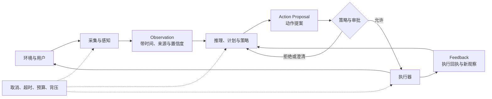
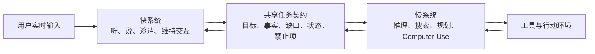
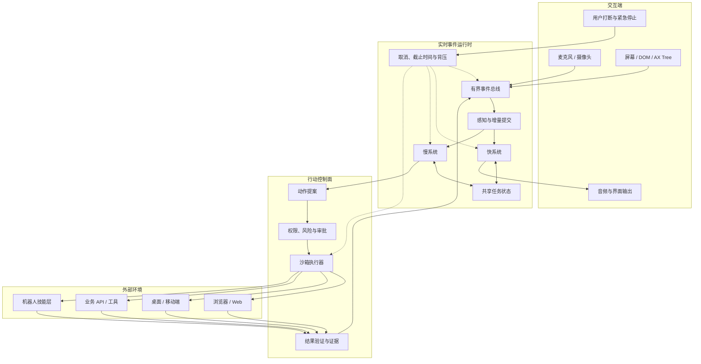

# 第 12 章：多模态、实时交互与行动环境

> 当 Agent 离开文本对话框，开始持续地听、看、说和操作时，核心问题不再只是“模型能否理解一种新模态”，而是“系统能否在时间继续流动、环境不断变化的条件下，安全地维持感知、决策、行动与反馈闭环”。

## 12.1 学习目标与边界

学完本章，你应该能够：

1. 用统一事件模型描述文本、音频、图像、视频帧、工具结果和环境动作。
2. 区分语音级联、原生多模态与全双工架构，并根据延迟、可控性、信息保真度和成本进行选择。
3. 设计流式输入输出、打断、取消、背压和快慢系统之间的状态协议。
4. 解释 Computer Use 的 `Observation -> Grounding -> Action -> Feedback` 闭环。
5. 在截图、DOM、可访问性树、坐标和语义目标之间选择合适的观察与定位方式。
6. 处理动态界面、陈旧观察、重复动作、部分成功和结果不确定等行动环境问题。
7. 为高风险动作设计授权、确认、幂等、补偿、恢复和审计机制。
8. 建立同时覆盖任务正确性、交互质量、安全性、延迟与成本的评估体系。
9. 解释机器人系统中高层规划与低层控制的边界，而不把语言 Agent 误当成实时控制器。
10. 用多时间尺度控制层、带版本的世界模型和统一约束包络限制物理动作。

本章讨论的是可迁移的 Agent 工程机制，不是某个平台的配置手册。静态图片理解、文档解析和图片生成，如果只是“一次输入、一次输出”，仍可视为普通模型调用或工具调用；本章重点是**持续输入、增量输出、外部动作和实时反馈**带来的系统变化。

机器人只作为行动环境的边界案例：本章讨论高层任务规划如何与低层实时控制衔接，不展开 VLA 训练、仿真训练、Sim2Real、机械结构和硬件部署。

## 12.2 为什么多模态不是“给 Prompt 加一张图”

在文本 Agent 中，一轮交互通常有清晰边界：

```text
用户提交完整消息
  -> 模型思考
  -> 可选工具调用
  -> 返回完整答案
```

即使一个 Turn 内包含多次模型调用，输入和输出在工程上仍多半是离散对象。实时多模态系统则不同：

- 用户还没说完，音频块已经持续到达。
- ASR 的部分转写会随着后续音频反复修订。
- Agent 正在说话时，用户可能插话、纠正或撤销请求。
- Agent 看见的屏幕截图，在它完成推理前可能已经过期。
- 一次点击可能触发动画、网络请求、页面跳转和多个异步事件。
- 用户说“停止”后，音频播放、模型生成、工具调用和真实环境动作可能处于不同阶段。
- 一个动作的结果可能已经发生，但确认响应恰好在网络中丢失。

因此，多模态实时 Agent 不是一个更宽的输入框，而是一个**运行在持续时间轴上的控制系统**。它必须回答五个新问题：

1. **何时理解**：等输入完整后再处理，还是基于部分输入提前处理？
2. **何时行动**：观察到什么程度才足以执行不可逆动作？
3. **谁能打断谁**：用户、前台交互模型、后台推理模型和工具之间如何抢占控制权？
4. **哪份状态可信**：屏幕、DOM、转写、模型内部计划和服务端业务状态冲突时，以谁为准？
5. **怎样证明完成**：模型说“完成了”、按钮消失了和业务系统确认成功，是三种不同证据。

这五个问题构成了本章的主线。

## 12.3 统一抽象：持续事件流中的闭环控制

语音 Agent、GUI Agent 和 Web Agent 表面差异很大，但可以放进同一条闭环：



这个闭环比简单的 `Observe -> Think -> Act` 多了三层工程含义：

- **Observation 不是事实本身**，而是某个时刻、某种传感方式得到的有限表示。
- **模型输出应先成为动作提案**，再由确定性的 Policy 和执行器决定能否真正落地。
- **Feedback 不等于下一张截图**，还包括执行回执、业务状态、异常、用户打断和超时。

### 12.3.1 模态负载与控制事件要分开

系统不应让每种模态各自发明一套无法互通的消息协议。更稳妥的设计是：

```text
统一事件信封
  + 模态负载：text / audio / image / video-frame / ui-tree / action / tool-result
  + 控制语义：start / delta / commit / revise / cancel / error / ack
```

模态负载回答“内容是什么”，事件信封回答“它在运行生命周期中的位置是什么”。一个最小事件可以包含：

```json
{
  "event_id": "evt_01",
  "session_id": "ses_01",
  "run_id": "run_07",
  "stream_id": "mic_user",
  "sequence": 184,
  "occurred_at": "2026-07-23T10:15:03.240Z",
  "observed_at": "2026-07-23T10:15:03.312Z",
  "kind": "input.audio.delta",
  "modality": "audio",
  "revision_of": null,
  "correlation_id": "utterance_23",
  "payload_ref": "blob://audio/chunk-184",
  "confidence": null,
  "provenance": {
    "source": "microphone",
    "device_id": "device_01"
  }
}
```

这里有几个容易忽视的字段：

- `sequence` 用于检测丢包、重复和乱序，不能只依赖到达时间。
- `occurred_at` 是事件在环境中发生的时间，`observed_at` 是系统收到它的时间；两者差值就是感知延迟的一部分。
- `stream_id` 区分用户麦克风、模型音频、屏幕帧、后台推理等并发流。
- `correlation_id` 把多个音频块、部分转写和最终提交关联为同一段话。
- `revision_of` 表示新事件修订旧事件，而不是假装早期结果从未存在。
- `provenance` 说明内容来自用户、环境、模型还是工具，防止不同信任等级的数据混在一起。

### 12.3.2 部分结果不是最终事实

流式系统会不断产生“暂时正确”的结果。例如：

```text
ASR partial #1：把会议改到两点
ASR partial #2：把会议改到两点半
ASR final：把明天下午的会议改到两点半
```

如果 Agent 在第一个部分结果出现时就提交日历修改，后续修订已经来不及。工程上必须区分：

- **Delta**：增量片段，适合展示和预取，不适合直接触发高风险动作。
- **Tentative**：当前最佳假设，后续可能修订。
- **Committed**：上游明确提交、下游可以稳定消费。
- **Verified**：经过外部事实或用户确认验证。

不同风险的动作需要不同证据门槛：

| 动作 | 可以使用 Partial/Tentative | 至少需要 Committed | 还需要 Verified/审批 |
| --- | --- | --- | --- |
| 实时字幕展示 | 是 | 否 | 否 |
| 预取搜索建议 | 是 | 否 | 否 |
| 草拟邮件 | 可以 | 建议 | 否 |
| 发送邮件 | 否 | 是 | 通常需要 |
| 下单、付款、删除 | 否 | 是 | 必须 |

低延迟不是越早行动越好，而是**把可以投机执行的工作提前，把不可逆提交推迟到证据充分时**。

## 12.4 语音 Agent 的三种架构

语音系统的架构差异，本质上由两个问题决定：

1. 听、想、说由几个模型完成？
2. 系统是否仍假设“你说完以后才轮到我说”？

据此可以得到三类架构。

### 12.4.1 级联架构：ASR、LLM、TTS 分工

最典型的级联链路是：

```text
音频输入
  -> 端点检测 / VAD
  -> ASR：音频转文字
  -> LLM：理解、推理、工具调用
  -> TTS：文字转音频
  -> 播放
```

它的优势来自模块化：

- ASR、LLM、TTS 可以独立选择、替换、扩缩容和评测。
- 中间文本可读、可编辑、可脱敏、可审计。
- 业务规则可以在文本层拦截或修正。
- 某一模态能力不足时，可以单独升级对应模块。

代价也来自模块边界：

- 每一级都可能增加排队、序列化和网络延迟。
- 情绪、语气、犹豫、重音和环境声会在转写为纯文本时丢失。
- ASR 的错误会被下游当成用户原话继续放大。
- 如果每一级都等上一级完整结束，总延迟会串行累积。

一个成熟的级联系统并不等同于“整句识别完成后再生成整段回答”。它可以全链路流式化：

```text
音频块 ──> 增量 ASR ──> 文本片段 ──> LLM token ──> 句段 TTS ──> 音频块
            ^                                               |
            +------------ 修订、取消与回压 ----------------+
```

但流式化会引入新的正确性问题：

- ASR 改写前文后，已经送进 LLM 的内容如何撤回？
- LLM 已经生成半句话时，后续信息推翻了当前结论怎么办？
- TTS 已经播放出去的声音无法真正“撤销”，只能停止并纠正。
- 过细的分块降低首包延迟，却增加调用次数、抖动和早期误识别。

所以级联架构的关键不是“每段都流式”这句口号，而是定义每一级的**提交点、修订窗口和取消边界**。

### 12.4.2 原生多模态架构：一个模型直接听、想、说

原生多模态模型可以直接接收音频，并直接生成文本或音频。它不必把所有信息压缩成普通转写，因此更容易保留：

- 说话人的情绪和语气。
- 停顿、犹豫、笑声和重音。
- 环境音、多人声和声音方向等上下文。
- 回复中的韵律、风格和情感表达。

它通常也能减少模型间交接，降低端到端延迟。但“端到端”并不意味着在所有维度都更优：

- 中间过程更难观察和纠错。
- 结构化合规、敏感词过滤和精确审计更困难。
- 单一模型升级会同时改变感知、推理和表达行为。
- 当任务只依赖“说了什么”时，结构化转写可能比隐式音频表示更容易验证。
- 如果系统仍依赖静音判断用户何时说完，它仍然是**轮次式交互**。

因此，选择标准不应是“端到端更新”，而应是：任务所需信息能否被中间表示完整承载。若任务只需要语义文本，级联的可控性很有价值；若情绪、音色、环境声或自然表达本身决定任务质量，原生多模态更合适。

实践中还可以保留一条审计旁路：

```text
原生音频模型负责实时交互
  + 独立 ASR 生成审计转写
  + 结构化提取器生成业务字段
  + Policy 只接受经过验证的字段触发副作用
```

这样既不强迫实时模型退回纯文本链路，也不给隐式表示直接写入业务系统的权力。

### 12.4.3 全双工架构：听与说同时持续发生

级联和原生多模态都可能仍采用“用户一轮、Agent 一轮”的半双工假设。全双工系统则把输入和输出视为并发流：

- 用户说话时，Agent 仍在持续监听。
- Agent 说话时，用户可以插话、附和或纠正。
- 系统持续判断应继续说、暂停、让出话权、简短回应还是调用工具。
- 输入、推理、输出和工具等待可以在时间上重叠。

全双工不是简单地“允许用户按下停止按钮”，而是把**交互决策**本身放进持续循环。系统需要区分：

- 背景噪声，不应打断。
- “嗯”“对”等附和，不一定要求让出话权。
- 用户的真正插话，应立即停止或淡出当前输出。
- 用户修改任务，应取消尚未提交的计划。
- 用户说“不要发”，应阻止后续发送，即使草稿已经完成。

全双工体验更自然，但状态空间也更复杂。系统必须追踪“用户听到了多少”和“模型生成了多少”：

```text
generated_offset >= transmitted_offset >= played_offset
```

取消时：

- `generated_offset` 之后的内容可以直接丢弃。
- 已生成但未传输的内容必须从队列删除。
- 已传输但未播放的音频要向客户端发送截断指令。
- 已经播放的内容不能撤回，只能在新一轮中纠正。
- 对话上下文只能记录用户实际听到的部分，不能把未播放文本当成已沟通事实。

如果这几个偏移量没有对齐，Agent 可能在后续说“正如我刚才解释的”，而用户其实从未听到那段解释。

### 12.4.4 三种架构不是一条淘汰链

| 维度 | 级联 | 原生多模态 | 全双工 |
| --- | --- | --- | --- |
| 组件可替换性 | 高 | 低到中 | 取决于实现 |
| 中间过程可审计 | 高 | 较低 | 较低且时序更复杂 |
| 非文字信息保留 | 较弱，可用结构化标记补充 | 强 | 强 |
| 轮次假设 | 通常存在 | 通常仍存在 | 取消固定轮次 |
| 打断实现 | 显式状态机 | 模型加状态机 | 交互能力内建程度更高 |
| 延迟优化空间 | 依赖流水线和并行 | 交接更少 | 输入输出可最大程度重叠 |
| 业务可控性 | 高 | 需额外旁路 | 需强控制面 |
| 适合场景 | 客服、结构化业务、强审计 | 情感交互、多模态理解 | 同声交互、自然陪伴、实时协作 |

生产系统常采用混合方式。例如：前台使用低延迟语音模型维持交流，后台使用更强的推理模型制定计划，关键字段再通过结构化组件验证。

## 12.5 流式运行时：不是 WebSocket 接通就结束

网络支持流式传输，只解决了“数据可以分块到达”。一个可用的实时 Agent 还需要完整的流控制和生命周期语义。

### 12.5.1 输入与输出流的状态机

每条输入流至少要区分：

```text
idle
  -> started
  -> receiving
  -> tentative
  -> committed
  -> completed
```

异常分支包括：

```text
receiving -> cancelled
receiving -> timed_out
receiving -> disconnected
tentative -> revised -> tentative
```

输出流则还要处理：

```text
planned -> generating -> queued -> transmitting -> played
                      \-> cancelled
transmitting -> interrupted -> truncated
```

不要用一个模糊的 `is_streaming` 布尔值承载所有状态。输入已经结束、模型仍在生成、音频仍在播放和工具仍在执行，是四件不同的事。

### 12.5.2 打断、取消与撤销不是同义词

- **打断（Interrupt）**：暂时抢占当前交互，例如用户开口时停止 Agent 说话。
- **取消（Cancel）**：要求尚未完成的工作尽快停止。
- **撤销（Undo）**：把已经发生的可逆结果恢复到之前状态。
- **补偿（Compensate）**：无法真正撤销时，执行一个语义相反的业务动作。

用户说“停”时，系统应该向每个子系统传播带作用域的取消：

```text
cancel_scope:
  playback: immediate
  model_generation: immediate
  speculative_work: immediate
  read_only_tool: best_effort
  external_side_effect: policy_dependent
```

已经提交的转账不能靠取消网络请求撤回；已经发出的邮件也不能因为模型停止生成而消失。取消协议必须返回实际结果：

```text
cancel_requested
cancel_acknowledged
cancelled_before_commit
too_late_already_committed
cancel_failed
```

### 12.5.3 背压：消费者跟不上时怎么办

实时系统的生产者和消费者速度不会永远一致：

- 麦克风持续产生音频，但上行网络变慢。
- ASR 持续产生修订，模型处理不过来。
- 模型生成音频比客户端播放更快。
- 屏幕变化频繁，但视觉模型只能低频分析。

如果没有背压，队列会无限增长。最终即使每个事件都被处理，Agent 看到的也是几秒前的世界。

背压策略要按事件语义选择：

| 数据类型 | 可用策略 |
| --- | --- |
| 原始音频 | 有界缓冲、降采样、丢弃过旧未处理块 |
| ASR Partial | 合并修订，只保留当前最新假设 |
| ASR Final | 不应静默丢弃，持久化并确认 |
| 视频/屏幕帧 | 丢弃中间帧，优先处理最新帧和关键帧 |
| 控制事件 | 高优先级，不与普通数据共用易阻塞队列 |
| 高风险动作回执 | 持久化、重试确认、不得覆盖 |

这里的原则是：**对状态快照追求最新，对业务事件追求完整**。屏幕帧可以跳过，付款确认不能跳过。

### 12.5.4 延迟预算要分解，不只看总耗时

总延迟可以粗略写成：

```text
T_total =
  T_capture
  + T_transport_in
  + T_perception
  + T_decision
  + T_policy
  + T_execution
  + T_transport_out
  + T_render
  + T_queue
```

真正决定体验的常常不是平均总延迟，而是：

- **首个可感知响应时间**：用户多久看到字幕、听到首个音节或看到动作开始。
- **轮次切换延迟**：用户说完后系统多久接话。
- **打断生效时间**：用户插话后 Agent 多久停止。
- **动作闭环时间**：从观察到执行再到确认结果需要多久。
- **长尾延迟**：P95/P99 是否出现明显卡顿。
- **抖动**：响应时间是否稳定，音频播放是否断续。

优化时应先找关键路径。把一个非关键日志写入从 20ms 优化到 5ms，无法弥补 800ms 的排队等待；把模型推理变快，也无法消除错误的结束点检测。

### 12.5.5 快慢系统：交互与深度推理解耦

实时交互要求快，复杂任务要求深。这两个目标可以由不同组件承担：



快系统不应凭空编造慢系统的进度。共享契约至少包含：

- 当前目标和已确认约束。
- 用户最新修订以及生效时间。
- 慢系统正在做什么。
- 已确认的外部事实。
- 仍缺什么信息。
- 哪些结果只是推测。
- 哪些动作等待用户批准。
- 是否已经获得权威完成证据。

快系统可以说“我正在检查订单状态”，但只有慢系统拿到业务系统确认后才能说“订单已经取消”。这种**状态真相约束**比让快模型“表现得自然”更重要。

快慢解耦也不能退化为两个 Agent 随意聊天。它们需要结构化交接、版本号和冲突规则：

```json
{
  "task_version": 12,
  "status": "waiting_for_approval",
  "confirmed_facts": ["商品总价为 399 元"],
  "tentative_facts": ["库存可能只剩 2 件"],
  "proposed_action": "submit_order",
  "required_approval": true,
  "supersedes_version": 11
}
```

## 12.6 Computer Use：Agent 如何进入图形界面

Computer Use 的价值在于：当目标系统没有稳定 API，或者任务本来就依赖视觉界面时，Agent 可以像人一样操作软件。但 GUI 不是一个函数库，它是一个**部分可观测、持续变化、动作有副作用的环境**。

最小闭环是：

```text
Observation -> Grounding -> Action -> Feedback -> 新 Observation
```

### 12.6.1 Observation：系统究竟看见了什么

观察可以来自多种通道：

| 观察方式 | 优势 | 盲点 |
| --- | --- | --- |
| 截图 | 与人看到的接近，跨应用、跨技术栈 | 文本和小元素难定位，成本高，缺少语义结构 |
| DOM | 元素、属性、层级和文本精确 | 只适用于 Web；Canvas、Shadow DOM、混淆结构可能失真 |
| 可访问性树 | 语义角色明确，适合按钮、输入框、菜单 | 覆盖取决于应用实现质量 |
| OCR | 可从图像提取文字 | 不理解元素角色，排版和小字会出错 |
| 系统/应用 API | 状态最结构化、动作最可靠 | 能力受平台和权限限制，不总是可用 |
| 音频与事件日志 | 捕获提示音、会议语音和后台事件 | 需要时间同步，信息可能与画面冲突 |

生产系统通常采用混合观察：

```text
截图提供全局视觉上下文
  + DOM/可访问性树提供语义和精确元素
  + OCR 补充不可访问文本
  + 网络/应用状态提供权威业务证据
```

观察对象应携带：

- 采集时间和环境版本。
- 屏幕尺寸、DPI、缩放和视口信息。
- 当前窗口、标签页、焦点和滚动位置。
- 页面 URL 或应用标识。
- 元素树摘要及其生成版本。
- 截图与元素坐标之间的映射关系。
- 是否被弹窗、遮罩、动画或加载状态覆盖。

否则模型输出的 `(x, y)` 即使在图上正确，也可能落在另一个缩放比例或已经变化的界面上。

### 12.6.2 Grounding：把语义目标绑定到可执行对象

Grounding 要回答：

> “模型所说的‘提交按钮’，在当前环境中究竟对应哪个对象？”

常见路线有三种。

#### 路线一：结构化元素索引

从 DOM 或可访问性树中枚举交互元素，为其分配稳定的观察内 ID：

```text
[17] role=button name="提交订单" enabled=true
[18] role=button name="返回购物车" enabled=true
[19] role=textbox name="优惠码" value=""
```

模型输出“点击 `[17]`”，执行器再解析到真实元素。这把开放式坐标预测变成选择题，通常更稳定。但 ID 只对当前观察版本有效；页面重渲染后，旧 `[17]` 不应继续使用。

#### 路线二：视觉标记与候选区域

当结构化树不可得时，可以在截图上检测候选元素、绘制边界框并编号。模型选择编号，执行器再计算点击点。它适合原生桌面、远程桌面和部分 Canvas 界面，但候选检测可能漏掉小元素或把装饰区域误认为控件。

#### 路线三：纯坐标预测

模型直接输出归一化或像素坐标。它通用、接口简单，却最依赖：

- 模型训练时的分辨率和宽高比。
- 截图是否裁剪、缩放或压缩。
- 系统 DPI 和浏览器缩放。
- 元素尺寸、密度与遮挡。

执行器应保存从模型坐标到真实坐标的明确变换，而不是让模型自行猜测：

```text
model_point
  -> model_viewport
  -> crop offset
  -> scale transform
  -> device pixel ratio
  -> physical screen point
```

若屏幕在观察后发生旋转、缩放或窗口移动，这份变换必须失效。

### 12.6.3 Action Space：限制动作比描述动作更重要

一个可治理的动作空间应由结构化动作构成，而不是任意自然语言：

```json
{
  "action_id": "act_204",
  "observation_version": 81,
  "type": "click",
  "target": {
    "element_id": "element_17",
    "fallback_point": [0.72, 0.84]
  },
  "preconditions": [
    "window=checkout",
    "element.name=提交订单",
    "element.enabled=true"
  ],
  "risk": "high",
  "idempotency_key": "order_932_submit_v1"
}
```

常见动作可以分为：

- **感知动作**：截图、读取元素树、读取光标、等待状态变化。
- **导航动作**：打开页面、后退、前进、切换标签页或窗口。
- **指针动作**：移动、点击、双击、拖拽、滚动。
- **键盘动作**：输入、快捷键、按下与释放。
- **文件动作**：选择文件、上传、下载、保存。
- **系统动作**：打开应用、切换焦点、调整设置。
- **业务动作**：提交、发送、购买、删除、发布。

最后一类不能因为底层表现为一次普通点击，就被当作低风险 GUI 动作。风险应按**业务语义和后果**分类，而不是按鼠标操作类型分类。

### 12.6.4 Feedback：动作执行过不等于任务成功

执行器返回“点击命令已发送”只能证明输入事件被发出，不能证明：

- 点击命中了目标元素。
- 页面接收并处理了事件。
- 网络请求成功。
- 业务事务已经提交。
- 用户目标已经完成。

验证应分层：

```text
L1 输入回执：操作系统接收了动作
L2 界面变化：按钮状态、页面或弹窗发生预期变化
L3 应用状态：DOM、应用 API 或本地状态反映成功
L4 业务状态：服务端订单、邮件、文件或交易记录确认成功
```

低风险导航可能验证到 L2 就够了；付款、发送和删除至少要取得 L4 证据。模型的自然语言判断最多是证据解释者，不应是唯一事实源。

## 12.7 Web Agent：Computer Use 的结构化特例

Web Agent 不是“在浏览器里运行的纯视觉 Agent”。浏览器同时提供：

- 像素画面。
- DOM 与可访问性树。
- URL、导航历史和标签页。
- Cookie、Local Storage、Session Storage。
- 网络请求、响应和加载状态。
- 下载、上传、弹窗、iframe 和 Shadow DOM。

因此 Web Agent 的最佳观察通常是混合的：视觉负责理解整体布局与语义，结构化树负责精确定位，浏览器和网络事件负责判断状态。

### 12.7.1 页面“加载完成”没有单一答案

现代网页可能在初始文档加载后继续：

- 请求异步数据。
- 渲染骨架屏。
- 延迟弹出 Cookie 横幅。
- 懒加载列表。
- 切换前端路由而不刷新页面。
- 在 iframe 或 Shadow DOM 中更新局部内容。

因此，`sleep(2)` 不是可靠的就绪条件。应根据任务定义等待策略：

```text
等待目标元素出现
或等待目标元素可交互
或等待指定网络请求结束
或等待页面关键区域稳定
或等待业务状态满足谓词
```

一个页面也可能永远不“完全静止”，例如行情、聊天或动画界面。等待条件必须面向任务，而不是面向全局静默。

### 12.7.2 会话状态属于行动环境

Web 任务经常依赖登录身份、Cookie、标签页和导航历史。它们不能只留在浏览器进程的隐式内存中。系统应明确：

- 哪个用户或租户拥有浏览器 Profile。
- 凭据是否由保险库按需注入，而不是进入 Prompt。
- 哪些 Cookie 可以跨 Run 保留。
- 新任务应复用会话还是启动隔离环境。
- 下载文件归属哪个任务，何时清理。
- Agent 是否允许跨域导航和打开新标签页。

截图可能不包含当前身份，模型却可能在错误账号下执行动作。高风险操作前应把账号、组织、目标对象和金额等关键状态显式展示并确认。

### 12.7.3 不把对抗平台当成默认能力

真实 Web 环境存在登录墙、验证码、访问限制、反自动化策略和服务条款。它们既是技术约束，也是权限和治理边界。系统不应把“绕过限制”视为普通恢复策略。

遇到阻断时，更合理的状态是：

```text
blocked_by_authentication
blocked_by_human_challenge
blocked_by_site_policy
blocked_by_permission
```

然后交回用户处理、改用官方 API，或终止任务。把阻断页面误判成正常内容并继续执行，是比明确失败更危险的失败。

## 12.8 动态环境：观察会过期，动作会竞态

在静态函数调用中，参数在调用期间不会自行变化。GUI 环境却可能在“观察”和“行动”之间变化：

```text
t0：截图中“删除”按钮位于右下角
t1：Agent 开始推理
t2：页面弹出通知，布局下移
t3：Agent 按旧坐标点击
t4：实际命中“全部发布”
```

这叫**观察-行动竞态**。解决方向不是一味让模型更聪明，而是把环境版本和前置条件带进动作：

1. 每次观察生成 `observation_version`。
2. 动作引用它所依据的版本。
3. 执行前重新检查窗口、元素、文本和位置等前置条件。
4. 变化超过阈值时拒绝执行并重新观察。
5. 高风险动作在最终提交前强制重新 Grounding。

### 12.8.1 状态快照与事件轨迹要同时保留

当前截图是状态快照，却解释不了状态如何到达这里；事件轨迹能解释变化，却不能保证当前仍然如此。系统需要同时维护：

- **Current State**：当前页面、焦点、选中项、表单值和任务状态。
- **Event Log**：动作、环境变化、工具结果、用户修订和审批记录。

恢复时先从权威来源重建 Current State，再用 Event Log 解释未完成动作。不能仅凭旧截图继续点击。

### 12.8.2 感知频率应该自适应

固定每隔几秒截图一次，会在静态页面浪费成本，也会漏掉短暂事件。更好的观察层可以组合：

- 低成本变化检测，忽略几乎不变的画面。
- 关键区域监控，在按钮、弹窗或进度区变化时触发观察。
- 浏览器/操作系统事件，捕获窗口、网络和焦点变化。
- 音量门控，在出现有效声音时启动转写。
- 定期保底采样，避免事件源失灵后永久失明。

视频和连续屏幕流通常不需要逐帧送给大模型。可以保留最新帧、变化关键帧和持久文字摘要。文字摘要有助于长期上下文，但不能替代需要精确视觉验证的原始证据。

## 12.9 副作用：幂等、确认与提交协议

Agent 在行动环境中的最大风险，不是回答得不够漂亮，而是错误被真实执行。

### 12.9.1 先给动作分类

可以按后果将动作分为：

| 级别 | 示例 | 默认控制 |
| --- | --- | --- |
| R0 观察 | 截图、读取页面、查看订单 | 自动允许，仍需权限和审计 |
| R1 可逆局部动作 | 滚动、打开菜单、填写未提交表单 | 自动允许，可设置作用域 |
| R2 外部可见但可补偿 | 保存草稿、创建日历草案 | 允许前检查，保留撤销/补偿 |
| R3 高影响提交 | 发送邮件、发布内容、删除、下单 | 明确审批、最终状态复核 |
| R4 敏感或受监管 | 转账、医疗/法律决策、权限变更 | 强身份验证、双重审批或禁止自动化 |

风险不是工具的永久属性。同一个 `click`，点“展开详情”是 R1，点“确认付款”可能是 R4。

### 12.9.2 高风险动作采用“准备—确认—提交”

对于发送、购买、删除等动作，不应让模型在一轮中直接完成。可以拆成：

```text
Prepare
  -> 收集并规范化参数
  -> 生成可供人检查的动作摘要
  -> 验证当前身份、对象、金额和约束

Confirm
  -> 用户或授权 Policy 批准这组具体参数
  -> 绑定审批版本和有效期

Commit
  -> 使用幂等键执行
  -> 获取权威业务回执
  -> 将结果写入审计轨迹
```

审批必须绑定具体动作内容。用户批准“向张三发送草稿 A”，不能被复用为“向所有联系人发送修改后的草稿 B”。参数变化后，旧审批应失效。

### 12.9.3 幂等不是“失败后再点一次”

幂等意味着同一个逻辑操作被重复提交时，最终只产生一次业务效果。理想情况下，业务接口支持：

```text
idempotency_key = task_id + operation + stable_parameter_hash
```

但 GUI 点击通常没有天然幂等键。此时重试前必须查询状态：

```text
提交动作后连接中断
  -> 不知道是否成功
  -> 重新观察和查询业务记录
  -> 已成功：记录回执，不再提交
  -> 明确未成功：在同一审批范围内重试
  -> 仍不确定：暂停并交给人处理
```

“没有收到成功响应”不等于“动作没有发生”。未知状态应成为一等状态，而不是被粗暴归类为失败。

### 12.9.4 可逆、可撤销和可补偿要区分

- 文本框输入通常可以撤销。
- 文件删除可能进入回收站，也可能永久删除。
- 邮件发送可能允许短暂撤回，也可能只能补发更正。
- 付款通常不能撤销，只能退款，而退款是新的业务动作。

执行器应为每个动作声明：

```text
reversibility: reversible | compensatable | irreversible
undo_window: duration | none
compensation_action: optional
required_evidence: interface | application | business
```

模型不能仅凭动作名称推断这些属性。

## 12.10 故障恢复：从“重新运行”升级为“恢复现场”

实时 Agent 的故障可能发生在任意边界：

- 音频块丢失或乱序。
- WebSocket 断开，客户端稍后重连。
- 模型已生成，用户却没有听到。
- 工具正在运行，前台 Run 被取消。
- 点击已经执行，页面反馈尚未到达。
- 浏览器或桌面进程崩溃。
- 用户在恢复前修改了目标。

恢复不能简单重放整个 Agent Loop，因为动作可能重复。一个可恢复系统需要持久化：

- Session、Run、输入流和输出流标识。
- 最后确认的输入序号与输出播放位置。
- 当前目标版本和用户修订。
- 最新权威环境状态。
- 动作提案、审批、提交与回执。
- 在途工具和动作的状态。
- 未决问题、预算、截止时间和取消状态。

### 12.10.1 恢复顺序

推荐按下面顺序恢复：

1. **冻结自动行动**：恢复完成前不执行新副作用。
2. **重新连接环境**：确认浏览器、桌面、音频设备和业务服务身份。
3. **获取最新状态**：重新截图、读取 DOM、查询服务端记录。
4. **核对在途动作**：判断已提交、未提交还是未知。
5. **合并用户新意图**：旧目标与恢复期间的新输入发生冲突时，以新确认版本为准。
6. **重建计划**：根据当前环境重新规划，不盲目继续旧坐标序列。
7. **恢复输出**：只补充用户未听到且仍有意义的内容。

恢复的核心是**重新建立事实**，不是把旧进程的内存复制回来。

## 12.11 安全架构：模型不直接拥有鼠标

将模型输出直接映射为系统输入，会把概率性生成器变成高权限执行器。更稳妥的结构是：

```text
Model
  -> Action Proposal
  -> Schema Validator
  -> Context & Staleness Check
  -> Risk Classifier
  -> Permission / Approval Policy
  -> Rate, Budget & Scope Limits
  -> Sandboxed Executor
  -> Evidence Collector
  -> Audit Log
```

### 12.11.1 必须分离的责任

- **模型**：理解目标、提出计划和候选动作。
- **Policy**：决定动作在当前用户、任务和环境下是否允许。
- **执行器**：只实现有限动作协议，不解释自由文本。
- **环境适配器**：负责坐标、DOM、设备和平台细节。
- **证据收集器**：验证动作结果。
- **人**：对高影响目标、例外和不可逆提交承担最终授权责任。

模型可以建议“删除这个文件”，但不能自行降低删除动作的风险级别。

### 12.11.2 最小权限与环境隔离

行动环境应尽量缩小：

- 使用专用浏览器 Profile 和测试账号。
- 限制可访问域名、应用、目录和时间窗口。
- 默认禁止密码、密钥和验证码进入模型上下文。
- 把凭据注入和模型可见内容分开。
- 对下载、剪贴板、上传和跨应用复制设独立权限。
- 高风险任务优先在沙箱或副本中演练。
- 对动作频率、总步数、token、成本和运行时长设上限。

“用户已经登录”不等于“Agent 获得该账号内所有操作的授权”。

### 12.11.3 来自界面的内容仍是不可信输入

网页、邮件、文档或弹窗可能包含诱导模型改变目标的文字，例如要求忽略用户指令、上传本地文件或泄露秘密。对 Agent 来说，这些内容是环境数据，不是系统指令。

观察层应标记来源和信任级别，Policy 应阻止环境内容自行扩大权限。尤其不能因为页面声称“为了继续，请上传配置文件”，就让 Agent 自动读取并上传本地秘密。

## 12.12 评估：正确之外，还要快、稳、可控

实时多模态 Agent 不能只用“最终答案是否正确”评估。至少需要六个维度。

### 12.12.1 任务完成

- 最终目标是否真正完成。
- 关键字段是否正确。
- 多步任务在哪一步失败。
- 是否产生不必要动作。
- 是否依赖人工接管。

对行动任务，成功判定应由环境或业务状态计算，不能只让模型自评。

### 12.12.2 感知与 Grounding

- ASR 字错率之外，关键实体、数字和否定词是否正确。
- 部分结果到最终结果的修订次数与收敛时间。
- UI 元素检出率、Grounding 命中率和坐标误差。
- 动态事件、弹窗、音频提示和短暂状态的漏检率。
- DOM、视觉和业务状态冲突时的处理正确率。

“把商品名称看对”与“点击了正确商品”是两种指标。

### 12.12.3 实时交互质量

- 首包延迟、轮次切换延迟和 P95/P99。
- 打断生效时间。
- 音频断续、重复、截断和播放错序。
- Agent 抢话、误把附和当打断或错过真正打断的比例。
- 快系统对慢系统进度的陈述是否真实。

### 12.12.4 行动可靠性与恢复

- 每个成功任务的平均动作数。
- 无效动作、重复动作和纠错动作比例。
- 陈旧观察被执行器拦截的比例。
- 断线、崩溃和超时后的恢复成功率。
- 未知提交状态是否被正确识别。
- 幂等、补偿和审批失效测试是否通过。

### 12.12.5 安全与人机协作

- 未授权动作率。
- 高风险动作审批召回率和误拦截率。
- 用户取消后仍发生副作用的比例。
- Prompt Injection 和恶意界面测试结果。
- 人工接管时是否提供足够上下文与证据。
- 是否能说明“谁批准了什么、系统实际做了什么”。

### 12.12.6 成本与资源

- 每分钟交互、每个任务和每个成功任务的成本。
- 音频、图像和视频 token 占比。
- 每步视觉推理、浏览器运行和后台模型成本。
- 无效观察和被丢弃中间结果的资源浪费。
- 并发上升时队列和长尾延迟的变化。

最终应关注的是：

```text
单位成功任务成本
+ 高风险错误成本
+ 人工接管成本
+ 用户等待成本
```

仅降低模型单次调用价格，可能因为成功率下降和重试增加而提高总成本。

## 12.13 可观测性：复现一段真实发生过的交互

实时系统排错不能只看最后一条错误日志。一次运行需要能够还原为对齐的时间线：

```text
用户音频
ASR partial / final
模型输入与输出
快慢系统交接
工具调用
截图与 DOM 摘要
动作提案、审批和执行
环境反馈
音频实际播放区间
取消、超时和重连
```

建议统一关联：

- `session_id`：长期交互容器。
- `run_id`：一次触发到结束或暂停的运行。
- `trace_id`：跨模型、工具和环境的调用链。
- `stream_id`：音频、视频、屏幕或后台推理流。
- `observation_version`：动作依据的环境版本。
- `action_id`：动作提案到业务回执的关联键。
- `approval_id`：具体批准的参数版本。

### 12.13.1 需要记录的延迟分段

每个关键事件至少记录：

```text
采集时间
发送时间
服务接收时间
排队开始/结束
推理开始/首包/结束
执行开始/结束
渲染或播放开始/结束
```

否则“慢”只能归因于整个系统，无法判断问题在采集、网络、排队、模型、执行还是播放。

### 12.13.2 记录证据，不等于无限保存敏感数据

原始语音、屏幕录像、网页内容和键盘输入都可能包含高度敏感信息。可观测性必须同时设计：

- 字段级脱敏。
- 原始媒体与摘要的分层保留。
- 按风险和用途设置保留期。
- 限制谁能回放真实运行。
- 审计日志防篡改。
- 用户删除和数据导出机制。

最完整的日志并不天然是最正确的日志。只记录解决故障、评估质量和满足审计所必需的数据。

## 12.14 机器人边界：语言规划不等于实时控制

机器人让行动后果进入物理世界，系统对延迟、稳定性和安全的要求更高。一个重要边界是：

```text
高层 Agent：理解目标、分解任务、选择技能、处理异常、与人协作
低层控制器：轨迹、力、速度、碰撞约束、毫秒级闭环
```

高层模型可以输出：

```text
识别目标杯子
-> 选择抓取技能
-> 设置目标位置和安全约束
-> 请求低层控制器执行
-> 根据成功/失败回执重新规划
```

但它不应逐 token 决定电机电流或关节力矩。原因包括：

- 模型推理延迟和抖动无法满足硬实时要求。
- 自然语言输出缺乏控制稳定性保证。
- 物理动作可能不可逆，错误会损坏设备或伤害人。
- 低层控制需要高频传感反馈和形式化安全约束。

接口应由可验证的技能或控制原语构成，并带前置条件、参数范围、超时、停止和安全监控。紧急停止必须独立于模型，不能等待 Agent“理解”后再执行。

这个双层边界也适用于 Computer Use：Agent 负责“要完成什么”，确定性执行器负责“怎样可靠地产生输入事件”；只是物理系统把这个边界的重要性放大了。

### 12.14.1 多时间尺度控制：不是只有“高层”和“低层”

真实物理系统通常需要多级控制，而不是让一个 Planner 直接跨到执行器。来源中的具身 Agent 用四层示例说明责任怎样随时间尺度变化：

| 层 | 典型责任 | 典型时间尺度 | 允许的输出 |
| --- | --- | --- | --- |
| 任务规划 | 目标、任务顺序、异常策略 | 秒到分钟 | 有限技能与任务约束 |
| 运动规划 | 可达路径、碰撞和几何可行性 | 百毫秒到秒 | 路径或运动原语 |
| 轨迹控制 | 速度、加速度和跟踪误差 | 毫秒到百毫秒 | 时间参数化设定值 |
| 伺服控制 | 电流、力矩和局部扰动抑制 | 亚毫秒到毫秒 | 执行器控制量 |

表中的频率只是架构示意，不是所有设备的固定参数。真正的不变量是：每一层只通过受约束接口影响下一层，上层不能绕过中间层直接写低层控制量；越靠近物理执行，截止时间越硬、输出空间越小、模型自由度越低。

取消也必须沿层级传播。用户取消任务后，任务规划器应停止产生新目标，运动规划器撤销未提交路径，轨迹层进入受控减速，伺服层维持稳定或执行安全停机。把所有层都解释为“立即终止进程”可能让设备停在更危险的状态。

### 12.14.2 世界模型是规划契约，不是媒体缓存

高层规划不应直接消费一堆未经归一化的相机帧、点云和传感器读数。世界模型把它们归约为可查询状态，例如对象姿态、占用区域、自由空间、设备能量和环境约束，并为每个状态保留：

```text
value + coordinate_frame + observed_at + source
+ uncertainty + valid_until + revision
```

规划器通过稳定接口询问“目标是否可抓取”“路径是否仍无碰撞”“预计返航电量是否足够”。感知层继续更新状态，安全层检查动作引用的 `revision` 和有效期。这样既避免把大块原始媒体不断塞入模型上下文，也能在观察过期时拒绝执行。

世界模型仍然是估计，不是真实世界本身。遮挡、传感器漂移、坐标系错误和对象移动都可能让内部状态看起来一致却已经过期。高风险动作应要求足够新的多源观察或确定性传感确认；模型对旧世界模型的流畅解释不能恢复其有效性。

### 12.14.3 统一约束包络：任何动作都必须落在可接受集合内

物理任务往往同时受设备、环境、权限、法规和任务条件约束。可以把各域允许的动作集合写成：

```text
A_allowed(s) = A_device(s)
             ∩ A_environment(s)
             ∩ A_permission(s)
             ∩ A_regulatory(s)
             ∩ A_mission(s)
```

Agent 只能从交集中选择动作。来源的无人机案例把天气、电池、空域、区域授权和路线可行性汇成 `GO / HOLD / ABORT` 包络：任一**硬约束**失败，系统都不能用其他域的高分抵消；约束数据未知、超时或陈旧时，对不可逆动作按不满足处理，先刷新或交给人。

“全部为绿”不表示所有偏好都应成为硬否决。舒适度、速度、成本和画面质量通常属于可优化的软目标；碰撞边界、最低能源储备、明确禁区和紧急停止属于不能被效用分数覆盖的硬约束。设计时必须先区分：

- 哪些约束决定动作是否**可行**。
- 哪些目标只在可行集合内决定动作是否**更优**。
- 谁提供约束，版本和有效期是什么。
- 多域结果冲突、缺失或无法查询时采用什么安全状态。

跨域知识图可以帮助发现“电力故障 -> 交通信号失效 -> 应急响应变慢”这类级联影响，但传播分数只是风险线索，不是物理保证。它适合触发补充查询、扩大安全边界或升级人工，不应直接替代领域控制器和权威状态源。

## 12.15 一套可落地的参考架构



这套架构有四条关键约束：

1. **媒体面和控制面分离**：大块音视频数据通过媒体通道传输，取消、审批和状态事件走高优先级控制通道。
2. **模型和执行分离**：模型只提出动作，Policy 与执行器决定能否落地。
3. **交互和深度推理分离**：快系统维持实时性，慢系统承担复杂推理，两者共享结构化任务真相。
4. **界面反馈和业务事实分离**：截图证明界面变化，业务系统证明真实结果。

## 12.16 典型失败模式

| 失败模式 | 根因 | 修正方向 |
| --- | --- | --- |
| ASR 刚出部分结果就提交订单 | 把 Tentative 当 Committed | 按动作风险设置提交门槛 |
| 用户插话后 Agent 仍说几秒 | 取消只停模型，未清空播放队列 | 传播取消并追踪播放偏移 |
| 页面已经变化仍按旧坐标点击 | 动作未绑定观察版本 | 前置条件检查与执行前重新 Grounding |
| 点击后按钮消失就宣称付款成功 | 界面变化被当作业务回执 | 查询权威交易状态 |
| 超时后重复点击“提交” | 将未知结果当成失败 | 幂等键、状态查询和人工升级 |
| 快系统虚构慢系统进度 | 没有共享任务契约 | 只允许复述结构化已确认状态 |
| 队列积压后 Agent 操作旧画面 | 没有背压和新鲜度策略 | 快照保最新、业务事件保完整 |
| DOM 精确却点错业务对象 | Grounding 正确但语义选择错误 | 同时验证目标语义和业务前置条件 |
| 用户批准后参数被模型改写 | 审批未绑定参数版本 | 参数哈希、审批有效期与变更失效 |
| 把网页文字当系统指令 | 未区分环境内容与可信指令 | 来源标签、权限隔离和注入测试 |
| 恢复后重放整段动作 | 把恢复等同于重跑 | 先重建事实，再处理在途动作 |
| 机器人等待模型决定紧急停止 | 高层规划侵入硬实时控制 | 独立安全控制器与硬件急停 |

## 12.17 实践：设计一个“边说边办事”的 Agent

选择一个低风险任务，例如：

> 用户通过语音要求 Agent 在测试站点中查找一项信息、填写草稿，但不允许最终提交。

### 12.17.1 最小能力

1. 麦克风输入与增量转写。
2. 快系统实时复述目标、澄清缺失信息。
3. 慢系统驱动浏览器完成搜索与表单草拟。
4. 截图加 DOM/可访问性树的混合观察。
5. 结构化动作提案和只读/写入风险分类。
6. 用户说“停”时取消生成、播放和未执行动作。
7. 操作轨迹、截图证据和延迟时间线。
8. 最终提交按钮始终被 Policy 禁止。

### 12.17.2 必测场景

1. 用户说到一半停顿，再补充关键数字，系统不得提前写入错误值。
2. Agent 说话时用户插话，输出应迅速停止，后续上下文只保留已播放内容。
3. 页面在观察后弹出模态框，旧动作应因版本或前置条件不符而失效。
4. 同一动作事件重复投递，表单不得重复填写或跳到下一字段。
5. 浏览器在填写中崩溃，恢复后应读取现有字段，而不是重放全部输入。
6. 页面中出现诱导 Agent 上传本地文件的文字，Policy 应拒绝。
7. 快系统不得在慢系统完成前声称任务已经完成。

### 12.17.3 完成标准

你应该能够回答：

- 每个动作依据哪一版观察？
- 用户实际听到了哪些模型输出？
- 哪些信息是部分结果，哪些已经提交？
- 用户取消后，哪些工作确实停止，哪些已经太晚？
- 浏览器点击与最终业务事实分别由什么证据证明？
- 系统崩溃后，怎样避免重复副作用？
- 任务失败时，能否从时间线定位到感知、推理、Policy、执行或反馈层？

## 12.18 共同结论

1. 多模态实时 Agent 的本质不是模态数量增加，而是系统进入了持续事件流和动态环境。
2. 统一事件信封应把模态内容与生命周期控制分开，并显式表达顺序、时间、修订、来源和关联关系。
3. 级联、原生多模态和全双工分别优化模块可控性、信息保真度与并发交互，不存在对所有场景都最优的单一路线。
4. 流式化会把延迟提前，也会把不确定性提前；部分结果只能驱动可撤销或投机工作。
5. 打断、取消、撤销和补偿具有不同语义，必须传播到模型、媒体、工具和行动环境的正确边界。
6. 背压不是网络细节，而是 Agent 是否仍在处理“当前世界”的正确性机制。
7. Computer Use 是部分可观测环境中的闭环控制；截图、DOM、可访问性树和业务 API 各自提供不同层次的证据。
8. Grounding 只解决“点哪里”，不能替代“为什么点、是否允许点、点完是否成功”的判断。
9. 高风险动作应经过准备、确认和提交，并用幂等、状态查询和补偿处理结果不确定性。
10. 快系统负责实时关系，慢系统负责复杂任务；两者必须通过结构化任务真相协作。
11. 评估必须同时覆盖正确性、实时性、行动效率、安全、恢复、成本和人机协作。
12. 在机器人系统中，语言模型属于高层规划，硬实时控制和紧急停止必须由独立控制层承担。
13. 物理行动要经过多时间尺度控制层和带版本的世界模型；所有硬约束的交集先决定可行集合，软目标只能在其中优化。

## 12.19 本章自检

1. 为什么“支持音频输入”不等于系统已经具备实时语音能力？
2. `Delta`、`Tentative`、`Committed` 和 `Verified` 分别适合驱动什么动作？
3. 级联架构经过全链路流式化后，仍有哪些无法自动解决的问题？
4. 原生多模态模型为什么仍可能是轮次式系统？
5. 全双工系统为什么必须记录生成、传输和实际播放三个偏移量？
6. 打断、取消、撤销和补偿的差异是什么？
7. 为什么屏幕帧可以丢中间帧，而业务回执不能使用同样策略？
8. 快系统在什么证据出现前不能说“已经完成”？
9. DOM、可访问性树和截图分别在哪些场景会失效？
10. 为什么元素 Grounding 正确仍可能造成严重业务错误？
11. `observation_version` 如何降低观察-行动竞态？
12. 超时后没有响应时，为什么不能直接再次点击提交？
13. 一次高风险审批应该绑定哪些信息？
14. GUI Agent 崩溃后，为什么不能简单重放之前的动作列表？
15. 为什么机器人高层规划与低层控制必须分离？
16. 多级控制中的取消为什么不能简单等同于“杀掉所有进程”？
17. 世界模型至少需要哪些时间、坐标、来源和不确定性字段，才能阻止旧观察驱动新动作？
18. 统一约束包络怎样区分硬约束与软目标，未知或陈旧约束为什么不能默认为通过？

## 12.20 开放性问题

1. 当 ASR 部分结果不断修订时，怎样让 LLM 提前推理，又不被错误前缀长期锚定？
2. 全双工 Agent 应如何判断“嗯”是附和、犹豫、否定前奏还是真正的打断？
3. 如果用户听到一半就打断，系统应如何压缩那段不完整输出进入后续上下文？
4. 快慢系统之间只传结构化文本，是否会丢失决定任务质量的情绪、语气或视觉细节？
5. 哪些工作可以安全地投机执行，投机结果应在什么时候作废？
6. 在持续变化的界面中，“足够新鲜的观察”应由时间、像素变化还是业务版本判断？
7. DOM 与截图给出冲突信息时，系统应怎样选择事实源？
8. Grounding 模型的置信度能否可靠地转换成“允许点击”的安全阈值？
9. 对没有幂等 API 的 GUI 提交动作，怎样构造跨崩溃的去重证据？
10. 用户审批一个自然语言目标时，审批范围怎样编译为精确、不可偷换的动作约束？
11. 为了调试而保存屏幕和语音，与用户隐私和组织数据治理之间如何平衡？
12. 当网站明确限制自动化访问时，Agent 的技术能力、用户授权和平台规则发生冲突，应由谁裁决？
13. 实时 Agent 应优先优化平均延迟、长尾延迟、抖动还是打断响应？不同场景为何不同？
14. 什么时候应使用通用 Computer Use，什么时候应该投入成本建设稳定 API 或专用自动化？
15. 如果一个任务最终成功但比人类多用十倍步骤，它是否仍可称为“有效 Agent”？
16. 机器人技能层的接口需要提供哪些保证，才足以让概率性的高层 Agent 安全调用？
17. 多个领域的约束由不同机构和传感器提供时，版本冲突、时钟偏差和撤销通知应怎样进入同一个包络？

## 12.21 原文入口

### 主要来源

- [AI Agent Book：第 9 章《多模态与实时交互》](../../source/ai-agent-book/book/chapter9.md)
- [AI Agent Book：第 9 章配套项目总览](../../source/ai-agent-book/chapter9/README.md)
- [AI Agent Book：级联实时语音示例](../../source/ai-agent-book/chapter9/live-audio/README.md)
- [AI Agent Book：模拟流式语音感知示例](../../source/ai-agent-book/chapter9/streaming-speech/README.md)
- [AI Agent Book：端到端语音示例](../../source/ai-agent-book/chapter9/end-to-end-speech/README.md)
- [AI Agent Book：可控语音合成示例](../../source/ai-agent-book/chapter9/controllable-tts/README.md)
- [AI Agent Book：电话 Agent 示例](../../source/ai-agent-book/chapter9/phone-agent/README.md)
- [30 Agents：第 11 章，多模态感知 Agent](../../source/30-Agents-Every-AI-Engineer-Must-Build/chapter11/ch11_multimodal_agents.ipynb)
- [30 Agents：第 16 章，多时间尺度控制、世界模型与统一约束包络](../../source/30-Agents-Every-AI-Engineer-Must-Build/chapter16/ch16_embodied_agents.ipynb)

### GUI 与 Web Agent 补充来源

- [hello-agents：GUI Agent 科普与实战](../../source/hello-agents/Extra-Chapter/Extra06-GUIAgent科普与实战.md)
- [hello-agents：Web Agent 科普与实战](../../source/hello-agents/Extra-Chapter/Extra11-WebAgent科普与实战.md)

本章只提炼上述材料中的通用机制。来源中的平台对比、在线体验、密钥申请、本地部署、厂商 SDK、反自动化配置和硬件复现步骤，保留在原文中按需查阅，不作为主教材的稳定知识主线。
