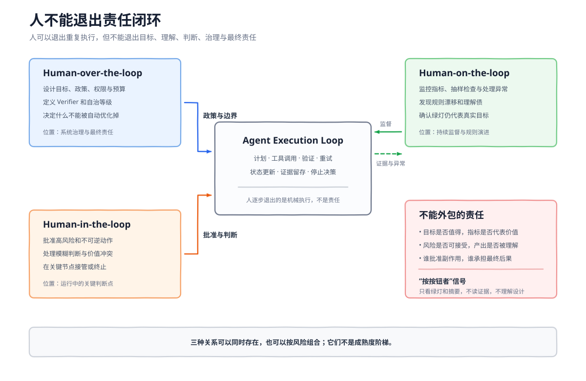

# 第 15 章：Loop Engineering：从单次循环到可持续执行系统

> 本章目标：理解 Loop Engineering 的核心不是写出一个会重复调用模型的 `while`，而是设计一个围绕目标持续行动、接收真实反馈、保存状态、控制风险并在正确时刻退出的执行系统。读完本章，你应该能够区分 Agent Loop、Harness、Workflow 与 Loop Engineering，设计一份 Loop Specification，判断任务是否适合进入 Loop，并说明人在高度自动化系统中仍然必须承担哪些责任。

## 15.1 学习目标与边界：控制权上移

本章讨论的是跨一次或多次 Agent 运行的目标反馈控制：目标如何被发现和选择，外部证据如何拒绝错误结果，状态如何跨上下文恢复，系统为何继续、何时停止，以及人如何始终保留责任。它不把 Agent Loop、Harness、Workflow、Cron 或多 Agent 编排重新包装成一个更大的“循环”名词。

[第 13 章](ch13-gateway-channel-identity-routing.md)负责入口、身份、session key 与路由，[第 14 章](ch14-background-cron-delivery-resilience.md)负责后台执行、Cron、队列、投递和运行时恢复。本章可以使用它们作为触发器和执行底座，但关注点始终是目标是否收敛、证据是否可信、边界是否仍然有效。多 Agent 只是可选执行拓扑，也不改变本章的控制责任。

大多数人使用 Agent 的方式仍然是逐轮推动：人提出要求，Agent 返回结果，人阅读结果、纠正方向，再输入下一条 Prompt。这个过程可能使用了工具、记忆和长上下文，但真正驱动任务前进的仍然是人。

```text
Human -> Prompt -> Agent -> Result
  ^                            |
  +------ inspect and retry ---+
```

在这种模式里，人既是目标定义者，也是调度器、检查者和停止控制器。人一旦离开，工作便停止。

Loop Engineering 试图改变的不是模型内部的推理方式，而是这层控制关系。人不再亲自发出每一条后续指令，而是预先设计一个系统，让系统能够：

- 发现或接收工作。
- 选择当前目标。
- 为 Agent 准备上下文、工具和权限。
- 检查真实结果，而不是只听 Agent 自述。
- 保存进度和证据。
- 根据反馈决定继续、修正、升级或停止。

```text
过去：人负责连续提示、检查和决定下一步
现在：人设计目标、反馈和边界，由系统推动执行
```

三篇核心文章都在描述这一变化，只是切入点不同。第一篇把它整理成从 Prompter 到 Loop Designer 的 14 步路线，强调适用条件、构建模块、成本、安全和理解债。第二篇用 `Discover -> Plan -> Execute -> Verify -> Iterate` 解释完整循环，并把重型代码 Loop 延伸到个人自动化。第三篇则指出：Agent 内部的基础循环已经相对简单，真正困难的工作已经移到模型之外，集中在停止、上下文、工具和验证器上。

因此，Loop Engineering 可以先被定义为：

> 围绕一个目标，设计行动、反馈、状态和停止机制，使 Agent 能在明确边界内持续推进，并让结果可验证、过程可恢复、风险可治理。

这个定义有两个关键词。

第一个是“反馈”。只有重复，没有反馈，只是自动重跑。第二个是“治理”。只有行动，没有权限、预算和停止控制，只是把错误放大得更快。

## 15.2 它不是 Agent Loop 的加强版

“Loop”这个词容易造成误解，因为 Agent 本身已经有一个 Loop。要理解 Loop Engineering，必须先分清五个相邻概念。

### 模型调用

一次模型调用接收输入并产生输出：

```text
Prompt -> Model -> Response
```

它可能包含推理，但不会天然读取环境、执行动作或验证真实世界结果。

### Agent Loop

Agent Loop 决定一次 Agent 运行中的下一步行动：

```text
Reason -> Act -> Observe -> Update Context -> Reason
```

模型读取上下文，产生工具调用，运行时执行工具并把结果放回上下文，直到模型给出最终响应或触发退出条件。OpenAI 在 [Unrolling the Codex agent loop](https://openai.com/index/unrolling-the-codex-agent-loop/) 中拆解的就是这一层。

下面几行伪代码揭示了一个重要事实：严肃的 Agent 框架最终都会出现类似循环，大家并不是在竞争谁能写出更特别的 `while`。

```python
while True:
    response = model(context)
    if not response.tool_calls:
        return response
    results = run_tools(response.tool_calls)
    context.extend(results)
```

Agent Loop 解决的是“当前运行下一步做什么”，但它不天然知道：

- Agent 声称完成时，任务是否真的完成。
- 失败是否值得再次尝试。
- 明天重新启动时从哪里继续。
- 哪些动作必须获得人工批准。
- 预算耗尽、需求变化或长期无进展时如何退出。

### Agent Harness

Harness 是 Agent 运行所处的环境和保障，包括 Prompt Runtime、上下文装配、工具执行、权限、沙箱、模型路由、会话、压缩、错误处理和日志。它回答：

> Agent 能看见什么、能做什么，以及如何稳定地运行？

Harness 可以只服务一次会话，也可以支持跨上下文窗口和跨进程恢复。时间长短不是 Harness 与 Loop Engineering 的边界。

### Workflow

Workflow 预先定义步骤、分支和流转条件。确定性工作流适合清晰、稳定、可以提前描述的路径；Agent 更适合步骤无法完全预知、需要根据环境反馈动态决策的任务。

Workflow 和 Loop Engineering 也不是互斥概念。Workflow 可以成为 Loop 的控制骨架，Agent 只负责其中需要适应性判断的节点。

### Loop Engineering

Loop Engineering 控制的是目标、反馈、状态和停止决策：

> 谁触发工作？如何选择下一项任务？什么证据表示成功？失败是否值得重试？状态保存在哪里？什么时候必须停止并把控制权交还给人？

| 概念 | 主要控制对象 | 核心问题 |
| --- | --- | --- |
| 模型调用 | 一次生成 | 这次应该输出什么 |
| Agent Loop | 当前运行中的行动 | 下一步应该调用什么工具 |
| Agent Harness | Agent 的运行环境 | Agent 能看到什么、能做什么、如何稳定运行 |
| Workflow | 预定义步骤与分支 | 已知流程如何流转 |
| Loop Engineering | 围绕目标的反馈控制 | 如何证明进展、更新状态并受控退出 |

第三篇文章使用了更宽的表达，把 Loop Engineering 描述为包裹 Prompt、Context 和 Harness 的整体自治周期。这种说法抓住了控制权上移，但会与 Harness 发生部分重叠。本章采用“控制责任”作为边界：Harness 负责提供可靠运行环境，Loop Engineering 负责使工作围绕目标收敛。二者可以由同一套代码实现，但分析责任时仍应分开。

因此，Loop Engineering 不是给 Agent Loop 加上持久化和监控后形成的“加强版”。更准确的关系是：

```text
Loop Engineering
  -> Goal / Scope / Budget / Approval
  -> Trigger / Discovery / Scheduling
  -> Agent Harness
       -> Prompt Runtime
       -> Agent Loop
            -> Model
            -> Tool Calls
            -> Observations
       -> Permission / Sandbox / Context
  -> Independent Verification
  -> Persist State / Evidence
  -> Retry / Escalate / Stop / Select Next Work
```

Agent Loop 是执行机制，Harness 是运行环境，Loop Engineering 是反馈与控制系统。


[可编辑 Draw.io 源文件](assets/ch11/loop-engineering-control-layers.drawio)

上图最重要的不是模块数量，而是控制关系：Agent Loop 位于 Harness 内部，Harness 位于目标与反馈闭环内部，而人的治理覆盖目标、权限、验证和最终责任。

### 用三层循环定位控制责任

《AI Agents in Action（第二版）》把循环分成三个层级。这个划分适合用来定位问题，但不能把三层都叫作 Loop Engineering：

| 层级 | 控制范围 | 典型状态 | 结束条件 | 本章处理方式 |
| --- | --- | --- | --- | --- |
| 内部 SPAL | 一次 Agent 运行中的感知、规划、行动、学习 | 当前消息、工具观察、临时计划 | 本次运行返回、报错或达到步数上限 | 作为执行器，不在本章展开 |
| 外部 Task Loop | 围绕一个任务跨多次运行推进 | `goal / plan / state / decision`、证据、预算、检查点 | 目标验证通过、停滞、预算耗尽或升级 | 本章重点 |
| Meta Loop | 管理多个任务循环或执行者 | 任务组合、优先级、资源、冲突和全局约束 | 组合目标完成、全局预算耗尽或人工接管 | 只讲控制接口，多 Agent 细节见第 16 章 |

内部 SPAL 回答“当前运行下一步做什么”。外部 Task Loop 回答“这次运行结束后，任务是否完成；若没有，下一次运行应该继承什么”。Meta Loop 回答“多个任务或执行者之间，谁先做、谁继续、谁停止”。三者可以嵌套，却不能共享一个含糊的 `done`。

```text
Meta Loop：选择任务、分配预算、解决冲突
  -> Task Loop A：目标、计划、外部状态、终止门
       -> Run 1：内部 SPAL
       -> Run 2：内部 SPAL
  -> Task Loop B：目标、计划、外部状态、终止门
       -> Run 1：内部 SPAL
```

本章所说的“跨运行控制”从 Task Loop 开始。模型内部是否使用 CoT、ReAct 或其他推理原语，不改变外层必须持久化目标、验证结果和停止原因这一事实。

## 15.3 核心机制：不是 Repeat，而是 Feedback

一个 Cron 每天执行同一条 Prompt，是重复执行，但不一定是有效 Loop。一个 Agent 连续修改代码十次，如果没有测试或其他外部信号判断结果是否改善，也只是重复产生变化。

Loop 最小闭环由五部分组成：

```text
Goal
  -> Action
  -> External Feedback
  -> State Update
  -> Stop or Next Action
```

可以借用控制系统的语言理解它：

| 控制系统概念 | Loop Engineering 中的对应物 |
| --- | --- |
| 目标值 | Goal 和验收标准 |
| 被控对象 | 代码库、文档、业务系统或外部环境 |
| 执行器 | Agent、工具、脚本、API、子 Agent |
| 传感器 | 测试、日志、查询、指标、人工检查 |
| 控制器 | Orchestrator 和下一步决策逻辑 |
| 状态 | 进度、尝试、检查点和工件 |
| 扰动 | 网络错误、环境漂移、需求变化、模型随机性 |
| 约束 | 权限、预算、时间、迭代次数和审批 |

开环系统只会行动，闭环系统会根据结果修正行动。没有可靠感知能力的 Agent，就像没有传感器的控制器：它可以持续输出动作，却不知道这些动作是否让系统接近目标。

所以，Loop Engineering 最重要的判断是：

> Loop 的价值不在重复，而在反馈；反馈的价值不在产生更多评价，而在能够拒绝错误，并推动下一轮采取不同动作。

这也是为什么 Verifier、State 和 Stop Condition 比“自动执行多少次”更重要。Automation 决定何时再次运行，Verifier 决定是否值得继续运行。

## 15.4 先写工作契约，再启动循环

Prompt 通常描述一次请求。Loop Specification 描述的是一份可以持续执行、验证和恢复的工作契约。

一份可靠的 Loop Specification 至少应回答：

- **Goal**：最终要改变什么真实状态？
- **Scope**：允许读取和修改哪些范围？
- **Invariants**：哪些事实绝不能被破坏？
- **Action unit**：每轮允许完成多大动作？
- **Verifier**：什么证据可以通过或拒绝本轮结果？
- **State**：跨阶段或跨运行需要保存什么？
- **Stop conditions**：成功、失败、停滞和预算耗尽如何定义？
- **Approval gates**：哪些动作必须由人批准？
- **Evidence**：最终要留下哪些可审计工件？

```yaml
goal: 修复 auth 模块中的失败测试
scope:
  allow:
    - src/auth/**
    - tests/auth/**
  deny:
    - deploy/**
    - database/migrations/**
invariants:
  - 不降低测试覆盖率
  - 不删除或跳过已有测试
action_unit: 每轮只处理一个失败簇
verify:
  hard_gates:
    - pytest tests/auth
    - ruff check src/auth tests/auth
    - mypy src/auth
state: .agent-state/auth-repair.json
stop:
  success: 所有验证命令退出码为 0
  no_progress: 连续两轮失败集合没有改善
  budget: 90 分钟或达到 token 上限
approval:
  required_before:
    - 修改数据库 schema
    - 合并 PR
    - 部署
evidence:
  - 修改摘要
  - 验证命令及退出码
  - 剩余风险
```

这份规格不预测 Agent 的每一步。它允许执行路径保持自适应，但不允许目标、边界和完成条件保持含糊。

如果完成标准只能写成“看起来不错”“尽量优化”“做得专业一些”，说明任务还没有准备好进入无人值守 Loop。此时更适合让人参与判断，而不是用更长的 Prompt 掩盖目标不清。

## 15.5 从发现工作到决定下一轮

一个完整 Loop 可以先用五个动作概括：

```text
DISCOVER -> PLAN -> EXECUTE -> VERIFY -> ITERATE
```

它们构成一条清晰主线。

### Discover：发现值得处理的工作

工作可以来自用户请求、Issue、CI 失败、告警、定时扫描或外部事件。Discover 不只是“发现有任务”，还要判断任务是否在当前 Loop 的职责范围内。

### Plan：决定本轮如何推进

读取目标、状态和最近证据，选择一个有限动作。好的计划不会试图一次解决所有问题，而是选择一个可验证、可回滚的变化。

### Execute：运行 Agent 或确定性程序

执行阶段内部可以包含 Agent Loop，也可以只是脚本、API 调用或 Workflow。Loop Engineering 不要求每一步都由模型决定。

### Verify：检查真实结果

验证器读取工件和环境状态，判断本轮是否达成目标、产生进展、破坏不变量或需要人工介入。

### Iterate：根据反馈决定下一步

Iterate 不是无条件再试一次，而是在“接受、修正、重试、升级、回滚、放弃或完成”之间做决策。

进入工程实现后，这五步通常会展开成更细的生命周期：

```text
TRIGGER
  -> DISCOVER：发现候选工作
  -> SELECT：选择本轮最值得处理的一项
  -> PREPARE：装配目标、上下文、权限和工作区
  -> EXECUTE：运行 Agent Loop 或确定性程序
  -> VERIFY：检查真实结果和工件
  -> DECIDE：通过、修正、重试、升级或放弃
  -> PERSIST：保存状态、证据和经验
  -> NOTIFY：报告结果或请求人工判断
  -> NEXT：进入下一项工作或等待触发
```

这里的 `PLAN` 被展开为 `SELECT + PREPARE`，`ITERATE` 被展开为 `DECIDE + PERSIST + NEXT`。Trigger 和 Notify 则把闭环接入真实组织和业务系统。

### 把 goal、plan、state、decision 移出对话

长任务失败的常见原因不是模型忘了某句话，而是系统把四类控制信息都留在对话里：

- `goal`：要改变的真实状态，以及不可破坏的约束。
- `plan`：当前分解、依赖、优先级和待探索分支。
- `state`：已经发生的事实、证据、工件、预算和未决副作用。
- `decision`：本轮为何继续、转向、升级或停止。

它们应该成为外部、带版本的数据。下一次运行读取一个经过筛选的快照，而不是把完整 transcript 当数据库。计划可以被修改，但系统要保留修改原因和基线版本；状态只能由已确认的事件和工件推进；决策必须引用触发它的验证结果。

```json
{
  "task_id": "research-42",
  "goal": {"question": "比较两种恢复路径", "acceptance": ["覆盖关键差异", "结论可回溯"]},
  "plan": {"revision": 3, "open_topics": ["崩溃窗口", "重复副作用"]},
  "state": {"evidence_ids": ["ev-7", "ev-9"], "iteration": 4, "budget_left": 0.38},
  "decision": {"action": "continue", "reason_codes": ["MISSING_COUNTEREXAMPLE"]}
}
```

外置状态不等于让模型自由改 JSON。运行时校验 schema、版本和状态迁移；模型只能提交候选更新，由控制器按证据和规则接受。

### 每轮返回类型化迭代结果

外层控制器不应从一段自然语言总结里猜测“是否完成”。让每轮返回类型化结果，控制器才能稳定组合模型判断与确定性规则：

```yaml
iteration_result:
  findings:            # 本轮新增结论，必须绑定 evidence_ids
  evidence_ids:        # 实际读取并登记的证据
  unresolved:          # 尚未回答的问题或冲突
  proposed_plan_delta: # 建议新增、完成或放弃的计划项
  goal_satisfied:      # 模型建议，不直接决定终止
  confidence:          # 自报信号，不等于校准概率
  next_action:         # continue / pivot / synthesize / escalate / stop
  reason_codes:        # 供策略和审计使用的有限枚举
```

`goal_satisfied` 和 `confidence` 只能作为输入信号。真正的终止决定还要检查硬约束、证据覆盖、预算和停滞。来源示例中的具体代码存在状态与控制流缺陷，本章只吸收“类型化迭代协议”这一机制，不把示例当作生产原型。

### 探索与综合分开

研究和方案设计容易让同一次模型调用一边找材料、一边维护全局结构、一边写最终答案。这样会让早期叙述锁定搜索方向，也很难判断新增调用究竟补了证据还是只润色文本。

更清晰的 Task Loop 分成两种阶段：

```text
Explore
  读取问题缺口 -> 搜索或执行 -> 登记证据与冲突 -> 更新计划

Synthesize
  冻结证据快照 -> 形成主张 -> 检查覆盖与反例 -> 生成工件
```

探索阶段不能把流畅文稿当进展；综合阶段默认不继续无边界搜索。若综合发现关键证据缺口，控制器创建明确的新探索任务，再返回 Explore。这个阶段切换应记录原因和预算，避免“写不出来就继续搜、搜到新内容又推翻全文”的摆动。

## 15.6 测试与验收：停止与拒绝

第三篇文章把长期 Loop 的工程困难分成四项：何时停止、如何保持上下文干净、工具是否适合被反复调用，以及系统里是否存在一个真正能说“不”的东西。本章把“何时停止”和“谁能拒绝不合格结果”放在同一节讨论，因为停止判断必须依赖拒绝机制；但它们仍然是两个不同问题。

模型停止调用工具，只表示当前 Agent Turn 结束，不表示任务已经完成。这是长期 Loop 最常见的概念错误。

```text
Agent says done != Task is verified done
Transcript != Outcome
```

Agent 说“测试已经修复”是一段执行叙述；测试进程退出码为 0 才是环境结果。Agent 说“订单已经创建”不等于数据库里真的存在订单记录。一个可靠 Loop 必须验证外部状态，而不是验证回答听起来是否自信。

### 验证器的四个层次

| 层次 | 例子 | 可靠性 |
| --- | --- | --- |
| 硬验证 | test、lint、build、schema、数据库约束 | 最适合直接作为 gate |
| 状态验证 | API 回读、文件检查、日志和指标 | 接近真实环境结果 |
| 结构化评分 | rubric、多维评分、阈值 | 适合写作、研究和设计 |
| 人工判断 | 架构、产品、伦理、审美和高风险决策 | 最慢，但有些任务不可替代 |

验证器应该尽量靠近真实结果。能检查数据库就不要只检查 Agent 文本，能运行测试就不要只让另一个模型阅读总结。

### Maker 与 Checker 为什么要分开

执行者天然拥有自我偏好。它知道自己为什么这样做，也容易把已有推理当作正确前提。让同一个模型在相同上下文里“再检查一下”，经常只是让它重复为自己的方案辩护。

Maker-Checker 分离可以通过多种方式实现：

- Maker 修改，硬测试检查。
- 一个 Agent 执行，另一个 Agent 只读审查。
- 同一模型使用隔离上下文和不同系统指令。
- 便宜模型执行，强模型检查高风险结果。
- 自动 gate 先拒绝明显错误，人只处理模糊部分。

真正的独立性不只来自“换一个模型名称”，还来自不同证据、不同上下文、不同职责和拒绝权限。

### 验证器也可能被投机

如果 Agent 能同时修改代码和测试，它可能通过降低测试强度获得绿灯。如果评分器只检查格式，系统可能生成格式完美但事实错误的报告。如果 Checker 只读 Maker 的解释，它可能被叙述说服，而没有检查真实工件。

因此 Verifier 也需要治理：

- 保护关键测试和不变量，执行 Agent 不得修改。
- 使用已知坏样本测试验证器能否拒绝错误。
- 定期比较硬 gate、模型评分和人工结论。
- 把生产事故和误判转成新的 eval case。
- 高风险场景让多个独立信号共同通过。

### 停止不是只有成功

一个严肃 Loop 至少应该拥有以下出口：

```text
SUCCESS             已通过真实验收
NO_PROGRESS         连续多轮没有改善
BUDGET_EXHAUSTED    时间、token、金额或轮次耗尽
NON_RETRYABLE       权限、策略或输入错误无法自动修复
APPROVAL_REQUIRED   即将进入高风险或不可逆动作
ENVIRONMENT_CHANGED 基线、需求或环境发生变化
CANCELLED           人主动停止
```

只设置最大轮数不够，因为系统可能用十轮重复同一个错误。No-progress detection 应比较失败集合、评分、工件或外部状态是否发生实质改善，而不是只比较 Agent 是否生成了不同文字。

终止门可以按优先级分层，前一层不通过就不让后一层用“高置信度”覆盖：

1. **硬边界**：取消、权限、时间、金额、token、轮次和不可恢复错误。
2. **安全与不变量**：越权、数据损坏、受保护测试被修改等立即停止或回滚。
3. **目标证据**：硬测试、环境回读、证据覆盖和交付物检查。
4. **进展信号**：失败集合是否收缩、信息增益是否增加、关键未知是否减少。
5. **模型建议**：`goal_satisfied`、自报置信度和下一步建议，只参与软决策。

来源第 10 章讨论的停滞、置信和知识边界，在本章只作为外层信号使用。控制器可以在“重复相同失败”“证据质量持续不足”“置信度没有随新证据变化”时转向或升级，但不把完整认知架构塞进 Task Loop，也不把模型自报置信度当作停止真值。

第一篇文章把“Agent 过早发出完成信号、系统在半成品上退出，或没有硬 gate 而继续花费”称为 `Ralph Wiggum loop`。这是该文对静默失败的命名方式。[Geoffrey Huntley 对 Ralph 的原始说明](https://ghuntley.com/ralph/)所指的是更广义的重复运行 coding agent 方法。Ralph 类方法本身不是失败，缺少 verifier、state、stop condition 和恢复机制的实现才会静默失败。

## 15.7 状态与上下文：保持可恢复和干净

State 常被称为使 Loop 能够“学习”的部分。严格来说，保存状态不等于模型参数发生学习，但它确实使后续执行能够利用先前结果，而不是每天从零开始。

### State 不是聊天摘要

聊天摘要回答“刚才讨论了什么”，工作状态回答“真实世界现在是什么样”。一份有用状态至少包含：

```json
{
  "goal": "修复 auth 测试",
  "phase": "verification_pending",
  "current_work": "refresh token failure cluster",
  "attempt": 3,
  "checkpoint": "worktree/commit identifier",
  "completed": ["expired-token", "missing-header"],
  "failed": ["refresh-race"],
  "evidence": ["pytest-output.txt", "diff.patch"],
  "next_action": "verify saved execution result",
  "budget_used": {"minutes": 42, "tokens": 180000}
}
```

长期状态应保存事实、证据、关键决策和恢复位置，不必保存所有推理过程。完整轨迹适合审计日志，当前状态适合恢复执行，两者职责不同。

### Checkpoint 是恢复协议，不只是存档

可恢复系统需要区分：

- 尚未开始执行。
- 执行已经开始但不知道副作用是否完成。
- 执行完成但验证尚未完成。
- 验证完成但状态尚未提交。
- 本轮已经完整提交。

如果系统在“发送邮件成功、记录状态之前”崩溃，简单重试会重复发送。恢复前必须通过幂等键、API 回读、事务记录或人工确认对账，而不是重新运行整个步骤。

Anthropic 的长期 Agent 实践使用进度文件和 Git 历史，让每次运行只推进有限工作，并在结束时留下干净、可继续的环境。长期执行的核心不是让一个上下文无限增长，而是设计可靠交班协议。

### Context Rot 为什么会形成负反馈

Loop 越长，旧工具输出、失败尝试、过期计划和无关日志越容易堆积。上下文变差后，模型做出更差决策；更差决策又产生更多噪音，形成所谓 context rot 或 doom loop。

所以 State 与 Context 必须分开：

```text
State：尽量完整、可恢复、可审计
Context：为当前决策挑选的最小相关信息
```

长期 Loop 可以采用四步上下文策略：

1. **Write**：把长工具结果、证据和进度写到上下文之外。
2. **Select**：每轮只加载当前任务需要的状态切片。
3. **Compress**：压缩稳定事实，保留原始证据路径。
4. **Isolate**：把高噪音探索交给独立子 Agent 或工作区，只返回干净结果。

压缩不是无损操作。失败原因、禁止事项和关键约束在多次摘要中最容易消失，所以高层目标、权限边界和不变量应保存在可重新读取的规格文件中，而不是只依赖对话摘要。

## 15.8 工具：必须适合被反复调用

单轮工具失败时，人可以立即介入；无人值守 Loop 会自动放大工具的歧义和副作用。Loop 的质量上限受工具质量约束。

### 少而清晰

工具名称、参数和返回值应表达真实动作，避免多个工具功能重叠。工具越多，选择成本越高。如果一个熟悉业务的人都不能确定该用哪个工具，Agent 更难稳定选择。

### 幂等或可去重

Loop 会重试。`create_customer` 调用两次如果创建两个客户，恢复机制就会变成数据事故。写操作应支持幂等键、存在性检查、upsert、事务或逐项去重记录。

### 可预演和可回滚

高影响动作优先支持 `dry_run`、diff、草稿、事务和撤销。先产生可审查工件，再执行真实副作用。

### 错误必须能指导下一步

给人看的“操作失败”对 Agent 没有行动价值。错误应告诉控制器失败类别和恢复方向：

```text
transient          网络或限流，可有界重试
invalid_input      修改参数后再试
permission_denied  不可重试，需要授权
conflict           重新读取状态，避免覆盖
policy_blocked     停止并升级
```

在 Loop 中，错误不是流程终点，而是下一步决策的输入。

### 权限按任务授予

读取 Issue 不应该顺便获得生产部署权限。Loop 的权限应按当前任务授予，而不是按 Agent 理论上可能使用的全部能力授予。

## 15.9 从五个构建块到完整执行环境

三篇文章列出的模块略有不同，合并后可以得到六个常见构建块：

| 构建块 | 作用 | 不能替代什么 |
| --- | --- | --- |
| Automations | 按时间、事件或条件触发工作 | 不能替代完成条件 |
| Worktrees / Sandbox | 隔离并行修改和故障 | 不能替代任务边界和合并判断 |
| Skills | 保存重复流程和项目知识 | 不能替代动态状态 |
| Connectors | 接入 GitHub、Jira、Slack、数据库等 | 不能替代权限治理 |
| Subagents | 分工、并行和 Maker-Checker | 不能自动保证检查独立可靠 |
| External State | 跨阶段或跨运行保存进度和证据 | 不能直接作为当前上下文 |

Verifier 有时被列为第七个模块，有时被放在 Subagent 或 Automation 内。但从控制系统角度看，它不是普通插件，而是闭环成立的必要条件。

同样，Automation 是心跳，不是大脑。它可以让任务每小时启动，却不能证明任务在收敛。Worktree 可以阻止文件机械冲突，却不能解决两个 Agent 重复处理同一问题。Skill 可以保存操作方法，却不能保存实时进度。Connector 可以扩大行动范围，也会同步扩大攻击面。

只有这些模块围绕统一 Goal、Verifier、State 和 Stop Policy 协同工作时，才构成可靠 Loop。

## 15.10 Loop 有多种形态，不是所有重复任务都一样

### Cron Loop

按固定时间或间隔运行，适合日报、巡检和同步。每次执行结束后等待下一次触发。

### Event Loop

由 CI 失败、Issue 创建、告警或消息等外部事件触发，适合事件处理和自动分诊。

### Goal Loop

只要可验证目标尚未满足就继续迭代，直到成功、停滞、预算耗尽或需要人工判断。代码修复、迁移和参数优化属于这一类。

### Human-steered Loop

人决定每次是否继续，适合架构设计、创作、探索和验收标准仍在形成的任务。

### 按移交控制权分类：Claude Code 的产品视角

Anthropic 的 Claude Code 团队还提供了另一种分类方式：不只看 Loop 如何运行，还看人把哪一部分控制权交给系统。这个框架来自具体产品实践，适合帮助团队讨论自治边界，但它不是行业唯一分类，也不是从低级到高级的成熟度排行榜。

| 类型 | 触发 | 停止 | 移交的控制权 | 适用场景 |
| --- | --- | --- | --- | --- |
| Turn-based | 用户发起一轮 Prompt | Agent 判断完成，或请求补充信息 | 可通过 Skill 逐步移交检查环节 | 探索、决策和短期任务 |
| Goal-based | 用户提交目标和成功标准 | 目标通过验证，或触发轮次、预算等上限 | 移交依据既定标准执行停止判断 | 测试修复、指标优化和有客观验收标准的复杂任务 |
| Time-based | 固定时间或间隔触发 | 被取消，或外部工作整体完成，例如 PR 合并、队列清空 | 移交触发时机 | 定时检查、周期同步和外部系统轮询 |
| Proactive | 事件、计划或持续任务源触发 | 单项任务完成；外层 Routine 仍可等待后续任务 | 移交无人实时参与时持续发起 Prompt 和工作的主动权 | Bug 分诊、升级、迁移和持续运营任务 |

这套分类与前面的 Cron、Event、Goal、Human-steered 属于不同观察轴：

- Cron、Event 主要描述**什么时候触发**。
- Goal、Human-steered 主要描述**由谁判断是否继续**。
- Turn-based、Goal-based、Time-based、Proactive 主要描述**人移交了哪一种控制权**。

因此，它们不能机械地一一对应。一个 Proactive Loop 可以由 Event 触发，也可以由 Cron 触发；一个 Goal Loop 可以完全自动停止，也可以在关键轮次由人决定是否继续。设计 Loop 时，应分别回答触发轴、停止轴、控制权轴和风险轴，而不是先选择一个名称，再把所有机制塞进这个名称。

Anthropic 的产品语境会把“一条 Prompt 启动的一次 Agent 运行”宽泛地称为 Turn-based Loop。本章采用更严格的反馈闭环定义：只有执行结果被回读、验证结论能够影响下一步，并且系统拥有明确停止边界时，重复执行才构成 Loop Engineering 意义上的闭环。宽泛分类有助于理解产品形态，但不能替代这一工程判据。

### 外层 Routine 与内层 Task：两个生命周期

Proactive Loop 不是一个永不结束的单体循环，而更像两个嵌套的生命周期：外层 Routine 负责持续发现和接收工作，内层 Task 负责把一个具体任务推进到可验证结果。

| 生命周期 | 状态 | 预算 | 停止条件 | 故障处理 |
| --- | --- | --- | --- | --- |
| 外层 Routine | 调度游标、队列位置、租约、最近运行时间 | 每日总 token、并发数、轮询次数、任务吞吐上限 | 被禁用、总预算耗尽、紧急熔断或服务退役 | 退避重试、释放租约、隔离故障源、通知运维人员 |
| 内层 Task | 当前目标、执行阶段、检查点、验证证据 | 单任务轮次、token、时间和工具调用上限 | 目标通过验证、任务无进展、单任务预算耗尽或需要人工判断 | 从检查点恢复、幂等重试、回滚副作用或升级给人 |

单项 Task 完成，只代表这一项工作可以退出，不代表 Routine 应当停止；反过来，Routine 仍在运行，也不意味着某个失败 Task 可以无限重试。两层必须分别拥有状态、预算、停止条件和故障策略。例如：

```yaml
routine:
  trigger: "每 15 分钟检查一次待分诊 Issue"
  state: "last_issue_cursor + active_task_leases"
  budget: "每天最多 200 个任务，并发上限 5"
  stop: "人工禁用、日预算耗尽或紧急熔断"
  on_failure: "指数退避并告警，不阻塞下一批任务"

task:
  goal: "完成一个 Issue 的分类并留下可审计证据"
  state: "issue_id + current_phase + evidence"
  budget: "最多 3 轮、10 分钟"
  stop: "分类通过校验、无进展或需要领域判断"
  on_failure: "撤销租约，保留检查点并升级给人"
```

这个分层还可以防止预算误用：Routine 的总预算控制系统规模，Task 的局部预算限制单个异常工作项。只有两层同时受控，常驻 Loop 才不会因一个坏任务拖垮整个执行系统。

> **Claude Code 产品案例：从命令到主动工作流**
>
> 在 Anthropic 官方文章介绍的产品形态中，`/goal` 用成功标准和评估器约束目标循环，`/loop` 在本机按间隔重复 Prompt，`/schedule` 把 Routine 交给计划调度；Skills 保存可复用的操作与验证知识，Auto mode 减少逐次授权，Dynamic workflows 负责任务编排。它们可以组合成“调度发现任务 -> Goal 推进单项工作 -> Skill 执行验证 -> Workflow 分派或复核”的运行链路。
>
> 这些命令、停止请求被评估器拦截的实现方式，以及 `/schedule`、Dynamic workflows 在文章发布时的研究预览状态，都是 Claude Code 的产品细节，不是 Loop Engineering 的通用原理。迁移到其他系统时，真正需要保留的是触发、状态、验证、停止、预算和治理关系。产品提供了更强的自动化入口，也不能绕过 [15.11](#1511-人不能退出责任闭环) 中的人类责任，或 [15.12](#1512-生产约束自治越强治理成本越高) 中的权限、安全 gate 与可恢复性要求。

### 单会话自检 Loop

一种低成本入口是把轻量 Loop 直接放入 ChatGPT 或其他 LLM：给出目标、严格成功标准和 `Plan -> Do -> Verify -> Decide` 协议，让模型在一个会话内反复改进。

它有助于改善一次产出，但仍有明显局限：模型往往自己给自己评分，没有独立状态和外部触发，关闭会话后也无法继续。因此它是理解 Loop 思想的低成本入口，不等于生产级 Loop。

### 轻量生活自动化

轻量生活自动化还可以覆盖会前提醒、邮件和日历简报、群聊摘要、内容加工、习惯追踪等场景。Mira 的 `Skills` 是其中一个消费级产品例子：用户只描述触发条件、动作和投递方式，托管产品负责连接应用并在后台运行。

这种形式很有价值，但需要区分自动化与反馈闭环：

| 形态 | 最小结构 | 是否必须迭代验证 |
| --- | --- | --- |
| 周期自动化 | trigger + action + delivery | 不一定，例如只读简报 |
| 事件自动化 | event + action + outcome check | 通常需要结果回读和幂等 |
| Goal Loop | goal + action + verifier + state + stop | 必须，否则无法判断收敛 |

“每天 7 点生成简报”可以被宽泛地称为生活 Loop，但严格来说更接近带状态的自动化。只有系统根据反馈调整行动，直到达到可验证目标或停止边界时，才形成完整反馈闭环。

## 15.11 人不能退出责任闭环

Loop Engineering 经常被描述为“人离开循环，Agent 自己工作”。这句话只说对了一半。

人可以离开重复执行过程，但不能退出目标、理解、判断、治理和责任闭环。如果人只负责点击“运行”，把问题定义、方案设计、验证标准和结果理解全部交给 Agent，那么系统并没有真正获得工程能力，只是把人的判断力也一起外包了。

### 从操作员变成系统设计者

人的工作不再是逐轮告诉 Agent 下一步做什么，而是设计一个能够正确行动、正确拒绝、正确停止的系统。至少包括七类责任。

#### 1. 定义值得追求的目标

Agent 可以把一个目标执行得很彻底，却不能替组织决定什么目标真正值得追求。人必须说明业务价值、优先级和成功含义，并识别表面指标与真实目的之间的差异。

“让测试全绿”不是完整目标。如果 Agent 通过删除测试获得全绿，系统完成了指标却背叛了目的。人需要定义“不降低覆盖率、不删除测试”等不变量。

#### 2. 设计行动边界

人决定 Agent 可以访问什么、修改什么、花费多少，以及哪些动作必须停止等待审批。权限、预算、时间和不可逆操作都属于设计问题，不能在运行中临时交给 Agent 自己解释。

#### 3. 设计能够说“不”的 Verifier

Verifier 是人对“什么算好结果”的工程化表达。选择测试、指标、rubric 和人工 gate，本质上是在把领域判断编码进系统。

如果 Verifier 只检查容易测量的东西，Loop 会优化容易测量的东西，而不是重要的东西。人必须持续追问：这个绿灯真的代表目标已经达到吗？系统是否正在投机评分规则？

#### 4. 保持对产出物的理解

自动生成速度越快，人越容易退化为只看摘要和状态灯的“按按钮者”。这会产生理解债：仓库、流程或决策在持续变化，但负责它们的人越来越不知道为什么会变成这样。

保持理解不等于阅读每个 token，而是：

- 阅读高风险和代表性 diff。
- 检查关键证据，而不只读完成摘要。
- 理解主要设计决策和替代方案。
- 对失败案例和异常路径保持熟悉。
- 确保团队仍有人能够调试、解释和接管系统。

如果一个团队每天自动生成 100 个 PR，却只能认真理解 10 个，瓶颈并没有消失，只是从编码移动到理解和验收。

#### 5. 处理无法完全形式化的判断

架构、产品方向、审美、伦理和组织影响通常无法被一个自动指标完整表达。此时人的价值不是充当低效工具调用器，而是处理目标冲突、价值权衡和未知风险。

#### 6. 治理和演进 Loop

Loop 不是设计一次后永久可靠。代码库会变化，业务目标会变化，测试会老化，权限会扩大，模型行为也可能变化。人需要抽样检查、分析误判、更新规则、删除过期 Prompt，并决定何时提升或降低自治等级。

#### 7. 承担最终责任

Agent 可以执行任务，不能承担组织、法律、安全和价值层面的最终责任。是谁定义了目标、授予了权限、接受了结果，谁就不能在事故发生后用“模型做的”替代责任说明。

### Human-in、Human-on 与 Human-over

人在 Loop 中的位置可以按风险和成熟度变化：

| 模式 | 人的作用 | 适用场景 |
| --- | --- | --- |
| Human-in-the-loop | 在关键步骤直接判断或批准 | 高风险、目标模糊、不可逆操作 |
| Human-on-the-loop | 日常不逐步操作，但监控、抽查和处理异常 | 已有稳定 gate 的中等风险任务 |
| Human-over-the-loop | 设计目标、政策、权限、验证器和演进机制 | 成熟、窄域、可恢复的自动 Loop |

这三种模式不是成熟度排行榜。高风险付款系统即使技术成熟，也可能长期需要 Human-in-the-loop；低风险 lint 修复则可以很快转向 Human-on-the-loop。



[可编辑 Draw.io 源文件](assets/ch11/human-governance-roles.drawio)

图中的三种关系可以同时存在：Human-over 设计规则，Human-on 监督运行，Human-in 处理关键判断。它们不是成熟度阶梯，而是根据任务风险组合使用的治理位置。

### “按按钮的人”为什么危险

下面几种状态表面上提高了自动化程度，实际上削弱了工程能力：

- 人只负责启动任务，把目标和设计也交给 Agent。
- 看到测试通过或模型给出高分，就不再理解产出物。
- 自动产生大量代码、文档或决策，Review 带宽远低于生成速度。
- 为追求无人值守，不断删除必要审批节点。
- 人不再形成独立意见，只接受系统推荐。
- 出现问题时把责任归因于模型，忽略 Loop 是由人设计和授权的。

Addy Osmani 把这种风险称为 cognitive surrender：人不再用 Agent 放大判断，而是用 Agent 逃避判断。真正的 Loop Designer 不是最少思考的人，而是把思考集中在目标、反馈、边界和系统演进上的人。

### 人应该退出哪里，又不能退出哪里

```text
可以逐步退出：
  重复操作、机械检查、固定格式转换、低风险重试

不能完全退出：
  目标定义、Verifier 设计、价值冲突、风险授权、抽样理解、最终责任
```

Loop Engineering 的理想结果不是“没有人”，而是“人的注意力被放在最需要判断的地方”。

## 15.12 生产约束：自治越强，治理成本越高

Loop 运行更久、连接系统更多、人工观察更少，因此会放大传统 Agent 风险：提示注入、供应链污染、凭据泄露、权限漂移、错误重试和不可逆副作用。

可以通过自治阶梯控制风险：

| 等级 | Agent 可以做什么 | 人的控制点 |
| --- | --- | --- |
| L0 建议 | 只读并给出建议 | 人执行所有动作 |
| L1 草稿 | 生成 patch、报告或草稿 | 人检查后应用 |
| L2 隔离执行 | 在 sandbox/worktree 中修改和验证 | 人决定是否合并 |
| L3 有界写入 | 对低风险系统执行可回滚动作 | 高风险动作审批 |
| L4 有界闭环 | 自动发现、执行、验证和提交 | 合并、部署、付款等保留 gate |
| L5 高自治 | 在窄域持续行动 | 只适用于证明充分且可快速撤销的场景 |

自治不是一次性开关，而是根据证据逐级授予。一个 Loop 在只读分诊上表现良好，不代表它自动获得生产写权限。

生产 Loop 至少需要：

- 独立身份和最小权限。
- 可配置的网络、文件系统和工具边界。
- 第三方 Skill、Plugin 和 Connector 来源审计。
- 日志与状态文件的密钥脱敏。
- 外部内容默认按不可信输入处理。
- 不可逆动作前的人工审批。
- 写操作的审计、幂等和回滚机制。
- 预算、并发、时间和递归派生硬上限。
- 定期重新审查权限和验证规则。

这种随自治能力增长而新增的治理成本常被称为 Security Tax。自动化节省的执行时间，不会消除安全成本，只会把安全工作从逐次操作转移到身份、策略、隔离、审计和恢复设计。

## 15.13 成本、可观测性与理解债

Loop 会同时放大 token、工具调用、并行 Agent、验证运行和人工 Review。真正应该优化的不是“运行了多少轮”，而是“每个被接受结果的总成本”。

```text
总成本
  = 模型成本
  + 工具与计算成本
  + 失败重试成本
  + 人工 Review 成本
  + 回滚与事故成本
  + 未来理解和维护成本
```

`cost per accepted change` 比 token 消耗更接近真实价值：如果十个结果中六个被丢弃，团队仍然承担了生成、检查和清理成本。

### 把成本约束落实为运行策略

成本治理不能只停留在事后看报表，还应在 Loop 启动前改变执行方式：

1. **先用小样本试点。** 先让 Loop 处理少量、低风险、具有代表性的任务，测量接受率、失败原因和人工 Review 时间，再逐步扩大任务量与自治范围。未经试点就直接提高并发，只会更快放大错误和理解债。
2. **确定性步骤优先使用脚本。** 格式转换、静态检查、文件枚举、数值计算等确定性工作，应交给普通程序完成；模型负责解释模糊输入、选择策略和处理例外。这样既降低 token 成本，也让验证结果更稳定。
3. **让轮询频率匹配环境变化。** 外部状态每小时才可能变化，就没有必要每分钟轮询。事件通知可用时优先事件触发；只能轮询时，根据变化速度、业务时效和接口成本设置间隔，并在连续无变化或失败后退避。
4. **按判断难度路由模型。** 简单分类、摘要和规则检查使用成本较低的模型或脚本；涉及跨文件推理、冲突权衡和高风险决策时，再升级到更强模型或人工判断。路由依据应是任务所需判断能力，而不是所有步骤固定使用同一模型。

这四条策略分别限制扩张速度、模型参与范围、触发密度和单次判断成本。它们与预算硬上限互补：硬上限防止失控，运行策略则从源头减少不必要的消耗。

### 观察一次运行，更要观察整个系统

每次运行至少应该能回答：

- 为什么被触发？
- 使用了哪个目标、模型、Skill 和工具集？
- 读取了哪些状态？
- 做了哪些外部动作？
- 哪些 gate 通过或失败？
- 为什么继续、停止或升级？
- 花了多少时间、token 和人工 Review？
- 留下了哪些工件和副作用？

更有意义的系统指标包括：

| 指标 | 含义 |
| --- | --- |
| accepted-result rate | 产出中真正被接受的比例 |
| cost per accepted result | 每个可接受结果的总成本 |
| first-pass gate rate | 第一轮通过主要 gate 的比例 |
| no-progress rate | 因停滞而退出的比例 |
| human-escalation rate | 需要人工判断的比例和原因 |
| rollback / reopen rate | 通过后被撤销或重新打开的比例 |
| time to verified outcome | 从触发到证据充分完成的时间 |
| verifier disagreement | 硬 gate、模型检查与人工结论的分歧 |

OpenAI 的 [Run verified operations](https://learn.chatgpt.com/use-cases/verified-operations-workflows) 强调逐项成功或失败记录、有限重试和可检查工件。这种“带收据的自动化”比一句完成摘要更适合生产 Loop。

### Comprehension Debt

当代码或文档产生速度超过团队理解速度，系统里会出现大量“存在但没人真正掌握”的产出。短期吞吐提高，长期调试、架构演进和安全审计成本上升。

降低理解债的方法包括：

- 限制每轮改动范围。
- 让 Loop 输出决策依据和验证证据。
- 对关键模块限制自动改动。
- 让人抽查失败案例和 gate 有效性。
- 把 Review 带宽作为并发上限。
- 定期删除失效的 Harness 规则和补丁式 Prompt。

人类理解能力不是自动化之外的附属指标，而是 Loop 系统容量的一部分。

## 15.14 什么任务值得进入 Loop

不是所有工作都值得被循环化。第一篇文章提出四个工程条件：

1. 任务会重复出现。
2. 验证可以自动化。
3. token 与计算预算能够承受探索和浪费。
4. Agent 拥有日志、复现环境和运行代码等完整工具。

第二篇文章提出另一组任务条件：

1. 工作会重复并能够获得反馈。
2. 坏结果可以被自动拒绝。
3. Agent 能够端到端采取行动。
4. 完成标准足够客观，而不是纯判断问题。

两组条件不能混成同一个“四项测试”。第一组更关注运行 Loop 的工程环境是否成熟，第二组更关注任务本身是否适合闭环自治。

第一篇文章还给出一个更具体的 30 秒检查：任务是否至少每周发生、是否有自动 gate、Agent 是否能运行代码、是否有硬停止、不可逆操作前是否保留人工审批。任何一项缺失，都应该先保持人工模式。

| 任务特征 | 建议方式 |
| --- | --- |
| 一次性、目标模糊、依赖审美或架构判断 | 人持续参与的 Prompt / Agent |
| 重复，但无法自动识别坏结果 | Skill 或模板 + 人工验收 |
| 可验证，但动作风险较高 | 半自动 Loop + 审批 gate |
| 重复、低风险、可回滚、硬验证充分 | 自动 Goal Loop |
| 可评分优化，但不存在唯一答案 | Eval-driven Loop + 多指标 + 人工抽查 |

适合起步的任务包括 CI 失败分诊、依赖升级、lint 和类型修复、失效链接检查、固定格式报告、重复数据清洗和有评分函数的实验优化。

不适合一开始无人值守的任务包括身份认证和支付重写、生产部署、数据删除、验收标准持续变化的产品探索、缺乏测试的架构重构，以及强依赖伦理、审美和组织判断的决策。

还有一类任务根本不该使用外层循环：路径固定、一次确定性程序即可完成的工作。为文件改名、字段转换或固定报表套上 Agent Task Loop，只会增加随机性、成本和恢复状态。任务虽然复杂，但如果无法观察进展、无法拒绝坏结果，循环也只会反复制造不可验证产物。此时应先改善数据契约、验证器或人工流程。

## 15.15 从人工流程到最小可信 Loop

第一篇文章的 14 步可以重新理解为三个阶段，而不是 14 个需要依次安装的产品功能：

```text
阶段一：判断是否值得
  替代逐轮提示 -> 四条件测试 -> 经济性 -> 具体任务检查

阶段二：建立执行环境
  Automation -> Worktree -> Skill -> Connector -> Subagent -> State

阶段三：形成可信闭环
  Minimum Loop -> 防止静默失败 -> 控制理解债 -> 支付安全成本
```

三篇文章共同支持一条保守但有效的实施顺序。

### 第一步：人工跑通一次

先手工启动 Agent，观察它需要哪些上下文、工具和人工纠正。流程尚未稳定时，不要急着接 Schedule。

### 第二步：把稳定做法固化为 Skill

把项目知识、允许范围、禁止事项、操作步骤和输出格式写入 `AGENTS.md`、Skill 或其他可复用规格。

### 第三步：建立真实 Gate 和停止条件

先使用已有测试、lint、build、schema 或查询。没有自动拒绝机制时，保留人工验收，不要假装全自动。

### 第四步：外化状态

保存当前任务、尝试历史、检查点、失败证据和下一步。用一个新会话验证是否真的能够恢复。

### 第五步：加入有界重试

每轮只完成有限动作，并重新验证。加入轮次、时间、token 和 no-progress 边界。

### 第六步：隔离执行与检查

在 Sandbox 或 Worktree 中运行；需要模型判断时，把 Maker 与 Checker 分开。

### 第七步：最后接入自动触发

只有人工流程已经稳定、失败可见、停止可靠，才接 Cron、Hook、Issue、CI 或消息事件。

第一篇文章给出的最小产品组合是：一项 Automation、一项 Skill、一个 State File 和一个 Gate。用反馈控制的语言展开，则是：

```text
一个明确目标
+ 一个有限动作单元
+ 一个能拒绝坏结果的 Gate
+ 一个外部状态文件
+ 一组硬停止条件
```

最小可信 Loop 不需要 Swarm，也不需要一开始就有复杂平台。它需要的是一个真实闭环。

## 15.16 四类案例，同一套控制结构

### 代码修复 Loop

```text
Trigger: CI 失败或人工启动
Goal: 指定测试套件通过
Action: 每轮修复一个失败簇
Verify: test + lint + typecheck
State: commit、失败集合、尝试历史
Stop: 全绿 / 8 轮 / 连续 2 轮无进展
Human: 审核关键 diff，批准合并
```

这是最适合重型 Loop 的类型，因为反馈明确、动作可隔离、结果容易复现。人的责任不是逐行指导 Agent，而是保护测试、审查高风险修改并决定是否合并。

### 研究报告 Loop

```text
Trigger: 用户提出研究问题
Goal: 覆盖预定义问题并提供可追溯证据
Action: 搜索、筛选、阅读、综合
Verify: 来源完整性、事实交叉验证、引用检查、反方审查
State: 已读来源、证据矩阵、争议点
Stop: 所有问题有证据 / 时间预算用尽
Human: 判断结论质量和重要遗漏
```

研究任务的 Verifier 比代码测试更软。结构化证据表、来源等级和反例搜索可以提升可靠性，但不能完全替代人的事实判断和问题意识。

### 每日简报 Loop

```text
Trigger: 每个工作日 07:00
Goal: 输出会议、紧急邮件和待跟进事项
Action: 读取 Calendar / Gmail，去重和排序
Verify: 字段完整、日期正确、链接可回溯
State: 上次已提醒项目，避免重复
Stop: 简报生成或连接器失败
Human: 决定关注规则，不自动回复外部邮件
```

这是轻量周期自动化。它不需要持续迭代到“完美”，但仍需要权限、隐私和投递失败处理。

### 批量运维 Loop

```text
Trigger: 已审批工单
Goal: 对输入列表完成有限范围更新
Action: dry-run -> 执行 -> 逐项记录
Verify: API 回读、日志、结果 CSV
State: 每一项 success / failure，支持断点续跑
Stop: 完成 / 权限失败 / 范围外操作
Human: 审批不可逆动作和范围变化
```

这类任务最重要的不是模型推理，而是输入规范、幂等、结果回读和失败隔离。人应设计授权范围并对不可逆动作负责。

四个案例说明：自治程度不由“Agent 有多聪明”决定，而由验证强度、可恢复性、风险和人的理解能力共同决定。

## 15.17 参考实现：可恢复的 Loop Controller

下面的伪代码故意把 Agent Loop 当作执行器，而不是把所有控制责任塞进模型：

```python
def run_loop(spec, state_store, runner, verifier):
    state = state_store.load_or_initialize(spec)

    while True:
        recovered_execution = None

        # 普通停止边界不能掩盖一个尚未对账的真实副作用。
        if state.phase == "execution_pending":
            work = state.current_work
            recovery = reconcile_interrupted_execution(state)

            if recovery.requires_human:
                return pause_for_reconciliation(recovery, state)

            if recovery.execution_completed:
                result = recovery.result
                state.begin_verification(result)
                state_store.save(state)
            else:
                recovered_execution = (work, recovery.checkpoint)

        # 已发生的执行必须先完成验证；预算只阻止新的执行或重试。
        if state.phase == "verification_pending":
            work = state.current_work
            checkpoint = state.checkpoint
            result = state.execution_result
        else:
            boundary = check_boundaries(spec, state)
            if boundary.should_stop:
                return finalize(boundary.reason, state)

            if recovered_execution:
                work, checkpoint = recovered_execution
            else:
                work = select_next_work(spec, state)
                if work.requires_approval:
                    return pause_for_approval(work, state)

                checkpoint = create_checkpoint(state)
                state.begin_execution(work, checkpoint)
                state_store.save(state)

            try:
                result = runner.execute(work, checkpoint)
            except Exception as error:
                failure = classify_execution_failure(error, checkpoint)
                state.record_failure(failure)
                state_store.save(state)

                if failure.retryable and within_retry_budget(spec, state):
                    state.next_instruction = recovery_instruction(failure)
                    continue
                return finalize(failure.kind, state)

            state.begin_verification(result)
            state_store.save(state)

        try:
            verdict = verifier.evaluate(
                goal=spec.goal,
                result=result,
                artifacts=result.artifacts,
                invariants=spec.invariants,
            )
        except Exception as error:
            failure = classify_verifier_failure(error)
            state.record_failure(failure)
            state_store.save(state)

            if failure.retryable and within_retry_budget(spec, state):
                continue
            return finalize(failure.kind, state)

        state.finish_run(verdict)
        state_store.save(state)

        if verdict.passed:
            return finalize("success", state)

        if not state.has_progress():
            return finalize("no_progress", state)

        if not verdict.retryable:
            return finalize("non_retryable_failure", state)

        state.next_instruction = verdict.findings
        state_store.save(state)
```

这段控制器展示了几个关键原则：

- 启动后先对账未决执行并完成未决验证，再决定是否停止；预算只能阻止新的执行或重试，不能掩盖已经发生的副作用。
- 每次开始新的执行或重试前检查预算、权限和停止边界。
- 执行前保存 `execution_pending` 和 Checkpoint。
- 执行后立即保存结果并切换为 `verification_pending`。
- 执行中断必须先对账：已完成就复用结果并进入验证，确认未完成才安全重试，无法确认则暂停并请求人工处理。
- 验证中断只重试 Verifier，不能重复真实副作用。
- Verifier 读取真实工件和不变量，而不只读 Agent 自述。
- 不可重试、无进展和等待审批都是正常出口。
- 下一轮指令来自验证证据，而不是笼统的“再试一次”。

生产实现还需要任务租约、并发控制、幂等键、事务日志、事件去重和人工 Override，但控制责任不应发生变化。

### 控制器测试与验收矩阵

Loop Controller 的测试不能只验证“最终返回 success”。它必须覆盖每个持久化窗口、停止出口和副作用不确定状态。

| 场景 | 注入位置或输入 | 必须满足的断言 |
| --- | --- | --- |
| 执行前崩溃 | `execution_pending` 已保存，工具尚未调用 | 恢复后最多执行一次，不跳过该工作项 |
| 工具成功后崩溃 | 外部副作用已发生，结果尚未持久化 | 先按幂等键或回执对账，不能盲目重做 |
| 结果保存后崩溃 | `verification_pending` 已保存 | 恢复后只运行 Verifier，不重复真实执行 |
| Verifier 暂时失败 | 验证服务超时或限流 | 在独立验证预算内重试，不消耗执行重试次数 |
| 无进展 | 连续两轮工件与关键指标没有变化 | 以 `no_progress` 停止并保留诊断证据 |
| 等待审批 | 下一项工作越过权限边界 | 状态转为 paused；批准前不执行，恢复后不重复审批前动作 |
| 预算边界 | 达到轮次、token、时间或成本上限 | 阻止新执行；已有未决副作用必须先对账 |
| 不可重试失败 | 无权限、输入无效或违反不变量 | 立即停止或移交，不用“换个说法”绕过 |
| 并发领取 | 两个 worker 同时发现同一工作项 | 只有持有有效租约者执行；过期后才能被安全接管 |
| 人工取消 | 在执行、验证和等待重试阶段取消 | 取消意图持久化并传播；最终状态可解释、可审计 |

端到端验收还要核对四类证据：最终工件是否满足 Outcome Gate；行动日志能否证明副作用没有重复；任一检查点能否在新进程恢复；每个停止原因是否与真实预算、权限和验证结果一致。只有“跑完了”而没有这些证据，不算 Loop 通过验收。

## 15.18 从运行数据到 Loop 的持续改进

Loop Engineering 不是把自动化部署后就结束。真正成熟的系统会把运行经验变成下一版规则。

```text
生产失败
  -> 保留轨迹和工件
  -> 压缩成 Eval Case
  -> 修正 Skill / Tool / Verifier / Policy
  -> 回归测试
  -> 小范围重新上线
```

改进对象不只是 Prompt：

- 如果 Agent 总是缺少信息，改进 Context 装配。
- 如果经常选错工具，缩小工具集或改进工具语义。
- 如果结果看似通过但业务失败，修正 Verifier。
- 如果频繁在同一阶段崩溃，改进 Checkpoint 和幂等。
- 如果人工升级过多，判断是边界太严还是任务不适合自动化。
- 如果团队理解跟不上，降低并发和改动范围。

OpenAI 的 Harness Engineering 和 Anthropic 的长期 Agent 实践都指向同一结论：Agent 能力不仅来自模型，也来自仓库结构、工具、测试、反馈和持续清理运行环境。

人的角色在这里再次出现。系统不能自行决定哪些失败最重要、哪些指标已经偏离业务价值、哪些自动化应该被删除。Loop 可以提出修改建议，但元规则的变更需要更高层验证和审批，否则系统可能通过修改判卷规则来制造“自我改进”。

## 15.19 常见失败模式

| 失败模式 | 表面现象 | 根因 | 修复方向 |
| --- | --- | --- | --- |
| 把重复当闭环 | 一直运行但质量不升 | 没有有效反馈 | 增加 Outcome Verifier |
| 过早宣布完成 | Agent 输出 done 后退出 | 把自述当验收 | 用外部 Gate 定义完成 |
| 无限重试 | token 和时间持续增长 | 没有硬边界 | 次数、预算、no-progress 停止 |
| 上下文腐烂 | 越跑越偏、重复犯错 | 历史噪音不断堆积 | 外化状态、选择性加载和隔离 |
| 自己审自己 | Checker 总是同意 Maker | 共享假设和证据 | 独立 Checker + 硬 Gate |
| 工具副作用重复 | 恢复后重复创建或发送 | 写操作不幂等 | 幂等键、状态和回读确认 |
| 评分器被投机 | 分数升高但结果变差 | Verifier 不完整或可修改 | 保护 Gate、不变量和坏样本 |
| 并行失控 | 冲突、重复工作、Review 堆积 | 缺少隔离和全局调度 | Worktree、任务所有权、并发上限 |
| 静默失败 | 系统没报错但产物不可用 | 只记录运行成功 | 记录业务 Outcome 和证据 |
| 权限漂移 | 为减少询问不断扩大权限 | 把便利当可靠性 | 独立身份、定期复查、审批 Gate |
| 理解债增长 | 产出很多但没人敢维护 | 生成超过理解带宽 | 缩小改动、限制并发、读关键 Diff |
| 自动化过早 | 每天重复同一错误 | 人工流程尚未稳定 | 先手工、再 Skill、再 Loop、最后 Schedule |
| 人变成按按钮者 | 只看绿灯，不理解产出 | 认知缴械和责任外包 | 抽样理解、设计审查、明确责任人 |

失败模式不是附录，它们反过来定义了 Loop Engineering 的工程对象：如果系统没有解决这些问题，就还只是自动调用 Agent 的脚本。

## 15.20 与前后章节的关系

Loop Engineering 把前后章节中的能力组织成反馈系统：

```text
第 13 章 Gateway / Channel / Identity / Routing
  提供可信入口、身份、会话隔离和 Agent 路由

第 14 章 Background / Cron / Delivery / Resilience
  提供触发、持久任务、并发、投递和故障恢复

第 15 章 Loop Engineering
  组织目标、反馈、状态、停止和人的治理

第 16 章 Multi-Agent
  提供分工、Maker-Checker、并行和隔离

第 17-19 章 Eval / Evolution / Production
  提供测试、Trace、Metrics、Eval 和产品化
```

第 13 章回答“消息从哪里进入、是谁、去哪里”；第 14 章回答“什么时候运行、如何可靠执行和投递”；第 15 章回答“为什么继续、如何证明完成、人在何处负责”；第 16 章回答“由谁分工执行和检查”；第 17-19 章回答“如何长期评测、演进和生产化整套系统”。

## 系统地图

```text
                         HUMAN GOVERNANCE
          goal / value / scope / approval / review / ownership
                                  |
                                  v
TRIGGER -> DISCOVER -> PLAN -> PREPARE ------------------------+
   ^                              |                            |
   |                              v                            |
   |                       AGENT HARNESS                       |
   |                  prompt / context / tools                 |
   |                              |                            |
   |                              v                            |
   |                         AGENT LOOP                        |
   |                  reason -> act -> observe                 |
   |                              |                            |
   |                              v                            |
   |                         ARTIFACTS                          |
   |                              |                            |
   |                              v                            |
   +---- NEXT / WAIT <- DECIDE <- VERIFIER <- TEST / EVAL -----+
                              |
                              v
                   STATE / EVIDENCE / CHECKPOINT
                              |
              retry / stop / rollback / escalate
```

这张图中，人不再逐步操纵 Agent，但仍然位于目标、权限、验证、抽查和责任层。把人从重复执行中移开，不等于把人从系统中删除。

## 共同结论

1. Loop Engineering 不是 Agent Loop 的扩展，而是围绕一次或多次执行建立的反馈控制系统。
2. Loop 的价值不在重复，而在外部反馈能够拒绝错误并改变下一步。
3. Verifier、State 和 Stop Condition 是可信闭环的核心。
4. Harness 提供运行环境，Workflow 可以提供控制骨架，二者都不能自动保证目标收敛。
5. 状态应可恢复、可审计；上下文应保持小而相关。
6. 工具必须考虑语义、幂等、回滚、错误分类和最小权限。
7. 最可靠的实施顺序是人工跑通、固化 Skill、加入 Gate 和状态，最后才自动触发。
8. 自治程度应由验证强度、风险、可恢复性和人的理解能力决定。
9. 人可以退出重复执行，但不能退出目标、判断、理解、治理和最终责任。
10. 生产轨迹应持续转化为 Eval、规则和新的安全边界。
11. 内部 SPAL、外部 Task Loop 与 Meta Loop 控制不同时间尺度；Loop Engineering 的重点是后两者中的跨运行反馈与治理。

## 本章自检

1. 为什么 Agent Loop 已经存在，仍然需要 Loop Engineering？
2. Harness 与 Loop Engineering 的边界为什么不应按运行时长划分？
3. `DISCOVER -> PLAN -> EXECUTE -> VERIFY -> ITERATE` 中，哪一步使重复变成进展？
4. 为什么 Agent 输出完成不能直接作为停止条件？
5. State、Context 和 Trace 分别应该保存什么？
6. 为什么写工具必须考虑幂等和恢复？
7. Cron 自动化与 Goal Loop 的本质区别是什么？
8. 为什么自动化水平提高后，人的责任不一定减少？
9. 哪些迹象说明团队正在积累 Comprehension Debt？
10. 为什么 Schedule 应该是实施 Loop 的最后一步？

## 开放性问题

1. 如果一个任务的验收标准本身需要模型判断，如何防止 Loop 学会迎合 Verifier，而不是真正改善结果？
2. Maker 和 Checker 使用同一种模型、不同上下文，与使用不同模型相比，独立性究竟来自哪里？
3. 当 Hard Gate 与人工判断冲突时，谁应该拥有最终控制权？这个答案是否应随风险等级变化？
4. 一个 Loop 连续多轮有小幅改善，但改善速度低于成本增长速度，系统应如何判断停止？
5. 如果 Loop 可以修改自己的 Skill、Prompt 或 Verifier，它是在自我改进，还是在修改判卷规则？
6. 对研究、写作和设计等软验证任务，最小可信闭环应该是什么样？
7. 当多个 Loop 共享代码库、预算和外部系统时，如何分配并发、Review 和责任？
8. 当自动产出速度超过组织理解速度时，应该降低 Agent 并发，还是投资更强的自动 Verifier？
9. 人在什么时候可以从 Human-in-the-loop 转向 Human-on-the-loop？需要哪些证据？
10. 如果负责人已经无法解释 Loop 产生的核心设计，他是否仍然有资格批准其进入生产？
11. 对一个长期运行的 Routine，外层总预算与内层 Task 预算应如何分配？当单项任务完成、失败或耗尽预算时，两层各自应该继续、暂停还是停止？
12. 当类型化迭代结果中的 `goal_satisfied` 与硬验证冲突时，控制器应怎样记录并利用这种分歧？

## 原文入口

### 用户提供的三篇核心文章

- [Codez：Loop engineering: the 14-step roadmap from prompter to loop designer](https://x.com/0xCodez/article/2064374643729773029)
- [第一篇可访问镜像：Rattibha](https://en.rattibha.com/thread/2064374643729773029)
- [第一篇可访问镜像：Tool.lu](https://tool.lu/en_US/article/7Ui/preview)
- [第一篇中文整理：Loop Engineering 14 步路线图](https://wangruofeng007.com/blog/2026-06/loop-engineering-14-step-roadmap/)
- [Anatoli Kopadze：Loops explained: Claude, GPT, Mira and what actually works](https://x.com/AnatoliKopadze/article/2068328135611822149)
- [第二篇可访问镜像：Tool.lu](https://tool.lu/ru_RU/article/7TE/preview)
- [第二篇中文整理：AI Loop 到底是什么](https://wangruofeng007.com/blog/2026-06/ai-loop-engineering-mira-skills/)
- [Akshay Pachaar：Loop Engineering Clearly Explained](https://x.com/akshay_pachaar/article/2069118430582866051)
- [第三篇可访问镜像：Rattibha](https://en.rattibha.com/thread/2069118430582866051)
- [第三篇扩展整理：Loop Engineering Clearly Explained](https://www.dailydoseofds.com/p/loop-engineering-clearly-explained/)
- [第三篇中文整理](https://learnblockchain.cn/article/26547)

### 主要补充资料

- [Anthropic：Loop engineering: Getting started with loops](https://claude.com/blog/getting-started-with-loops)（一手来源）
- [微信公众号：从零开始玩转 Loop 工程架构设计](https://mp.weixin.qq.com/s/ZF4iohUtmFWAiL6lK7IJ6g)（中文转述与整理入口）
- [Addy Osmani：Loop Engineering](https://addyosmani.com/blog/loop-engineering/)
- [OpenAI：Unrolling the Codex agent loop](https://openai.com/index/unrolling-the-codex-agent-loop/)
- [OpenAI：Harness engineering](https://openai.com/index/harness-engineering/)
- [OpenAI：How OpenAI runs Codex safely](https://openai.com/index/running-codex-safely/)
- [OpenAI：A practical guide to building agents](https://openai.com/business/guides-and-resources/a-practical-guide-to-building-ai-agents/)
- [OpenAI / ChatGPT：Follow a goal](https://learn.chatgpt.com/use-cases/follow-goals)
- [OpenAI / ChatGPT：Iterate on difficult problems](https://learn.chatgpt.com/use-cases/iterate-on-difficult-problems)
- [OpenAI / ChatGPT：Run verified operations](https://learn.chatgpt.com/use-cases/verified-operations-workflows)
- [OpenAI：Codex-maxxing for long-running work](https://openai.com/index/codex-maxxing-long-running-work/)
- [OpenAI：An open-source spec for Codex orchestration: Symphony](https://openai.com/index/open-source-codex-orchestration-symphony/)
- [Anthropic：Building effective agents](https://www.anthropic.com/research/building-effective-agents)
- [Anthropic：Effective harnesses for long-running agents](https://www.anthropic.com/engineering/effective-harnesses-for-long-running-agents)
- [Anthropic：Harness design for long-running application development](https://www.anthropic.com/engineering/harness-design-long-running-apps)
- [Anthropic：Scaling Managed Agents](https://www.anthropic.com/engineering/managed-agents)
- [Anthropic：Demystifying evals for AI agents](https://www.anthropic.com/engineering/demystifying-evals-for-ai-agents)
- [Anthropic：How we built our multi-agent research system](https://www.anthropic.com/engineering/multi-agent-research-system)
- [Anthropic：Beyond permission prompts](https://www.anthropic.com/engineering/claude-code-sandboxing)
- [Geoffrey Huntley：Ralph](https://ghuntley.com/ralph/)

### 本项目相关教程入口

- [AI Agents in Action（第二版）：第 9 章，内部循环、Task Loop 与 Meta Loop](../../source/ai-agents-in-action-2nd-edition-cn/cn-book/9.理解智能体循环.md)
- [AI Agents in Action（第二版）：第 10 章，停滞、置信门与知识边界](../../source/ai-agents-in-action-2nd-edition-cn/cn-book/10.探索会思考、监控和适应的认知智能体.md)

- [Agent Loop](../../source/learn-claude-code/s01_agent_loop/README.md)
- [Context Compact](../../source/learn-claude-code/s08_context_compact/README.md)
- [Task System](../../source/learn-claude-code/s12_task_system/README.md)
- [Background Tasks](../../source/learn-claude-code/s13_background_tasks/README.md)
- [Cron Scheduler](../../source/learn-claude-code/s14_cron_scheduler/README.md)
- [Autonomous Agents](../../source/learn-claude-code/s17_autonomous_agents/README.md)
- [Worktree Isolation](../../source/learn-claude-code/s18_worktree_isolation/README.md)
- [Hermes: Context Compression](../../source/hermes-book/src/part4/ch12-context-compression.md)
- [Hermes: Concurrency](../../source/hermes-book/src/part6/ch19-concurrency.md)
- [Hermes: Lifecycle](../../source/hermes-book/src/part6/ch20-lifecycle.md)
- [Hermes: Runtime Defense](../../source/hermes-book/src/part6/ch21-runtime-defense.md)
- [Hermes: Testing](../../source/hermes-book/src/part6/ch22-testing.md)
- [Harness Engineering: Agent 派生与编排](../../source/harness-engineering-from-cc-to-ai-coding/book/src/part6/ch20.md)
- [Hello-Agents: 上下文工程](../../source/hello-agents/docs/chapter9/第九章%20上下文工程.md)
- [Hello-Agents: 智能体性能评估](../../source/hello-agents/docs/chapter12/第十二章%20智能体性能评估.md)
- [Hello-Agents: Agent 自进化](../../source/hello-agents/Extra-Chapter/Extra10-Agent自进化.md)
