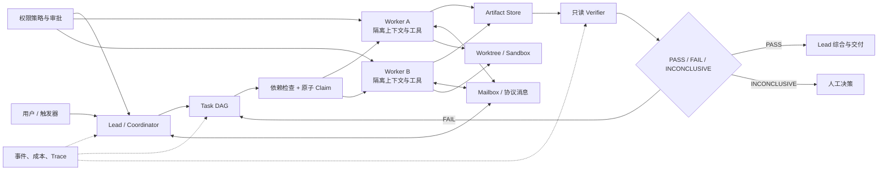

# 第 16 章：多 Agent、任务系统与团队协作

> 本章目标：学会判断何时值得引入多 Agent，并把多 Agent 从“多个模型同时说话”落实为任务图、委派契约、隔离边界、通信协议、工作区和独立验证。读完后，你应该能设计 Lead、Worker、Verifier 的职责，能实现带依赖和原子认领的任务 DAG，能解释权限冒泡、Mailbox、Worktree 与生命周期的生产约束，也能识别团队规模扩大后出现的协调失败。

## 16.1 学习目标与边界

本章讨论的是**一个目标怎样由多个有边界的执行单元协作完成**。这里的 Agent 可以是独立进程、同一进程中的隔离运行、远程执行器，也可以是通过工具调用派生的短生命周期子 Agent。物理上是否“多进程”不是定义关键，关键是它是否拥有独立的任务、上下文、工具与生命周期。

本章不把以下内容混在一起：

- 多模型路由决定一次调用使用哪个模型，第 5 章负责。
- 会话、检查点和上下文构造由第 6 章负责，本章只定义父子 Agent 的交接包。
- A2A 等互操作标准由第 12 章负责，本章聚焦团队内部协议语义。
- 后台任务与队列韧性由第 14 章负责，本章只处理协作中的并发和取消。
- Loop 的停止、验证和人的控制权由第 15 章负责，本章把这些原则落实到团队拓扑。
- 系统性评测由第 17 章负责；本章只说明多 Agent 机制应该怎样测试和验收。

多 Agent 不是默认升级路线。单 Agent 加确定性代码、清晰工具和外部任务状态通常更便宜、更容易调试。只有当分工带来的收益超过通信、重复上下文、结果合并和权限治理成本时，多 Agent 才成立。

## 16.2 何时真的需要多 Agent

### 16.2.1 四类成立条件

引入多 Agent 通常至少满足下面一类条件。

| 条件 | 单 Agent 的瓶颈 | 多 Agent 的收益 |
| --- | --- | --- |
| 可并行的独立子问题 | 串行调研耗时过长 | 并行检索、实验或方案比较 |
| 需要不同认知角色 | 实现者容易确认自己的方案 | Writer、Executor、Verifier 相互制衡 |
| 上下文互相污染 | 一个长上下文混合多个领域与中间噪声 | 每个 Worker 只看到局部任务和必要证据 |
| 权限与环境必须隔离 | 同一主体拥有过多工具或修改范围 | 按角色下放最小权限，并隔离工作区 |

还可以用一个更严格的决策式来检查：

```text
值得拆分，当且仅当：

并行收益 + 专业化收益 + 隔离收益 + 独立验证收益
>
模型调用成本 + 交接成本 + 重复探索成本 + 合并成本 + 风险增量
```

这里的收益不能只用“生成得更快”衡量。三个 Agent 同时读同一批文件，可能只是把 token 成本乘以三；三个 Worker 分别处理互不重叠的模块，并由 Lead 统一综合，才可能产生有效并行。

### 16.2.2 不该拆的情况

以下任务通常先留在单 Agent：

- 一次工具调用就能确定性完成的操作。
- 强顺序依赖、每一步都需要上一步完整结果的短流程。
- 任务边界无法写清，拆分后仍需要共享几乎全部上下文。
- 修改集中在同一小段代码，并行编辑会提高冲突率。
- 没有可靠的合并标准，也没有人或 Verifier 能判断哪个结果更好。
- 数据敏感，额外复制到子上下文会扩大泄露面。

多 Agent 也不能替代普通程序。依赖检查、原子认领、超时、权限判定和结果去重应由确定性运行时完成，不应让模型在自然语言里反复协商。

## 16.3 团队拓扑：先选协作结构，再选 Agent 数量

### 16.3.1 父子委派

Lead 派生一个或多个短生命周期 Subagent，子 Agent 返回结果后结束。它适合检索、局部代码分析和独立验证。

```text
Lead -> Subagent A -> report
     -> Subagent B -> report
     -> synthesis -> user
```

Lead 持有全局目标和最终责任，Subagent 不需要了解团队全部历史。Hermes 的委派机制进一步表明，子 Agent 应有独立迭代预算、中断传播和递归深度限制；“调用一个 Agent 工具”背后其实是一段受约束的嵌套运行。

### 16.3.2 Supervisor / Coordinator

Coordinator 持续观察共享状态，把工作路由给专业 Worker，再综合结果。它适合任务类型不同、需要动态选择执行者的流程。

Coordinator 必须保留三个不可外包的职责：

1. 维护全局目标、约束和完成定义。
2. 解决 Worker 结论冲突，形成单一决策。
3. 对最终交付和风险说明负责。

如果 Coordinator 只把 Worker 文本拼接起来，它不是协调者，只是消息转发器。

### 16.3.3 Pipeline 与图式协作

Writer -> Reviewer -> Reviser 这类链式流程适合交付物逐步变换。LangGraph 一类图式编排把角色实现为节点，把状态迁移和条件边显式化。它的优势是可恢复、可观测和可测试；缺点是流程变化需要维护图与状态模式。

### 16.3.4 Peer / Swarm

多个平级 Worker 从共享 TaskList 自主认领任务，通过 Mailbox 协作。它适合任务池动态变化、Worker 能力相近且工作项边界清楚的场景。

去中心化不等于没有控制面。可靠 Swarm 至少仍需要：

- 共享任务图和原子 claim。
- 身份、角色和权限边界。
- 消息去重、超时与关闭协议。
- 并发上限和成本预算。
- Lead 或外部机制负责最终收敛。

生产系统常采用混合拓扑：Lead 管全局，专业 Worker 从任务图认领，关键结果再交给独立 Verifier。

## 16.4 Todo 不是 Task DAG

Todo 是某个执行者的注意力清单，Task DAG 是多个执行者共享的调度状态。两者不能只靠增加几个字段就混成同一概念。

| 对比项 | Todo | Task DAG |
| --- | --- | --- |
| 主要用途 | 维持当前执行焦点 | 表达工作、依赖和所有权 |
| 典型作用域 | 单次运行或单个 Agent | 跨 Agent、跨运行 |
| 依赖关系 | 通常没有 | `blocked_by` / `blocks` |
| 并发认领 | 不需要 | 必须原子化 |
| 持久化要求 | 可选 | 生产环境通常必须 |
| 失败语义 | 重新写清单即可 | 影响下游解锁、重试和补偿 |

### 16.4.1 任务记录

一个最小任务节点可以表示为：

```yaml
id: task-17
title: 为认证模块补回归测试
description: 覆盖过期 token 和重复刷新
status: pending          # pending / in_progress / awaiting_verification / completed / failed / cancelled
owner: null
blocked_by: [task-12]
blocks: [task-21]
scope:
  paths: [src/auth, tests/auth]
required_actions: [file.read, test.write, test.run]
acceptance:
  - 新测试能在旧实现上失败
  - 修复后相关测试通过
artifacts: []
attempt: 0
lease_until: null
lease_epoch: 0
fencing_token_hash: null
revision: 4
```

`description` 说明做什么，`acceptance` 说明怎样算完成。只有标题而没有验收条件的任务，无法可靠委派。

### 16.4.2 状态机与依赖不变量

最小状态迁移是：

```text
pending -> in_progress -> awaiting_verification -> completed
                       -> failed -> pending（受控重试）
awaiting_verification  -> failed -> pending（带验证意见重试）
pending / in_progress -> cancelled
```

运行时应守住这些不变量：

1. 只有所有 `blocked_by` 任务完成的节点才可开始。
2. 同一时刻一个任务最多有一个有效 owner。
3. 完成任务必须附带工件、证据或验收结果，不能只改状态。
4. 失败不会自动等于“可无限重试”；重试要增加 `attempt` 并受预算限制。
5. 取消和失败不会默认解锁下游；下游应显式取消、改依赖或走补偿路径。
6. DAG 必须拒绝环；依赖更新要重新执行环检测。

### 16.4.3 原子认领、租约与 fencing token

多个 Worker 同时扫描可执行任务时，必须用 compare-and-swap、数据库事务或文件锁实现原子认领。仅有过期时间仍不足以阻止旧 Worker：旧 Worker 可能经历长暂停，恢复时继续提交结果，而调度器已经把任务重派给新 Worker。系统还需要单调递增的 `lease_epoch`，并为每次认领签发绑定任务、owner 和 epoch 的 fencing token。

```python
def claim(task_id, worker_id, expected_revision):
    with transaction():
        task = load_for_update(task_id)
        assert task.revision == expected_revision
        assert task.status == "pending"
        assert task.owner is None
        assert all(load(dep).status == "completed"
                   for dep in task.blocked_by)

        task.status = "in_progress"
        task.owner = worker_id
        task.lease_epoch += 1
        task.lease_until = now() + CLAIM_TTL
        token = issue_fencing_token(
            task_id=task.id,
            owner=worker_id,
            lease_epoch=task.lease_epoch,
        )
        task.fencing_token_hash = hash_token(token)
        task.revision += 1
        save(task)
        return Lease(task.id, worker_id, task.lease_epoch, token)
```

续租只延长 `lease_until`，不会增加 epoch；释放后重新认领或重派才增加 epoch。所有会改变权威结果的入口都要校验 token，而不只在 `claim` 时检查：

```python
def assert_current_lease(task, worker_id, lease_epoch, token):
    assert task.owner == worker_id
    assert task.lease_epoch == lease_epoch
    assert task.lease_until > now()
    assert constant_time_equal(task.fencing_token_hash, hash_token(token))


def commit_artifact(task_id, worker_id, lease_epoch, token, blob_ref):
    with transaction():
        task = load_for_update(task_id)
        assert_current_lease(task, worker_id, lease_epoch, token)
        artifact_store.attach(
            task_id, blob_ref,
            fencing={"lease_epoch": lease_epoch, "owner": worker_id},
        )


def transition_task(task_id, worker_id, lease_epoch, token, next_status):
    with transaction():
        task = load_for_update(task_id)
        assert_current_lease(task, worker_id, lease_epoch, token)
        assert allowed_transition(task.status, next_status)
        task.status = next_status
        task.revision += 1
        save(task)


def perform_side_effect(lease, action, resource, payload):
    task = load_task(lease.task_id)
    assert_current_lease(
        task, lease.owner, lease.epoch, lease.token
    )
    authorize(lease.owner, action, resource)
    # 权威资源必须拒绝低于其已见最大 epoch 的请求。
    return resource_proxy.execute(
        action=action,
        resource=resource,
        payload=payload,
        fencing_token=lease.token,
        lease_epoch=lease.epoch,
        idempotency_key=(lease.task_id, action, stable_hash(payload)),
    )
```

大对象可以先上传到临时 blob 区，但把它挂接为任务工件时必须验证当前 token；否则旧 Worker 仍能污染权威工件列表。状态更新和 ActionLog 提交同样要携带 epoch。外部数据库、队列或资源代理只有在保存“已见最大 epoch”并拒绝更小 epoch 时，才能提供真正的 fencing。若第三方 API 不支持 fencing，运行时只能通过一个串行化的权威代理、幂等键和事后对账降低风险，不能宣称已经消除旧请求晚到的问题。

租约过期后也不能立刻重做有副作用的动作。调度器先查看 ActionLog、工件和外部系统状态，判断上次执行是失败、成功未回报，还是仍在运行；重派产生更高 epoch 后，旧 Worker 的工件提交、状态迁移和资源写入都必须被拒绝。

## 16.5 委派是一份可验证契约

模糊指令“你去看看认证模块”会产生难以综合的散文。一个可用的委派包至少包含：

```yaml
task_id: task-17
goal: 找出 token 刷新竞态的根因
scope:
  include: [src/auth, tests/auth]
  exclude: [migrations, billing]
context:
  decisions: [不改变公开 API]
  evidence_refs: [artifact://trace-23]
permissions:
  actions: [file.read, search.query, test.run]
  resource_scopes:
    file.read: [repo://src/auth/**, repo://tests/auth/**]
    search.query: [index://project-docs]
    test.run: [suite://tests/auth]
  conditions:
    network: denied
    approval: inherited
budget:
  max_turns: 18
  deadline_s: 600
output_schema:
  status: success | blocked | failed
  findings: list
  evidence: list
  uncertainty: list
  recommended_next_step: string
acceptance:
  - 每个结论包含文件路径或可复现实验
```

委派时要区分四种内容：

- **任务事实**：目标、约束、输入工件和验收标准。
- **必要背景**：已经确认的决策与来源，不是父上下文全文。
- **能力边界**：工具、路径、网络、密钥和审批策略。
- **返回协议**：状态、证据、不确定性和资源用量。

父 Agent 应保存委派时的输入清单和版本。否则子 Agent 返回后，Lead 无法判断它基于的是当前代码还是旧快照。

## 16.6 隔离：多 Agent 的核心机制

“干净上下文”只是隔离的一层。生产系统至少要考虑七个轴。

| 隔离轴 | 要隔离什么 | 典型机制 |
| --- | --- | --- |
| 身份 | 谁执行、代表谁审批 | `agent_id`、角色、租户与会话标签 |
| 上下文 | 任务相关输入和历史 | 独立消息链、context manifest |
| 状态 | 局部进度和临时判断 | 独立 checkpoint、带版本交接包 |
| 工具 | 能调用哪些能力 | 按角色组装工具池 |
| 权限 | 哪些副作用可自动执行 | 能力令牌、路径规则、审批代理 |
| 文件系统 | 修改和构建产物 | 沙箱、容器、临时目录、worktree |
| 生命周期 | 取消、超时和资源回收 | 独立预算、AbortController、租约 |

### 16.6.1 继承与隔离的平衡

子 Agent 不应从零开始，也不应复制父 Agent 的全部世界。可继承的通常是不可变系统策略、任务目标、确认过的项目规则和必要证据；应隔离的是父 Agent 的冗长探索、中间猜测、无关工具结果和不属于子任务的密钥。

Fork 模式可以共享较长前缀，利用 Prompt Cache 并保留共同背景，但要防止递归 Fork 和过期上下文扩散。标准 Subagent 更适合重新构造小而明确的上下文。

### 16.6.2 分开计算动作能力与资源 scope

工具动作和资源 scope 是异质对象，不能把 `read`、路径、网络范围和运行时策略放进一个集合直接求交。运行时先计算父 Agent 允许继续委派的动作，再对每个动作收窄资源范围：

```text
delegable_actions
= parent.delegable_actions
∩ role.allowed_actions
∩ task.required_actions
∩ runtime_policy.allowed_actions

resource_scope[action]
= narrow(
    parent.resource_scope[action],
    role.resource_scope[action],
    task.resource_scope[action],
    runtime_policy.resource_scope[action]
  )

authorize(action, resource)
= action in delegable_actions
  and resource_matches(resource, resource_scope[action])
  and conditions_hold(action, resource)
```

`narrow` 按资源类型实现：文件用规范化路径与 glob 包含关系，数据库用租户、实例、schema 和表，网络用目标域、端口和方法，消息工具用账号、渠道和收件人。最终授权对象是 `(action, resource)`，还可以绑定次数、金额、时间、任务、Agent、lease epoch 和是否需要审批。

子 Agent 不能因为“是专业角色”获得父 Agent 没有或不允许继续委派的动作。能力令牌应绑定 Agent、task、动作、资源 scope、条件、到期时间和 lease epoch，不能只写一个宽泛的工具名。遇到需要审批的操作时，可以把请求冒泡给 Lead，再由 Lead 向用户呈现。冒泡请求必须包含规范化后的 action、resource、参数摘要、风险和等待截止时间，审批结果要绑定请求 ID 和资源，防止把一次文件授权复用到另一路径或另一类动作。

## 16.7 通信协议：把控制消息和工作证据分开

### 16.7.1 共享状态与 Mailbox

多 Agent 常用两类通信：

| 方式 | 优点 | 风险 | 适用场景 |
| --- | --- | --- | --- |
| 共享状态 | 所有人看到同一任务图，易于调度 | 并发覆盖、字段污染、权限越界 | Task DAG、图式工作流 |
| 消息协议 | 因果和交接更明确，适合异步 | 重复、乱序、丢失、等待 | Worker 报告、审批、关闭 |

成熟系统通常混合使用：任务可执行性由共享状态决定，协作说明和控制请求走 Mailbox。Harness Engineering 对 Teams 的分析说明，文件型 Mailbox 虽然延迟高于 RPC，却具有可持久化、崩溃后可检查和跨进程简单的优点；低延迟场景可以再增加进程内队列或本地 Socket，但不改变上层协议。

### 16.7.2 消息信封

不要让协议只传一段文本。最小信封可以是：

```json
{
  "message_id": "msg-882",
  "protocol_version": 1,
  "team_id": "team-auth",
  "from": "worker-test",
  "to": "lead",
  "type": "task_result",
  "correlation_id": "task-17",
  "reply_to": "msg-801",
  "sent_at": "2026-07-17T09:30:00Z",
  "expires_at": "2026-07-17T10:00:00Z",
  "payload": {
    "status": "success",
    "summary": "复现刷新竞态并补充失败测试",
    "artifacts": ["worktree://worker-test/tests/auth/test_refresh.py"],
    "evidence": ["artifact://test-run-44"]
  }
}
```

消费端应按 `message_id` 去重，按 `correlation_id` 聚合，同一请求只接受协议允许的响应类型。`shutdown_request`、`shutdown_response`、`permission_request`、`permission_response`、`task_result` 和 `idle` 应是不同消息类型，不能靠模型猜一段话是在聊天还是在控制生命周期。

### 16.7.3 四步请求协议

一个有状态请求可以抽象为：

```text
request_created -> request_sent -> response_received -> request_resolved
                                  -> timeout / rejected
```

发送方保存请求状态，接收方返回 `reply_to`，Lead 校验响应类型和发送者。超时后迟到的响应不能自动改变已经回滚或重派的任务。

### 16.7.4 交接报告不是完整 transcript

Worker 应返回结论、证据、工件、不确定性和未完成项。完整 transcript 可以归档供审计，但不应默认注入 Lead 上下文。这样既降低上下文污染，也减少 Prompt Injection 从工具结果跨 Agent 传播的机会。

## 16.8 并发、生命周期与收敛

### 16.8.1 并行必须受任务图约束

只有同时满足以下条件的任务才适合并行：

- 依赖已经完成。
- 写集合不冲突，或冲突可被确定性合并。
- 不竞争同一个独占外部资源。
- 各任务有独立验收条件。
- Lead 有足够预算综合所有结果。

`claw0` 的命名 lane 提供了一个可迁移思路：按资源或会话建立并发 lane，每个 lane 设置上限；重启时用 generation 让旧任务不能继续泵送新工作。多 Agent 调度同样需要全局上限、每角色上限和每资源上限。

### 16.8.2 Worker 生命周期

一个持续工作的队友可以使用：

```text
SPAWNING -> WORKING -> REPORTING -> IDLE
                     -> FAILED
IDLE -> WORKING（认领新任务）
IDLE / WORKING -> DRAINING -> STOPPED
```

Idle 不是完成，也不是断线。Worker 空闲后可以扫描任务图，但要采用事件通知或有退避的轮询，避免所有 Worker 高频读取同一目录。关闭应先停止认领新任务，再完成或释放当前任务，发送 summary，最后回收进程、锁、临时目录和凭据。

### 16.8.3 取消传播

前台子 Agent 通常随父运行取消；显式后台任务可以拥有独立生命周期，但必须在用户界面和状态中可见。取消传播应明确：

- 父任务取消时哪些子任务一起取消。
- 哪些已提交副作用不能撤销，只能补偿。
- 哪些后台 Worker 继续运行，结果投递给谁。
- 多久后强制终止，以及怎样标记未确认状态。

### 16.8.4 收敛信号

团队不能以“所有 Agent 都停止说话”作为完成条件。完成至少要求：

1. 目标任务处于可接受终态。
2. 验收条件有证据。
3. 未解决冲突和阻塞被显式列出。
4. 关键副作用的状态已确认。
5. Lead 完成综合，Verifier 给出判定或剩余风险。

## 16.9 Worktree：隔离修改，不隔离一切

Git Worktree 为每个修改型 Agent 提供独立目录和分支，同时共享对象数据库。它适合并行实现、方案实验和在干净基线上的验证。

### 16.9.1 最小生命周期

```text
task claimed
  -> validate branch/worktree name
  -> create worktree at recorded base commit
  -> run Worker with cwd fixed to worktree
  -> collect diff, commits, tests and artifacts
  -> review / merge / reject
  -> remove clean worktree or preserve changed worktree
```

任务记录应保存 `base_commit`、worktree 路径、分支、owner 和清理状态。Worker 返回结果时，Lead 要检查它相对哪个基线产生；如果主分支已变化，需要重新基线化和再验证。

### 16.9.2 Worktree 解决与不解决的问题

它能隔离已跟踪文件的修改，却不会自动隔离：

- 数据库、消息队列和第三方测试账号。
- 端口、浏览器 profile、缓存和临时目录。
- 依赖安装产物和全局工具配置。
- 环境变量、密钥和云资源。
- 两个方案最后合并时的语义冲突。

因此完整隔离还需要任务级环境命名空间，例如独立端口、临时 home、数据库 schema 和资源标签。Worktree 不是安全沙箱，危险命令仍要经过权限系统。

### 16.9.3 不覆盖用户已有修改

创建和回收 worktree 前要检查工作区状态。Lead 不应为“获得干净基线”而重置用户改动；更不能让 Worker 在不知情时覆盖其他 Agent 的分支。合并前应展示来源分支、diff、测试结果和冲突处理结论。

## 16.10 Verifier：独立检查不是另一个意见

Verifier 的价值来自**角色、上下文和权限上的独立性**。让实现者在同一上下文里补一句“再检查一下”，只是自我反思，不是独立验证。

Verifier 应具备：

- 只读工具或独立干净工作区。
- 明确的验收标准和风险清单。
- 实现者的交付物与必要证据，但不默认继承其完整推理。
- 找问题优先、证据优先的输出协议。
- `PASS / FAIL / INCONCLUSIVE` 三态，而不是被迫二选一。

```yaml
verdict: FAIL
findings:
  - severity: high
    claim: 过期 token 场景仍会重复提交刷新请求
    evidence: tests/auth/test_refresh.py::test_expired_race
remaining_risks:
  - 尚未在真实 Redis 后端验证锁超时
```

Verifier 不能只看最终文本。代码任务要运行测试、检查 diff 和工作区；研究任务要抽样回到来源；数据任务要重算指标。验证失败后由 Lead 决定修复、重派还是向用户暴露不确定性，不能让 Verifier 悄悄改实现后再自我通过。

## 16.11 最小实现：一个可恢复的 Lead / Worker 调度器

第一版可以只支持一种拓扑：Lead 创建 DAG，Worker 认领，Verifier 检查。不要一开始同时实现递归 Subagent、去中心化 Swarm 和远程团队。

```python
def scheduler_tick(team_id):
    expire_dead_leases(team_id)

    for worker in idle_workers(team_id):
        task = find_runnable_task(
            team_id=team_id,
            actions=worker.delegable_actions,
            resource_scopes=worker.resource_scopes,
            exclude_conflicting_scopes=True,
        )
        if not task:
            continue

        lease = compare_and_swap_claim(
            task.id, worker.id, expected_revision=task.revision
        )
        if lease:
            send(worker, make_delegation_packet(task, lease))


def consume_result(message):
    assert dedupe(message.message_id)
    assert message.type == "task_result"

    task = load_task(message.correlation_id)
    lease = message.payload["lease"]
    assert_current_lease(
        task, message.from_, lease.epoch, lease.fencing_token
    )
    for blob_ref in message.payload["artifacts"]:
        commit_artifact(
            task.id, message.from_, lease.epoch,
            lease.fencing_token, blob_ref,
        )

    if message.payload["status"] == "success":
        transition_task(
            task.id, message.from_, lease.epoch,
            lease.fencing_token, "awaiting_verification",
        )
        dispatch_verifier(
            task.id,
            expected_revision=task.revision + 1,
            expected_lease_epoch=lease.epoch,
        )
    else:
        transition_task(
            task.id, message.from_, lease.epoch,
            lease.fencing_token, "failed",
        )
        record_failure(task.id, lease.epoch, message.payload)


def consume_verdict(verdict):
    # Verifier 不持有 Worker token。调度器在事务内同时校验
    # expected revision、当前 lease epoch 和 awaiting_verification 状态，
    # 然后撤销该 lease，再完成或重开任务。
    apply_verdict_as_scheduler(
        verdict,
        expected_revision=verdict.task_revision,
        expected_lease_epoch=verdict.lease_epoch,
    )
```

持久层至少包含 TaskStore、MessageStore、ArtifactStore 和 ActionLog。模型只生成任务内容、局部方案和报告；状态迁移、去重、认领、依赖解锁和权限计算由代码完成。Worker 发起的所有提交验证当前 fencing token；调度器和人工恢复路径不复用 Worker token，而是在事务中校验 expected revision 与 lease epoch、撤销旧 lease 并写入审计事件。

## 16.12 生产约束与不变量

### 16.12.1 必须守住的不变量

1. 每个任务只有一个权威状态和 revision。
2. 每次认领是原子的；重派递增 lease epoch，旧 epoch 的工件提交、状态更新和副作用都被权威存储或资源代理拒绝。
3. 运行时分别收窄可委派动作与每个动作的资源 scope，并对 `(action, resource)` 授权。
4. 控制消息有类型、ID、关联 ID、过期时间和去重记录。
5. 所有工件都记录来源 Agent、任务、基线版本和校验信息。
6. Lead 保留全局综合责任，Verifier 不修改被验证对象。
7. 并发受全局、角色、资源和成本四类上限约束。
8. Worktree、进程、锁、端口和临时凭据都有所有者与清理策略。
9. 团队记忆不能绕过来源、权限和晋升规则直接写入全局事实。
10. 团队完成由验收证据决定，不由消息数量或 Agent 自报决定。

### 16.12.2 成本与容量

至少记录每个任务的模型调用、输入输出 token、工具次数、运行时长、重试、消息量和工件大小。调度器应支持：

- 最大活跃 Worker 数。
- 每任务最大轮次和墙钟时间。
- 每团队 token 与费用预算。
- Mailbox 大小和广播限制。
- 同一作用域的并发写限制。
- 达到预算后的降级、暂停或请求确认。

### 16.12.3 隐私与信任边界

子上下文也是数据复制。交接前应按最小披露原则筛选，敏感字段使用引用或能力令牌，而不是把真实密钥写进 Prompt。第三方 Agent、远程执行器和跨租户团队要有更强隔离，消息和工件需要来源标签，不能因为来自“队友”就自动可信。

## 16.13 典型失败模式

| 失败模式 | 表现 | 根因 | 防护 |
| --- | --- | --- | --- |
| 过度拆分 | 消息比有效工作多 | 任务粒度太小 | 以独立验收和低共享上下文为拆分条件 |
| 虚假并行 | 多人重复读同一材料 | 没有范围分片 | 委派包声明 include/exclude 和交付物 |
| Lead 失去全局 | 直接拼接 Worker 输出 | 综合责任未定义 | Lead 维护决策表和冲突清单 |
| 重复认领 | 两个 Worker 修改同一任务 | claim 非原子 | CAS、锁或事务 |
| 过期 Worker 晚到 | 旧 Worker 在重派后提交工件或副作用 | 只有 TTL，没有 fencing | 单调 lease epoch，所有提交点和权威资源拒绝旧 token |
| 相互等待 | A 等 B 消息，B 等 A 任务 | 协议无超时或 DAG 成环 | 环检测、超时、等待图诊断 |
| 权限死锁 | Worker 永久等待 Lead 审批 | Lead 不在线或请求丢失 | 持久请求、截止时间、拒绝默认 |
| 权限放大 | 子 Agent 对错误资源执行了允许动作 | 把动作、路径和策略混成一个集合 | 分别收窄动作与资源 scope，对 `(action, resource)` 授权 |
| 上下文串扰 | A 的私密信息进入 B | 全量复制父 transcript | 最小交接包和安全标签 |
| 消息风暴 | 广播和 idle 通知淹没 Lead | 无背压与摘要 | 限流、聚合、优先级和容量上限 |
| 僵尸 Worker | 父任务结束后仍写入 | 取消传播和 generation 缺失 | 租约、代次、关闭协议 |
| Worktree 假隔离 | 文件没冲突但共享数据库互相污染 | 只隔离 Git 文件 | 端口、home、DB、账号一起命名空间化 |
| 验证同源偏差 | Verifier 重复实现者结论 | 共享了完整推理或可写环境 | 独立输入、只读工具、三态判定 |
| 团队记忆污染 | 一次错误经验影响所有人 | 未经验证直接巩固 | 候选、验证、晋升和回滚 |

## 16.14 测试与验收

### 16.14.1 确定性机制测试

| 测试 | 验收条件 |
| --- | --- |
| DAG 环检测 | 任意新增依赖形成环时事务失败 |
| 依赖解锁 | 仅当所有 blocker 完成后任务可认领 |
| 并发认领 | N 个 Worker 同时 claim，最多一个成功 |
| Fencing 竞争 | 暂停的旧 Worker 在新 Worker 认领后恢复；旧 epoch 的工件、状态和副作用全部被拒绝 |
| 租约恢复 | Worker 崩溃后任务可诊断、递增 epoch 后重派或人工接管，不重复已确认副作用 |
| 消息去重 | 同一 `message_id` 重放不会重复完成任务 |
| 响应匹配 | 错误发送者、错误类型和过期响应被拒绝 |
| 权限与 scope | 允许 `file.read` 不代表可读任意路径；每个 `(action, resource)` 都经过规范化与 scope 检查 |
| 取消传播 | 前台父任务取消后子 Agent、工具和锁达到预期终态 |
| Worktree 清理 | 无改动自动清理，有改动保留并返回准确元数据 |

### 16.14.2 行为验收场景

准备一个包含三个独立模块和一个共享接口的代码任务：两个 Worker 并行修改独立模块，第三个任务在二者完成后更新共享接口，Verifier 最后运行测试并检查范围。验收应同时满足：

1. 并行只发生在无依赖且写集合不冲突的任务之间。
2. Worker 只读取和修改委派范围。
3. 所有结果带工件、基线和测试证据。
4. 任一 Worker 失败不会错误解锁下游。
5. Verifier 在独立环境中复验，不复用实现者自报结果。
6. Lead 能解释最终采用了哪些结果、拒绝了哪些结果以及剩余风险。

### 16.14.3 故障注入

至少注入消息重复、Mailbox 暂时不可写、Worker 进程崩溃、Lead 审批超时、主分支在执行中前进、测试资源冲突和关闭时仍有未决任务。只在顺利路径上演示成功，不足以证明团队系统可靠。

## 16.15 与相邻章节的接口

| 输入或输出 | 本章约定 | 相邻章节 |
| --- | --- | --- |
| 父子上下文 | 使用最小交接包和 context manifest | 第 6 章负责构造与恢复 |
| 团队内部协议 | 定义消息语义、状态和幂等 | 第 12 章负责跨产品互操作标准 |
| 长任务调度 | 任务 DAG 提供工作依赖 | 第 14 章负责队列、Cron 和投递韧性 |
| 完成与停止 | Lead 和 Verifier提供团队收敛证据 | 第 15 章负责 Loop 的停止与人类控制 |
| 质量数据 | 保存任务、轨迹、判定与资源指标 | 第 17 章负责离线和线上评测 |
| 经验沉淀 | 只提交候选经验，不直接改全局能力 | 第 18 章负责自进化闭环 |

## 16.16 系统地图



这张图有两个控制中心：Task DAG 决定“谁现在可以做什么”，权限策略决定“允许做到什么程度”。Mailbox 负责控制与交接，Artifact Store 负责保存工作证据，Verifier 不进入实现路径，而是在独立边界上给出判定。

## 16.17 共同结论

九个来源从不同层面指向同一个工程结论。`learn-claude-code` 和 Harness Engineering 给出 TaskList、Claim、Mailbox、Team 与 Worktree 的运行时结构；Hermes 强调委派预算、中断、深度和认知隔离；Alice 说明角色、并发、二次审查和收敛信号；Claude Code 分析补充进程内上下文与权限实现；`easy-langent` 展示 Supervisor、Sequence、Peer 和并行状态合并；`claw0` 提供 lane 与 generation；Hello-Agents 和 `hello-claw` 则展示框架级与产品级团队案例。

可以把本章压缩为八条结论：

1. 多 Agent 的成立条件是分工收益大于协调成本，不是 Agent 数量更多。
2. Task DAG 是调度内核；原子认领、单调 lease epoch 和 fencing token 共同阻止旧 Worker 晚到提交。
3. 委派要交付目标、范围、权限、预算、输出协议和验收条件。
4. 隔离包括身份、上下文、状态、工具、权限、文件系统和生命周期。
5. Worker 权限要分别收窄可委派动作和每个动作的资源 scope，并对 `(action, resource)` 授权。
6. Worktree 隔离文件修改，但仍需隔离端口、数据库、账号、缓存和密钥。
7. Lead 负责全局综合，Verifier 负责独立判定，两者都不能被结果拼接替代。
8. 团队完成必须由可验证工件和明确终态证明。

## 16.18 本章自检

1. 什么条件下增加一个 Subagent 的收益会超过它的上下文和通信成本？
2. Todo 与 Task DAG 在作用域、依赖和并发语义上有什么根本差别？
3. 为什么任务认领既需要原子化，也需要 lease epoch 和 fencing token？哪些提交点必须校验？
4. 一份完整委派包必须包含哪些字段？
5. 为什么不能把工具动作、文件路径和网络 scope 放进同一个集合求交？
6. 共享状态和 Mailbox 各自应该承载什么？
7. Worktree 没有隔离哪些常见资源？
8. Verifier 与实现者的“自我检查”有什么结构性差别？
9. 团队系统怎样证明自己已经收敛，而不是暂时没有新消息？

## 16.19 开放性问题

1. 能否根据共享上下文比例、写集合重叠率和验收独立性，自动建议任务是否值得拆分？
2. 当两个高质量 Worker 给出互斥结论时，Lead 应请求第三方验证、做实验，还是把分歧交给用户？决策阈值怎样设定？
3. 去中心化 Swarm 中，谁有权修改任务 DAG 本身，怎样防止 Worker 为方便自己而重写依赖？
4. 任务租约与真实外部副作用之间怎样建立通用的 exactly-once 或补偿语义？
5. Mailbox 中哪些消息应该长期留存，哪些应该聚合或删除，才能同时满足审计和隐私？
6. Verifier 使用相同基础模型时，角色独立能在多大程度上抵消同源偏差？
7. Worktree、容器和远程沙箱应怎样组合，才能在成本、启动速度与隔离强度之间取得平衡？
8. 团队共享记忆如何避免错误经验快速扩散，同时仍让有效经验跨 Worker 复用？
9. 多 Agent 的边际收益应该用完成率、延迟、成本、风险还是人的监督负担来优化？这些目标冲突时谁拥有最终权重？

## 16.20 原文入口

### 本地来源

- [learn-claude-code：Subagent](../../source/learn-claude-code/s06_subagent/README.md)
- [learn-claude-code：Task System](../../source/learn-claude-code/s12_task_system/README.md)
- [learn-claude-code：Agent Teams](../../source/learn-claude-code/s15_agent_teams/README.md)
- [learn-claude-code：Team Protocols](../../source/learn-claude-code/s16_team_protocols/README.md)
- [learn-claude-code：Autonomous Agents](../../source/learn-claude-code/s17_autonomous_agents/README.md)
- [learn-claude-code：Worktree Isolation](../../source/learn-claude-code/s18_worktree_isolation/README.md)
- [Alice 方法论：多 Agent 协作](../../source/Alice_methodology/chapters/06-multi-agent.md)
- [Alice 博客：一个人的公司，11 个人的团队](../../source/Alice_methodology/blog/blog-05-multi-agent.md)
- [Hermes：子代理与委托](../../source/hermes-book/src/part3/ch09-delegation.md)
- [Harness Engineering：Agent 派生与编排](../../source/harness-engineering-from-cc-to-ai-coding/book/src/part6/ch20.md)
- [Harness Engineering：Teams 与多进程协作](../../source/harness-engineering-from-cc-to-ai-coding/book/src/part6/ch20b.md)
- [Claude Code 分析：Multi-Agent 机制](../../source/claude-code-analysis/analysis/04h-multi-agent.md)
- [easy-langent：LangGraph 多智能体](../../source/easy-langent/docs/guide/chapter7.md)
- [Hello-Agents：框架开发实践](../../source/hello-agents/docs/chapter6/第六章%20框架开发实践.md)
- [Hello-Agents：自动化深度研究智能体](../../source/hello-agents/docs/chapter14/第十四章%20自动化深度研究智能体.md)
- [hello-claw：一人公司实战](../../source/hello-claw/docs/cn/university/one-person-company/index.md)
- [claw0：Gateway 与多 Agent 路由](../../source/claw0/sessions/zh/s05_gateway_routing.md)
- [claw0：并发 lane](../../source/claw0/sessions/zh/s10_concurrency.md)
