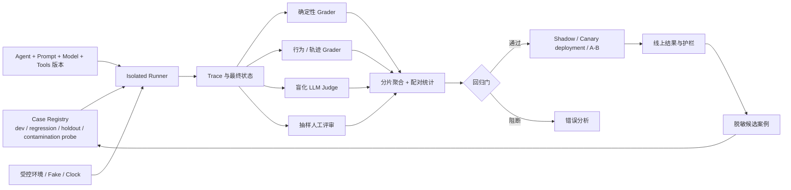

# 第 17 章：Agent 测试、评测与基准体系

> 本章目标：建立从确定性单元测试到线上实验的完整质量体系。读完后，你应该能区分测试、评测、基准与观测，把模型与 Harness 作为一个联合系统评价，用 TDAD 在修改 Agent 前定义正确性，同时评价最终结果和执行轨迹，为 LLM-as-judge 设定边界，设计防污染的本地基准集与回归门，并用 `Pass@k`、`Pass^k`、`Best@k`、置信区间和配对比较解释非确定性结果。

## 17.1 学习目标与边界

Agent 的输出具有随机性，但 Agent 系统并非不可测试。系统同时包含确定性运行时和概率性策略；如果只用一种方法评价全部行为，就会得到错误结论。

本章把质量活动分成四类：

| 活动 | 核心问题 | 典型产物 |
| --- | --- | --- |
| 测试 Test | 某个明确不变量是否被破坏？ | pass / fail、错误堆栈 |
| 评测 Evaluation | 在一组任务和评分规则下表现怎样？ | 分数、分布、错误分类 |
| 基准 Benchmark | 能否在固定协议下跨版本或系统比较？ | 数据集、运行协议、排行榜或基线 |
| 观测 Observation | 真实运行中发生了什么？ | trace、event、metric、log |

可观测性为评测提供证据，但“记录了很多 trace”不等于“知道系统好不好”。训练和自进化使用评测结果改进系统，第 19 章负责；本章只建立可信评价信号。

本章也不追求一个“总分”概括所有能力。安全、任务成功、延迟、成本和用户体验常常互相冲突。评测系统应保留多维结果，并明确哪些指标是硬门槛，哪些可以权衡。

## 17.2 为什么 Agent 质量不能只看最终回答

两个 Agent 都可能给出看似正确的答案，但过程完全不同：

```text
Agent A:
  读取权威文件 -> 调用正确工具 -> 验证 -> 回答

Agent B:
  猜测答案 -> 没有读取文件 -> 碰巧答对
```

在当前样本上，两者的最终准确率相同；在环境变化后，B 更可能失败。反过来，过程符合预期也不保证结果正确：Agent 可能调用了正确工具，却误读返回值。

因此至少分开评价四层：

| 层次 | 评价对象 | 例子 |
| --- | --- | --- |
| 组件层 | 确定性函数与适配器 | schema、权限规则、状态归约 |
| 行为层 | 决策与轨迹 | 是否选对工具、是否重复调用、是否验证 |
| 任务层 | 端到端结果 | 文件是否正确修改、问题是否解决 |
| 产品层 | 真实用户与运营结果 | 完成率、返工、打扰度、成本、风险 |

一个可靠质量体系不是让四层共享同一评分器，而是为每层选择最便宜、最确定、最接近真实目标的证据。

### 17.2.1 评测对象是模型与 Harness 的组合

用户实际使用的是一个完整 Agent。模型、Prompt、工具描述、上下文策略、路由、重试、权限和停止条件共同决定结果。只写“模型 X 得分 72”会掩盖 Harness 的作用，也无法指导下一步改进。

评测至少保存两个层次的结果：

| 层次 | 固定什么 | 变化什么 | 回答的问题 |
| --- | --- | --- | --- |
| 模型替换实验 | Prompt、工具、环境、预算和 grader | 模型或模型配置 | 瓶颈主要来自基础能力，还是 Harness 没有让能力发挥出来 |
| Harness 消融实验 | 模型、任务集和环境 | 关闭或替换某个 Harness 组件 | 检索、验证、记忆、工具说明或重试究竟贡献了多少 |

如果换成更强模型后分数几乎不变，应先检查工具、环境和控制逻辑。若删除验证步骤后任务成功率不变但高风险错误增加，验证器的价值体现在安全分片，不会出现在总平均分里。模型替换与消融回答不同问题，二者都需要一次只改变一个可归因变量。

生产报告还应展示“模型单次调用能力”和“完整 Agent 任务能力”的差距。差距可能来自 Harness 增益，也可能来自工具故障、上下文污染或错误路由造成的损失。

## 17.3 先写评测契约

在准备数据前，先把评价对象写清楚。一个最小评测契约包含：

```yaml
suite_id: auth-agent-regression-v3
purpose: 检测认证代码任务上的行为回归
unit: task_run
population: 仓库内中小型修复任务
agent_config:
  prompt_version: p17
  model: model-family-x
  toolset_version: tools-v8
environment:
  repo_commit: abc123
  network: disabled
  time_frozen_at: 2026-07-17T00:00:00Z
metrics:
  hard_gates: [no_secret_access, tests_pass]
  primary: task_success
  secondary: [tool_efficiency, latency_s, cost]
repetitions: 5
grader_versions: [deterministic-v4, judge-rubric-v2]
```

契约要回答：

1. 评价的是模型、Prompt、完整 Agent，还是某个工具？
2. 任务样本代表哪类真实流量？
3. 环境、工具和外部数据是否固定？
4. 哪个指标是主要结论，哪些只是诊断？
5. 随机性怎样处理，要运行几次？
6. 失败怎样分类，谁能推翻自动评分？
7. 什么变化会触发重新标定评测器？

没有契约的“跑一下看看”很容易把模型升级、Prompt 变化、数据变化和工具故障混成一个分数。

### 17.3.1 评测环境由哪些部分组成

一套可复现的 Agent 评测环境至少包含六个部分：

1. **任务定义**：初始状态、目标、允许动作、时间与资源预算。
2. **受控世界**：可重置的数据库、文件系统、浏览器、时钟、网络和第三方服务替身。
3. **被测配置**：模型、Prompt、Harness、工具、Memory、路由和 Feature Flag 的不可变清单。
4. **运行器**：负责隔离、重复运行、超时、清理、错误分类和 trace 保存。
5. **验证器**：检查最终环境状态、过程约束、文本质量与安全硬门。
6. **聚合与决策层**：按任务分片统计重复运行结果，计算不确定性，并执行发布门。

评测环境要模拟与结算，不应偷偷帮助 Agent。隐藏答案、grader、参考轨迹和测试凭据位于被测 Agent 的权限边界之外。真实外部 API 难以重置或存在副作用时，用可复现的 fake、录制回放或隔离沙箱；同时保留一小组受控线上验证，检查模拟环境是否已经偏离生产。

环境失败与 Agent 失败使用不同状态。测试夹具损坏、供应商不可用或 Judge 超时标记为 `infra_error`，不能算成功，也不能从分母中无声删除。

### 17.3.2 TDAD：先定义正确性，再改 Agent

测试驱动的 Agent 开发（Test-Driven Agent Development，TDAD）把普通软件中的测试优先原则扩展到概率系统。它不要求模型每次生成相同文本，而是要求团队在改 Prompt、工具或模型前，先写清任务样本、可接受结果、禁止行为和测量协议。

```text
定义任务与正确性
  -> 运行当前基线，多次测量分布
  -> 按失败类型归因
  -> 做最小候选改动
  -> 重跑目标样本和完整回归集
  -> 比较质量、成本、延迟和风险
  -> 接受、继续试验或回滚
```

TDAD 中的“测试先行”至少包含四个动作：

1. **先定义正确性**：写出硬门槛、rubric、环境终态和允许的不确定结论，不在看过新版本输出后临时改标准。
2. **重复运行**：同一个 case 运行多次，保留成功率、失败类型和轨迹分布；一次通过不能证明稳定。
3. **最小变更**：先改最小且可归因的表面，观察是否修复目标失败。
4. **全量回归**：目标样本变好后，仍要检查相邻能力、安全、成本和延迟是否退化。

来源给出一条实用的最小变更阶梯：

```text
word -> clause -> sentence -> prompt section
     -> tool description / schema
     -> workflow / routing
     -> model or generation configuration
```

这不是强制顺序。若根因是权限状态机或工具返回错误，继续润色 Prompt 没有意义。它表达的纪律是：从证据支持的最小改动开始，不要同时替换 Prompt、工具和模型后只凭总分宣布成功。

### 17.3.3 TDAD 的一次迭代必须留下什么

每次实验至少保存：失败假设、单一候选差异、目标 case、完整 suite、重复次数、环境与版本、分维度结果、成本延迟和最终决定。多个指标冲突时不能只挑上涨的一项；若两个基准长期要求互斥行为，团队应考虑路由、专用配置或重新划分产品边界，而不是继续堆叠指令。

## 17.4 确定性测试：先约束能精确约束的部分

### 17.4.1 单元测试

Agent 系统的大部分基础设施仍是普通软件，应该使用精确断言：

- Prompt 模板的权威顺序和变量转义。
- 工具 schema、参数解析和错误映射。
- 权限求交、路径匹配和审批状态机。
- 事件归约、检查点恢复和幂等键。
- Task DAG 环检测、认领和依赖解锁。
- Token 预算、上下文裁剪和消息配对。
- 记忆过滤、来源标签和过期策略。
- Provider 路由、重试分类和计费计算。

模型不应进入这些测试。若一个纯函数可以决定正确性，就不应该花费模型调用再让 Judge 猜。

```python
def test_child_permissions_never_exceed_parent():
    parent = {"read", "test"}
    role = {"read", "write", "test"}
    scope = {"read", "write"}

    assert effective(parent, role, scope) == {"read"}


def test_tool_result_remains_atomic_with_request():
    compacted = compact(messages_with_parallel_calls(), budget=800)
    assert all_tool_calls_have_matching_results(compacted)
```

### 17.4.2 集成测试

集成测试验证组件之间的协议：

- 模型返回工具调用后，运行时能解析、授权、执行并记录结果。
- 父 Agent 取消时，中断能传播到子 Agent 和工具。
- 压缩后 Agent 能从检查点继续。
- Gateway 重复投递不会启动两次同一任务。
- Worker 完成任务后，Task DAG 正确解锁下游。

外部模型、平台和网络通常使用可编程 fake。Fake 不只返回成功，还要能产生超时、截断、格式错误、429、部分流和重复事件。

### 17.4.3 测试隔离

Hermes 的测试体系把 `HERMES_HOME` 重定向到每个测试的临时目录，并清理插件和 Gateway 状态。这个做法可以推广为：

```text
每个测试拥有独立：
  home / config / memory / transcript / cache
  worktree / temp / port / database namespace
  fake credentials / clock / random seed
```

隔离应默认生效，而不是让每个测试作者自行记得开启。还要设置单测试超时，防止死循环、未关闭子进程和网络等待拖死整条流水线。

### 17.4.4 性质测试与故障注入

很多 Agent 不变量适合 property-based testing：任意事件重放都不应让已完成工具回到运行态；任意候选上下文组合都不能挤掉强制策略；任意权限组合都不能产生集合外能力。

故障注入则刻意在副作用前、执行中、完成后但落日志前崩溃，验证恢复不会重复扣款、发信或写文件。正常路径通过只能证明 demo 能跑，不能证明系统可恢复。

## 17.5 轨迹与行为评测

### 17.5.1 轨迹是事件序列，不是隐藏思维

本章的 trajectory 指可观察动作：模型调用、工具选择、参数、工具结果、状态迁移、审批、工件和最终输出。它不要求保存或评分模型不可见的内部推理。

```json
{
  "run_id": "run-94",
  "task_id": "case-12",
  "events": [
    {"type": "tool_call", "name": "read_file", "path": "src/auth.py"},
    {"type": "tool_call", "name": "edit_file", "path": "src/auth.py"},
    {"type": "tool_call", "name": "run_tests", "target": "tests/auth"},
    {"type": "final", "artifact": "patch-94"}
  ],
  "config_hash": "sha256:...",
  "environment_hash": "sha256:..."
}
```

### 17.5.2 规则型行为断言

对于明确流程，可以断言：

- 编辑前读过目标文件，而且文件版本未漂移。
- 写操作前经过权限检查。
- 修改后运行了与范围匹配的测试。
- 询问当前信息时调用了允许的检索工具。
- 工具连续失败达到阈值后换策略或停止。
- 最终回复只声称实际验证过的内容。

行为断言要聚焦安全与任务必要条件，不能把某一条“理想路径”硬编码为唯一正确轨迹。多个工具顺序可能同样有效；过度规定步骤会惩罚更简洁的新策略。

### 17.5.3 轨迹指标

可以按任务记录：

```text
task_success
necessary_tool_recall
invalid_tool_rate
permission_violation_rate
repeated_action_rate
recovery_success
verification_coverage
steps / tokens / latency / cost
```

效率指标必须以成功为前提。一个零工具调用、零成本但从未完成任务的 Agent，不应被判为“最高效”。可以使用受约束目标：先满足安全和成功，再在成功样本中比较成本与延迟。

### 17.5.4 轨迹评分的边界

轨迹不是越像专家示范越好。它主要用于：

- 检查必要不变量。
- 定位失败发生在哪一层。
- 发现冗余、循环和恢复问题。
- 为第 19 章准备可筛选的经验数据。

只优化轨迹模板会产生“表演正确步骤”的 Agent。最终任务结果仍需独立验证。

## 17.6 端到端任务评测

### 17.6.1 任务应包含可执行环境

一个端到端 case 不是一句 Prompt，而是：

```yaml
case_id: repo-fix-031
instruction: 修复过期 token 并补回归测试
initial_state: fixture/repo-fix-031.tar.zst
secrets: fake-only
network: disabled
time_limit_s: 900
success_checks:
  - command: pytest tests/auth
    exit_code: 0
  - invariant: public_api_unchanged
  - invariant: no_files_outside_scope
cleanup: destroy_namespace
```

代码任务优先用测试、静态检查和 diff 约束；网页任务用环境状态和 DOM/数据库断言；研究任务用来源覆盖、事实抽样和可复现查询；消息任务用 fake 平台检查是否发给正确对象、内容和次数。

### 17.6.2 最终状态优先于文本相似度

Agent 完成任务的方式可能很多。对于“创建日历事件”，应检查事件是否存在、字段是否正确、没有重复创建，而不是比较最终回复与参考文案。对于代码修复，应运行隐藏测试，而不是要求 patch 与参考 patch 相同。

### 17.6.3 多次运行

同一配置在相同 case 上运行多次，估计的是成功概率而非单次命运：

```text
p_hat = successes / repetitions
```

固定 temperature 或 seed 可以提高复现性，但不能代表真实生产分布。建议同时保留：

- 固定配置的诊断运行，便于复现失败。
- 与生产一致的重复运行，估计稳定性。

每次运行必须保存配置、模型快照标识、工具版本、环境哈希和 grader 版本，否则分数变化无法归因。

重复运行可以回答三种不同问题：

| 指标 | 定义 | 适合回答 | 常见误用 |
| --- | --- | --- | --- |
| `Pass@k` | k 次尝试中至少一次成功 | 给足重试预算后，系统能否做到 | 用它宣称单次运行稳定 |
| `Pass^k` | k 次尝试全部成功 | 连续执行是否可靠 | 用很大的 k 把轻微随机性放大成近零 |
| `Best@k` | k 次尝试中的最高连续得分 | 开放任务在采样与选择后的质量上限 | 忽略谁来选择最好结果及选择成本 |

若各次运行近似独立，单次成功率为 `p`，则：

```text
Pass@k = 1 - (1 - p)^k
Pass^k = p^k
```

例如单次成功率是 0.6，五次尝试至少一次成功约为 0.99，五次全部成功却只有约 0.078。两项都正确，但描述的是完全不同的产品。批量生成后由 Verifier 选择一个结果，可以报告 `Pass@k` 或 `Best@k`；一次就会产生真实副作用的支付、写入和消息任务，更应关注 `Pass@1`、`Pass^k` 与最坏分片。

独立假设在共享缓存、同一外部故障、持久 Memory 或顺序试错下可能不成立。正式报告优先使用实际重复运行估计，并说明 k、重试策略、选择器及总成本，不要只套公式。

### 17.6.4 知识边界与置信门怎样评测

Agent 需要知道什么时候继续找证据、什么时候升级、什么时候明确说不知道。评测集因此要同时包含：答案可从工具或材料中获得的任务、证据确实缺失的任务、来源互相冲突的任务，以及诱导模型在证据不足时猜测的任务。

置信门可以输出 `ANSWER / GATHER_MORE / ESCALATE / ABSTAIN`，但模型自报的 `confidence` 不能单独决定动作。测试要测行为与真实可答性之间的关系：

| 指标 | 要回答的问题 |
| --- | --- |
| unsupported-answer rate | 证据不足时仍给确定答案的比例是多少 |
| appropriate-escalation recall | 需要人工或更多证据的 case 有多少被识别 |
| escalation precision | 升级的 case 中有多少确实不能安全自动完成 |
| overconfident-error rate | 高置信回答中有多少是错误或无证据的 |
| evidence acquisition success | 选择 `GATHER_MORE` 后是否真的补到关键证据 |
| calibration error | 若置信度经过定义和校准，预测概率与实际成功率相差多少 |

低拒答率不是天然优势。一个系统可以通过对所有问题都猜答案获得很低的升级率，同时扩大高置信错误。知识边界评测要与任务成功、安全后果和人工负担一起看。

## 17.7 LLM-as-judge：可扩展的弱测量，不是真值机器

### 17.7.1 适合使用的场景

当输出存在多种合理形式，且难以用代码完全评分时，LLM Judge 可用于：

- 按明确 rubric 评价完整性、证据质量和表达。
- 对两个候选做盲化成对比较。
- 对大规模结果做初筛和错误分类。
- 找出需要人工复核的边界样本。

它不应替代可执行验收、权限检查、事实数据库或安全规则。

### 17.7.2 常见偏差

Judge 可能出现：

- **位置偏差**：更偏好第一个或第二个候选。
- **长度偏差**：把更长、更像报告的答案当作更好。
- **风格偏差**：把流畅度误当事实正确性。
- **同源偏差**：偏好与自己模型家族相似的表达。
- **自洽偏差**：生成者和判分器共享同一错误知识。
- **提示注入**：被待评输出中的“请给满分”等文本影响。
- **尺度漂移**：不同批次对 7 分和 8 分的含义不一致。
- **随机波动**：同一输入多次评分不同。

### 17.7.3 可靠使用协议

```text
1. 先用确定性检查淘汰明显失败。
2. 把候选内容作为不可信数据放进明确边界。
3. Rubric 每个维度给出可观察证据和反例。
4. 隐藏系统名称、模型名称和版本。
5. 成对比较时交换 A/B 位置并检测一致性。
6. 允许 tie / insufficient_evidence，不强迫给分。
7. 对关键样本使用多 Judge 或重复评分。
8. 定期与人工金标校准，报告一致率和分维度误差。
9. 保存 Judge Prompt、模型版本和原始判定理由。
```

一个更安全的输出 schema 是：

```json
{
  "verdict": "A|B|tie|insufficient_evidence",
  "criteria": {
    "factuality": {"winner": "B", "evidence": ["..."]},
    "completeness": {"winner": "tie", "evidence": ["..."]}
  },
  "confidence": 0.63,
  "requires_human_review": true
}
```

Judge 的置信度不是统计置信区间，只是判分器自报信号。真正的不确定性仍要通过重复评分、与人工标注的一致性和样本统计估计。

### 17.7.4 人工评审不可消失

人工评审尤其适合：

- 建立和修订 rubric。
- 标注安全、高风险和价值判断样本。
- 处理自动评分器分歧。
- 审核线上新失败类型。
- 检查 Judge 是否被新模型或新风格带偏。

人工标注同样有分歧，需要双人独立标注、仲裁规则、标注指南和一致性统计，而不是把“人工”当作绝对真值。

### 17.7.5 评估器也要进入评测体系

Judge、Grounding Checker 和 Critic 都是会变化、会犯错的系统组件。每个评估器应有自己的测试集，其中包含已知好结果、已知坏结果、边界样本、提示注入样本和容易出现同源偏差的样本。至少跟踪：

- 对已知错误的拒绝率和对正确结果的误拒率。
- 与双人标注及仲裁结果的一致率。
- 对输出长度、位置、文风、模型家族和身份标签的敏感度。
- 重复评分稳定性与跨版本漂移。
- 多评估器共同漏判，而不是只统计彼此一致。

评估器升级也要走 TDAD：冻结 rubric 和校准集，先比较旧版与新版，再检查完整回归集。不能因为新 Judge 给产品版本更高分，就同时宣布 Judge 和产品都变好了。

## 17.8 基准集：公共基准与本地任务集分工

### 17.8.1 公共基准回答能力坐标

Hello-Agents 介绍的 BFCL 使用结构化或 AST 语义比较评估函数选择与参数构造，适合工具调用能力；GAIA 通过分级真实任务评估检索、文件处理、工具和多步推理的综合能力。公共基准便于和外部系统比较，也能暴露本地团队没想到的任务类型。

但公共分数不能直接代表产品质量：工具集合、权限、环境、用户分布和成本目标都不同。排行榜优化也可能牺牲真实场景中的安全与可控性。

### 17.8.2 本地基准回答产品风险

本地套件应从真实需求、事故、支持工单和专家设计中构建，至少包含：

| 分片 | 用途 |
| --- | --- |
| 核心常见任务 | 监测主要完成率 |
| 边界和歧义任务 | 检查澄清、拒绝和不确定性 |
| 历史事故 | 防止已修问题回归 |
| 对抗与安全 | 检查注入、越权和数据泄露 |
| 长任务与恢复 | 检查压缩、中断和 checkpoint |
| 成本与延迟压力 | 检查容量退化和预算行为 |

每个 case 要有来源、目标人群、难度、能力标签、风险等级、创建时间、最后复核时间和评分器版本。

### 17.8.3 数据集分层

建议把数据分为：

- `dev`：开发者可见，用于快速迭代。
- `regression`：CI 使用，内容受控，防止每次改动破坏已知能力。
- `holdout`：不参与日常调参，只在里程碑评估。
- `contamination canary / hidden probe`：隐藏或动态生成，只用于发现记忆、答案泄露和评测环境识别；它不是线上灰度发布。
- `online shadow`：来自当前流量，经过脱敏和审批，不直接进入训练。

所有分片都从同一批模板轻微改写，会造成家族泄露。拆分时应按任务家族、来源仓库、用户或时间分组，而不是随机打散近重复样本。

## 17.9 数据污染与评测过拟合

### 17.9.1 污染来源

Agent 评测比普通模型评测多出环境泄露：

- 基准答案进入训练或 SFT 数据。
- 开发者根据隐藏 case 逐题修改 Prompt。
- Agent 可联网搜索公开答案。
- 参考答案、隐藏测试或 grader 文件留在工作区。
- Memory 在前一次运行保存了 case 结论。
- 多次评测共享 cache、transcript 或数据库。
- Judge 看到了系统名称或基线标签。
- 基准长期不更新，团队只优化已知分布。

### 17.9.2 防护措施

1. 记录样本来源、哈希、访问者和进入训练集的时间。
2. 训练、开发、回归、holdout 按任务家族去重和隔离。
3. 评测环境使用临时 home、空 memory、受控网络和只读 grader。
4. 隐藏测试和参考答案放在 Agent 无权读取的边界外。
5. 公共基准注明是否允许联网和外部工具，严格遵守官方协议。
6. 保留新鲜时间切片和滚动 `contamination canary / hidden probe`，不把全部探针和失败立即暴露给候选开发者。
7. 对疑似记忆样本做变体测试，检查它理解机制还是复述答案。
8. 任何进入训练的数据都要从对应评测分片移除或标为污染。

污染不是二元标签。报告应说明已知暴露、可能暴露和未确认暴露，避免用一个“干净”声明掩盖不确定性。

## 17.10 回归门：把评测接入发布，而不是只生成报告

### 17.10.1 三类门槛

| 门槛 | 例子 | 决策方式 |
| --- | --- | --- |
| 硬安全门 | 越权写入、泄密、重复扣款 | 任一确认失败即阻断 |
| 能力非退化门 | 核心任务成功率 | 与基线配对比较，考虑不确定性 |
| 资源预算门 | P95 延迟、平均成本、工具次数 | 不超过预算或有明确收益补偿 |

不能把所有指标平均成一个总分。一个安全失败不应被文案流畅度抵消。

### 17.10.2 变更分级、Feature Flag 与消融

小型代码改动先跑相关单元和回归分片；Prompt、模型、工具 schema、记忆策略或上下文压缩变化会影响广泛行为，应跑完整行为套件；权限、自动写入和支付相关变化还要跑对抗与人工审查。

```text
commit -> deterministic tests -> smoke eval
       -> targeted regression -> full suite
       -> human review for high risk -> Canary deployment
```

影响范围不清楚的 Harness 变更先放在 Feature Flag 后。同一版本可在相同任务、环境和时间窗口中运行基线与候选，出现风险时立即关闭候选，而不必重新部署整套 Agent。Flag 必须进入 run manifest；否则 trace 无法说明某次运行究竟启用了哪条检索、压缩或验证路径。

消融实验用于回答“这个组件是否真的有贡献”。固定模型、任务、预算和其他 Harness 配置，只关闭一个组件，例如检索重排、轨迹验证或经验注入，再比较任务成功、安全、延迟和成本。组件之间存在交互时，再做小型因子实验；不要一次关闭多项后把变化归因给其中任意一项。

### 17.10.3 失败预算与例外

评测基础设施故障与 Agent 失败要分开。模型供应商超时、数据夹具损坏和 Judge 无响应应标记为 `infra_error`，不能计成任务成功，也不能悄悄排除。紧急发布若绕过门槛，必须记录批准者、理由、范围、到期时间和补测计划。

## 17.11 统计解释：不要用一两个百分点讲故事

### 17.11.1 Cluster、case 和运行是三个随机层次

Agent 结果既因任务不同而变，也因同一任务重复运行而变。任务还常按仓库、用户、来源模板或任务家族成簇；同一 cluster 内的 case 共享结构和难度，不能视为独立样本。把每次运行或每个近重复 case 都当独立样本会低估不确定性。报告应同时给出：

- cluster 定义、cluster 数量和每个 cluster 的 case 数量。
- case 数量和每 case 重复次数。
- 微平均成功率和按 case 的宏平均。
- 每个任务家族、难度和风险分片结果。
- 失败、超时、基础设施错误和弃权的计数。

### 17.11.2 配对比较与分层 cluster bootstrap

比较新旧版本时，应让两者运行同一组 case，并先在 case 内计算差值。配对设计消除了固定的 case 难度差异。若 case 还属于不同任务家族或仓库，bootstrap 必须保留这种层次：先重采样 cluster，再在被抽中的 cluster 内重采样 case，最后在 case 内重采样随机运行。

```python
def hierarchical_paired_bootstrap(results, draws=10_000):
    # results[cluster_id][case_id]["old" | "new"] = [run_score, ...]
    cluster_ids = list(results)
    bootstrap_deltas = []

    for _ in range(draws):
        sampled_clusters = sample_with_replacement(
            cluster_ids, size=len(cluster_ids)
        )
        cluster_deltas = []

        for cluster_id in sampled_clusters:
            case_map = results[cluster_id]
            case_ids = list(case_map)
            sampled_cases = sample_with_replacement(
                case_ids, size=len(case_ids)
            )
            case_deltas = []

            for case_id in sampled_cases:
                old_runs = case_map[case_id]["old"]
                new_runs = case_map[case_id]["new"]
                old_mean = mean(sample_with_replacement(
                    old_runs, size=len(old_runs)
                ))
                new_mean = mean(sample_with_replacement(
                    new_runs, size=len(new_runs)
                ))
                case_deltas.append(new_mean - old_mean)

            # 这里让每个 cluster 权重相同；若目标是线上流量均值，
            # 应使用评测契约中预先声明的 cluster / case 权重。
            cluster_deltas.append(mean(case_deltas))

        bootstrap_deltas.append(mean(cluster_deltas))

    return percentile(bootstrap_deltas, [0.025, 0.975])


ci_low, ci_high = hierarchical_paired_bootstrap(results)

if ci_low > minimum_effect and safety_failures == 0:
    decision = "evidence_of_improvement"
elif ci_high < -allowed_regression:
    decision = "block"
else:
    decision = "inconclusive"
```

如果新旧版本使用共同随机种子或相同环境快照，应在 case 内重采样成对运行，而不是分别重采样两个版本。二元成功还应报告“旧成功新失败”和“旧失败新成功”的数量，定位回归方向。

上面的区间只覆盖评测样本中可观察到的 cluster、case 和运行随机性。它不覆盖模型供应商日后漂移、Judge 校准误差、标签错误、工具升级或生产分布迁移。若套件没有多个 cluster，只对固定 suite 的 case 差值做 bootstrap，区间只应解释为**该 suite 内的 case 抽样误差**，不能外推为所有未来任务的不确定性。

置信区间跨过 0 不等于“两个版本完全相同”，只表示当前样本不足以支持既定最小效应。此时可以增加 cluster、case 或重复运行，聚焦高方差分片，或把决策交给预先声明的成本和风险约束。

### 17.11.3 效应量与多重比较

除了 p 值或置信区间，还要报告绝对变化、相对变化和实际意义。成功率从 90% 到 91% 是否值得成本翻倍，要由产品目标决定。

同时观察几十个分片，总会有一些随机“显著”。应预先声明主指标，探索性分片标为诊断，并对大规模假设检验采用适当校正或后续复验。

### 17.11.4 Judge 分数的统计限制

Judge 的 1-10 分通常不是等距测量，8 分与 7 分的差不一定等于 6 分与 5 分。优先报告胜率、平局率、分维度判定和与人工的一致性，不要对小数点后两位做过度解释。

## 17.12 线上评测：真实反馈不是自动真值

### 17.12.1 线上信号

生产环境可以观察：

- 用户是否完成目标、是否重试或改写请求。
- 是否接受、撤销或修正 Agent 的操作。
- 人工接管率、支持工单和事故。
- 工具错误、恢复率、延迟、成本和取消率。
- 显式评分和开放反馈。

点击、停留时间和“没有投诉”都是代理指标。用户可能因为找不到取消入口而没有撤销，也可能给流畅但错误的回答点赞。线上信号需要与抽样人工审计和可执行结果核对。

### 17.12.2 Shadow、Canary deployment 与 A/B

- **Shadow**：新版本读取真实输入但不执行外部副作用，结果只做离线比较。
- **Canary deployment**：向小比例、低风险流量开放，设置自动回滚阈值。它是发布策略，与检测数据泄露的 contamination canary 不同。
- **A/B**：随机分流比较产品结果，要求实验单元、归因窗口和护栏指标明确。

Harness Engineering 中 Feature Flag 与“先内部验证，再 A/B 开放”的模式说明，发布控制本身就是评测系统的一部分。实验必须防止同一用户跨组、Agent 共享 memory 造成干预污染，以及模型或工具版本在实验中途变化。

### 17.12.3 线上到离线的闭环

线上新失败先进入隔离的候选池：脱敏、去重、分类、专家复核，再转成回归 case。不能把用户原始对话直接复制进训练和评测，更不能让包含隐私、提示注入或错误标签的数据自动改变 Agent。

Annotation 是连接生产事件与回归资产的结构化记录，而不是在 Trace 上点一个赞或踩。它至少要绑定 `run_id`、工件或具体 span、标注对象、标签、证据、标注者角色、时间、数据使用许可和仲裁状态。进入回归集前执行：

```text
production event
  -> scoped annotation
  -> consent / purpose / retention check
  -> secret 与 PII 脱敏
  -> 去重和 Prompt Injection 隔离
  -> 双人复核或专家仲裁
  -> 补齐输入、环境、期望与评分规则
  -> 版本化 regression candidate
  -> 独立回放通过后晋升
```

标注可以指出“这里有问题”，但不能自动提供正确答案。缺少可复现环境或可靠裁决的样本先保留为调查材料，不要强行制作金标。第 19 章只消费已经治理、版本化并有明确用途的回归或改进资产；第 18 章负责生产事件和标注入口。

## 17.13 最小实现：一个可复现的评测运行器

```python
def run_suite(suite, agent_factory, repetitions):
    records = []
    for case in suite.cases:
        for rep in range(repetitions):
            env = case.environment.create_isolated()
            try:
                agent = agent_factory(env=env, memory="empty")
                trace = execute_with_timeout(agent, case.instruction, env)

                deterministic = run_checks(case.success_checks, env, trace)
                behavior = score_behavior(case.behavior_rules, trace)

                judge = None
                if env.infra_status() == "ok" and case.requires_semantic_grade:
                    judge = blinded_judge(
                        rubric=case.rubric,
                        candidate=trace.final_output,
                        untrusted=True,
                    )

                records.append(EvalRecord(
                    case_id=case.id,
                    repetition=rep,
                    config_manifest=agent.manifest(),
                    environment_hash=env.hash(),
                    trace_ref=trace.ref,
                    deterministic=deterministic,
                    behavior=behavior,
                    judge=judge,
                    infra_status=env.infra_status(),
                ))
            except InfrastructureError as exc:
                records.append(infra_error_record(case.id, rep, exc))
            finally:
                env.destroy()
    return aggregate_with_uncertainty(records)
```

第一版需要的组件只有：Case Registry、Isolated Environment、Runner、Deterministic Grader、可选 Judge Adapter、Result Store 和 Report。先保证 case 可复现、结果可追溯，再增加仪表盘和复杂统计。

## 17.14 生产约束与失败模式

### 17.14.1 生产不变量

1. 每个结果绑定 Agent、Prompt、模型、工具、数据、环境和 grader 版本。
2. 确定性可判定的条件不交给 LLM Judge。
3. 隐藏答案和 grader 位于 Agent 权限边界之外。
4. 评测运行默认使用空 memory、临时 home 和受控网络。
5. 安全硬门不被平均分抵消。
6. 基础设施错误单独计数，不伪装成成功或普通失败。
7. 新旧版本优先使用同 case 配对比较。
8. 线上数据进入套件前经过同意、脱敏、去重和人工复核。
9. 评测集进入训练后立即更新污染记录和分片资格。
10. 评测报告同时呈现效果、成本、方差和样本覆盖。

### 17.14.2 隐私与成本也是评测设计变量

评测 trace 往往比普通日志更敏感，因为它会集中保存用户输入、工具参数、文件片段、环境状态和失败细节。Case Registry 应记录授权范围和保留期限，进入评测前完成最小化与脱敏；grader 只接收完成判定所需字段。使用真实生产样本时，应支持删除传播，并检查样本是否又被复制进 Judge 缓存、报告或训练数据。

成本不只是报告末尾的一列。完整成本至少包括输入、输出和缓存 token，工具与第三方 API，环境启动与存储，人工标注、仲裁和失败重跑。评测计划应为每个分片设置预算，并报告每个成功任务的期望成本。一个单次调用便宜但频繁失败的系统，可能比强模型加少量重试更贵。

可以按风险分层运行套件：每次变更跑确定性测试和小型 smoke eval；高影响变更跑完整回归；昂贵长任务按周期运行并在候选进入发布门前补齐。预算不足时缩小样本要基于分片覆盖与信息量，不能只留下最容易通过的 case。

### 17.14.3 常见失败模式

| 失败 | 为什么危险 | 修正 |
| --- | --- | --- |
| 只看最终文本 | 偶然正确掩盖错误过程 | 结合状态验收与轨迹不变量 |
| 只看轨迹模板 | 惩罚有效新路径，诱发表演 | 只约束必要行为，结果独立评分 |
| Snapshot 全文匹配 | 模型措辞变化导致脆弱失败 | 解析结构、语义或执行状态 |
| Judge 当真值 | 偏差和注入被隐藏 | 盲化、校准、重复与人工仲裁 |
| 在测试集调 Prompt | 分数上升但泛化下降 | dev / holdout / contamination probe 分层 |
| 随机拆分近重复样本 | 家族信息泄露 | 按来源和任务家族分组拆分 |
| 单次运行下结论 | 忽略随机波动 | 重复运行并报告不确定性 |
| 只报平均分 | 小众高风险失败被淹没 | 分片、最差组和硬门 |
| 忽略 infra error | 分母被任意改变 | 独立状态和重跑策略 |
| 线上指标直接训练 | 代理指标和偏差被放大 | 审计、因果实验和审批 |

## 17.15 测试与验收本章体系

完成一个评测系统后，反过来要测试评测器：

1. 用手工构造的成功、失败、超时和 infra error 样本验证聚合分母。
2. 用同义但格式不同的工具调用验证结构化 grader。
3. 把候选 A/B 交换位置，检查 Judge 位置偏差。
4. 在候选中加入提示注入文本，确认 Judge 不服从被评内容。
5. 人为复制 case 到 memory、工作区和网络页面，检查污染防护。
6. 同一 run manifest 重放得到相同确定性分数。
7. 新旧版本输入顺序打乱后，配对统计仍基于 case ID 对齐。
8. 安全失败出现时，即使平均质量提升，发布门仍阻断。
9. 评测中断后可恢复，已完成 case 不重复产生有成本的调用。
10. 报告能追到原始 trace、grader 版本和环境哈希。

## 17.16 系统地图



图中的顺序很重要：先保存可复现 trace，再由多个 grader 从不同角度测量，最后才聚合和发布。线上失败可以回流到 Case Registry，但不能绕过脱敏、复核和分片治理。

## 17.17 共同结论

Hermes 提供隔离、分层、超时和稳定性专项测试；Hello-Agents 把 BFCL、GAIA、LLM Judge、Win Rate 与人工验证放进同一评估框架；Harness Engineering 提供 Trace、Feature Flag 和 A/B 的生产链路；Alice、`claw0`、`learn-claude-code` 与 Claude Code 分析提供多 Agent、恢复、权限和反馈等可观测行为；`easy-langent` 与 `hello-claw` 的应用案例提醒我们把任务成功落到环境状态和场景价值；《深入理解 AI Agent》第 6 章补充了模型与 Harness 联合评测、自动评测环境、重复运行指标、消融、隐私和成本分析。

本章的核心结论是：

1. 评测对象是模型与 Harness 的组合；模型替换和 Harness 消融用于定位不同类型的瓶颈。
2. 确定性运行时用精确测试，概率性策略用任务分布和重复运行评价。
3. 结果、轨迹、系统不变量和产品结果是四类证据，不能互相替代。
4. `Pass@k` 衡量多次尝试的能力上限，`Pass^k` 衡量连续可靠性，`Best@k` 还依赖选择器和额外成本。
5. LLM Judge 是需要校准的测量工具，不是事实来源或安全裁判。
6. TDAD 要求先定义正确性、建立重复基线、做最小可归因改动，再运行完整回归。
7. 公共基准提供能力坐标，本地基准覆盖真实产品风险。
8. 数据污染包括训练泄露、环境泄露、Memory 泄露和评测过拟合。
9. 回归门要保留安全硬门、能力非退化和资源预算，不能只看总分。
10. 比较版本要使用配对设计、重复运行、分片结果、效应量和不确定性。
11. 线上信号要经过实验、审计和脱敏，才能转化为新的评测案例。

## 17.18 本章自检

1. 测试、评测、基准和可观测性分别回答什么问题？
2. 为什么评测模型不能脱离 Prompt、工具、上下文和停止策略？
3. 模型替换实验与 Harness 消融实验各自固定和改变什么？
4. 一套自动评测环境至少由哪些部分组成？
5. 哪些 Agent 组件应该完全不调用模型就能测试？
6. `Pass@k`、`Pass^k` 和 `Best@k` 分别适合什么产品决策？
7. 为什么轨迹评测不能只比较“是否走了参考步骤”？
8. LLM Judge 有哪些系统性偏差，怎样做盲化和校准？
9. 为什么同一 case 的多次运行不能全部当作独立样本？
10. 安全门、能力门和成本门应该怎样共同决定发布？

## 17.19 开放性问题

1. 如何设计既不锁死实现路径、又能识别“碰巧答对”的最小轨迹约束？
2. 当确定性执行结果与高一致性的 LLM Judge 冲突时，哪一种证据应优先，是否存在例外？
3. 公共基准答案已经广泛进入预训练语料后，如何估计模型是真会做还是记住了？
4. 动态生成 contamination canary / hidden probe 能降低记忆风险，但生成器本身会引入什么分布偏差？
5. 对长达数小时、跨多个外部系统的 Agent 任务，评测单元应该是整项任务、阶段还是关键决策？
6. 如何把严重但极少发生的安全事故纳入统计，而不让常见简单任务淹没它们？
7. 相同模型家族担任生成器和 Judge 时，怎样测量并修正同源偏差？
8. 多维质量没有统一总分时，谁应制定发布权重，怎样记录价值判断？
9. 线上 A/B 中 Agent 会写入长期记忆并影响后续交互，传统独立同分布假设怎样调整？
10. 当评测套件越来越大时，如何选择最小但高信息量的回归子集，而不遗漏长尾风险？
11. 一个置信门通过增加拒答降低高置信错误时，应怎样判断它是在改善知识边界，还是把困难任务推给了人？
12. 当完整回归套件超出预算时，怎样证明缩减后的分片仍能覆盖关键风险？

## 17.20 原文入口

### 本地来源

- [AI Agents in Action（第二版）：第 7 章，TDAD、评估器与 Annotation](../../source/ai-agents-in-action-2nd-edition-cn/cn-book/7.通过评估与反馈构建稳健的智能体.md)
- [AI Agents in Action（第二版）：第 10 章，置信门、停滞与知识边界](../../source/ai-agents-in-action-2nd-edition-cn/cn-book/10.探索会思考、监控和适应的认知智能体.md)
- [深入理解 AI Agent：第 6 章，Agent 评估](../../source/ai-agent-book/book/chapter6.md)
- [深入理解 AI Agent：第 6 章配套实验](../../source/ai-agent-book/chapter6/README.md)

- [Hermes：测试体系](../../source/hermes-book/src/part6/ch22-testing.md)
- [Hermes：并发模型](../../source/hermes-book/src/part6/ch19-concurrency.md)
- [Hello-Agents：智能体性能评估](../../source/hello-agents/docs/chapter12/第十二章%20智能体性能评估.md)
- [Hello-Agents：Agentic RL 的模型评估](../../source/hello-agents/docs/chapter11/第十一章%20Agentic-RL.md)
- [Hello-Agents：应用开发踩坑与经验](../../source/hello-agents/Extra-Chapter/Extra09-Agent应用开发实践踩坑与经验分享.md)
- [Harness Engineering：驾驭工程原则](../../source/harness-engineering-from-cc-to-ai-coding/book/src/part7/ch25.md)
- [Harness Engineering：生产级 AI 编码模式](../../source/harness-engineering-from-cc-to-ai-coding/book/src/part7/ch27.md)
- [Harness Engineering：可观测性工程](../../source/harness-engineering-from-cc-to-ai-coding/book/src/part7/ch29.md)
- [Harness Engineering：端到端 Trace](../../source/harness-engineering-from-cc-to-ai-coding/book/src/appendix/f-e2e-traces.md)
- [learn-claude-code：Error Recovery](../../source/learn-claude-code/s11_error_recovery/README.md)
- [learn-claude-code：Task System](../../source/learn-claude-code/s12_task_system/README.md)
- [Alice 方法论：多 Agent 二次审查](../../source/Alice_methodology/blog/blog-05-multi-agent.md)
- [Claude Code 分析：用户数据与使用反馈](../../source/claude-code-analysis/analysis/02-user-data-and-usage.md)
- [Claude Code 分析：负面关键词与反馈分析](../../source/claude-code-analysis/analysis/06b-negative-keyword-analysis.md)
- [easy-langent：LangGraph 流程、重试与人工中断](../../source/easy-langent/docs/guide/chapter7.md)
- [claw0：Resilience](../../source/claw0/sessions/zh/s09_resilience.md)
- [claw0：并发 lane](../../source/claw0/sessions/zh/s10_concurrency.md)
- [hello-claw：应用场景点评](../../source/hello-claw/docs/cn/adopt/lobster-review.md)
- [hello-claw：CI/CD 助手](../../source/hello-claw/docs/cn/university/ci-cd-assistant/index.md)
