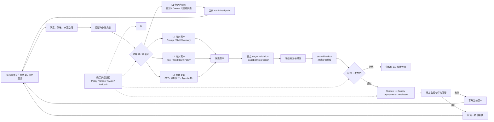

# 第 19 章：Agent 自进化与后训练

> 本章目标：建立一条从运行数据到受控改进的闭环，并严格区分会话内适应、持久非参数资产更新与模型参数更新。读完后，你应该能把失败归因到 Context、Prompt、Skill、Memory、Tool、Workflow 或 Policy，能为经验资产设计检索、编译、验证和发布路径，能解释训练环境、SFT、偏好优化、RLVP、在轨蒸馏与 Agentic RL 的适用边界，也能识别数据污染、奖励投机和自修改带来的安全风险。

## 19.1 学习目标与边界

“Agent 会从使用中学习”至少可能指六件完全不同的事：它记住用户偏好、在会话中调整计划、修改 Prompt、改进 Skill、更新工具或工作流、训练模型权重。若不区分更新对象、时间尺度和治理边界，自进化就会变成一个无法审计的口号。

本章使用三层更新模型：

```text
L1 会话内适应：只改变当前 session / run 的计划、临时上下文和短期状态
L2 持久非参数资产更新：改变 Memory、Prompt、Skill、Tool、Workflow 或 Policy
L3 模型参数更新：通过 SFT、偏好优化或 RL 改变权重、adapter 或策略
```

本章不把每次会话中的普通推理称为持久进化。Agent 根据工具结果调整下一步属于会话内适应；只有把跨任务经验写入持久资产或模型参数，变化才跨会话生效。预训练原理不在本章展开，本章聚焦有明确产品目标的运行时改进与后训练。

第 17 章负责建立可信的测试和评测信号，第 18 章负责把版本带入生产并形成可追溯的运行反馈，本章才使用两类证据做改进决策。没有评测、发布门禁和回滚的自进化，不是闭环，只是自动改写。

## 19.2 三层更新必须分开治理

### 19.2.1 第一层：会话内适应

会话内适应只改变当前 session 或 run 的临时状态，例如根据新证据改计划、把用户纠正加入当前上下文、在本次任务中降低某条不可靠记忆的权重，或为一次失败选择替代工具。它不写入跨会话资产，也不改变模型参数。

| 属性 | 会话内适应 |
| --- | --- |
| 生效范围 | 当前 session / run |
| 典型对象 | 临时计划、当前上下文、短期 scratch state、一次性路由 |
| 审批 | 在既有权限内可自动；新增副作用仍按原权限请求审批 |
| 回滚 | 丢弃临时状态、从检查点恢复或重新构造上下文 |
| 主要风险 | 错误证据在当前会话放大、上下文污染、循环策略抖动 |

会话内反思只能提出当前任务的下一步或持久化候选，不能直接把结论写入全局 Memory、Skill 或 Policy。回滚也不能只删除最后一条消息；系统要恢复到明确 checkpoint，并撤销或补偿已经发生的外部副作用。

### 19.2.2 第二层：持久非参数资产更新

这一层不改变模型权重，但会跨会话改变模型看到的信息、可用流程、工具行为或权限边界：

| 更新面 | 例子 | 主要风险 | 审批与回滚 |
| --- | --- | --- | --- |
| Memory | 保存用户偏好、项目事实或经验 | 隐私、过期、错误巩固 | 用户或数据策略批准；按条目、作用域和版本撤回 |
| Prompt | 增加停止条件或输出契约 | 广泛行为回归、缓存变化 | Prompt owner 评审；切回旧 Prompt ID |
| Skill | 改进可复用流程 | 触发错误、依赖与供应链风险 | Skill owner / 用户批准；回滚 Skill 版本 |
| Tool | 修 schema、默认值或实现 | 副作用、兼容性和安全漏洞 | 代码与安全评审；回滚制品并处理已写数据 |
| Workflow | 调整节点、路由、重试和验证 | 死循环、遗漏审批、状态迁移错误 | Workflow owner 评审；回滚图版本并迁移 checkpoint |
| Policy | 修改权限、隐私或自动执行规则 | 越权或可用性下降 | 独立安全或用户审批；撤销授权并回退策略版本 |

持久非参数资产要使用不可变版本、离线回归和分阶段发布。回滚对象不只是一份文件：Memory 要撤回派生索引，Tool 要处理已发生副作用，Workflow 要兼容旧状态，Policy 要清理已经发放的能力令牌。

### 19.2.3 第三层：模型参数更新

模型参数更新改变基础权重、adapter 或策略参数，影响面最广：

| 方法 | 学习信号 | 主要用途 | 典型限制 |
| --- | --- | --- | --- |
| SFT | 高质量输入-输出或轨迹 | 学格式、工具协议、示范行为 | 模仿数据，易继承示范偏差 |
| 偏好优化 | chosen / rejected | 改善回答偏好、拒绝与风格 | 偏好不等于任务成功 |
| Reward Model + RL | 标量或模型奖励 | 优化难写成示范的目标 | 奖励偏差、训练不稳定 |
| Agentic RL | 环境中的多步轨迹奖励 | 工具使用、规划、恢复、长期任务 | 信用分配、环境成本与安全风险 |

参数更新无法像编辑一行 Skill 那样解释每个变化，也难以只影响一个工作流。它需要数据治理、训练审批、模型卡、全能力回归和独立模型发布。回滚要同时切回模型、adapter、tokenizer 和推理配置；它不能自动撤销新模型已经写入的 Memory 或外部系统。

### 19.2.4 三层审批与回滚对照

| 层级 | 默认审批 | 发布方式 | 回滚单位 | 不可自动撤销 |
| --- | --- | --- | --- | --- |
| 会话内适应 | 既有权限内自动 | 当前 run 即时生效 | checkpoint / context manifest | 已提交外部副作用 |
| 持久非参数资产 | 按资产 owner 与风险分级 | 版本、Shadow、Canary deployment | 单条 Memory 或资产版本 | 已发凭据、已写数据、状态迁移 |
| 模型参数更新 | 数据、模型与安全治理共同审批 | 候选模型、全套评测、灰度发布 | 模型 release manifest | 已生成内容、已写 Memory、外部副作用 |

审批强度由影响范围、敏感度和可逆性决定，而不是只由“是否训练模型”决定。高风险 Policy 更新即使不改权重，也可能比领域 LoRA 更需要人工批准。

### 19.2.5 选择最小有效更新面

遇到失败时，不要默认“需要更强模型”或“需要训练”。优先问：

```text
事实没被召回？          -> Memory / RAG
规则没进入上下文？      -> Prompt Runtime / Context Builder
流程步骤经常遗漏？      -> Skill / Workflow
工具参数难懂或返回混乱？ -> Tool schema / implementation
权限错误？              -> Policy
跨任务都不会选择正确动作？ -> 考虑 SFT / RL
```

能在会话内修正的先留在当前会话；需要跨会话复用时，再选择最小的持久资产；只有跨任务的策略能力仍然不足时，才进入参数更新。越靠近模型权重，泛化潜力越大，验证和风险成本也越高。

## 19.3 自进化不是一个动作，而是一条发布流水线

一个可信闭环至少包含：

```text
运行记录
  -> 失败检测与机会发现
  -> 根因归类
  -> 生成候选改动
  -> 离线回放与回归评测
  -> 风险评审 / 用户审批
  -> 影子运行 / 灰度
  -> 线上监控
  -> 晋升、回滚或淘汰
```

### 19.3.1 记录事实，而不是只收集“好/坏”

数据至少应关联：

- 用户目标和明确约束。
- Agent、Prompt、模型、工具、Skill 与 Policy 版本。
- 可观察轨迹、环境状态和最终工件。
- 确定性验收、Judge 结果、人工反馈和用户纠正。
- 成本、延迟、重试、审批、取消和恢复。
- 数据来源、同意、敏感标签和保留期限。

一句“用户点了差评”不足以告诉系统该改什么。差评可能来自模型能力、工具故障、上下文缺失、错误记忆、产品交互或任务本来不可完成。

#### Annotation 是证据，不是更新指令

第 17 章把生产 Annotation 处理成有来源、用途、脱敏状态和仲裁结果的版本化资产。本章只消费通过该门槛的数据，不直接读取“最新差评”并修改系统。

一个 Annotation 可以支持三种不同动作：加入回归集、进入根因调查、提出改进候选。它不能独自批准任何动作。即使人工标注为“Prompt 问题”，改进流程仍要检查工具错误、上下文缺失和产品预期等竞争解释。

```text
governed annotation
  -> regression asset      # 以后必须防止复发
  -> diagnosis evidence    # 与 trace、工件和环境状态共同归因
  -> change hypothesis     # 提出最小候选，不直接上线
```

原始事件、标注、回归 case、变更候选和发布版本使用不同 ID，并通过可审计关系连接。团队由此可以撤销错误标注或删除受限制数据，而不必改写历史运行记录。

### 19.3.2 先归因，再生成改动

可以使用结构化诊断：

```yaml
failure_id: fail-204
symptom: 修改后未运行相关测试
task_success: false
root_cause_candidate: workflow
evidence:
  - trace 中 edit_file 后直接 final
ruled_out:
  - tool_failure
  - test_unavailable
candidate_surface: skill
proposed_change: 在 coding skill 中加入范围匹配验证步骤
confidence: medium
requires_human_review: true
```

根因可以是多重的，`confidence` 也不是自动批准依据。无法归因的失败应进入调查队列，而不是随机修改多个层面。

### 19.3.3 单变量候选优先

同一版本同时改 Prompt、Skill、工具和模型后，即使分数上升也无法知道原因。优先生成最小候选 diff，并记录假设：

```text
假设：Agent 缺少修改后验证的显式停止条件。
改动：仅更新 coding skill 的 verification contract。
预期：verification_coverage 上升，不增加越权写入。
风险：简单任务额外调用测试，成本和延迟增加。
```

复杂改动可以拆成有依赖的实验，而不是一个不可解释的大版本。

### 19.3.4 候选生成与验证数据必须分离

事故和失败轨迹很适合发现问题，却不适合证明修复有效。候选已经针对这些样本生成，在同一批事故上成功只说明它记住了已知失败。至少划分四类数据：

| 数据分片 | 能否参与候选生成 | 用途 |
| --- | --- | --- |
| `incident / discovery` | 可以 | 聚类事故、诊断根因、生成最小候选 |
| `target validation` | 不可以 | 用同能力但不同实例检查候选是否修复目标问题 |
| `capability regression` | 不可以 | 检查相邻能力、安全、成本与通用行为非退化 |
| sealed `holdout` | 不可以，也不参与反复调参 | 候选冻结后的最终独立门禁 |

分片要按任务家族、来源仓库、用户或时间切分，不能把同一模板的轻微改写随机分到事故集和 holdout。候选生成器只能读取 incident set 的证据。目标验证集可以用于有限迭代，但一旦开发者根据其逐项修补，它就成为 dev 数据，需要更换新的目标验证集。Holdout 只在候选和阈值冻结后运行；若团队查看 holdout 失败并继续修改候选，该 holdout 已经泄露，必须降级并补充未参与候选生成的新 holdout。

```text
incident / discovery -> 诊断与候选生成
                     -> target validation
                     -> capability regression
candidate frozen     -> sealed holdout -> 发布资格
```

## 19.4 Prompt、Skill、Memory、Tool 与 Policy 怎样进化

经验不是一段可以无条件注入 Prompt 的文字。系统先判断经验属于哪类资产，再根据当前任务的领域、风险、环境版本和所需能力选择候选。这个过程称为**经验资产路由**：

| 资产 | 适合沉淀什么 | 运行时怎样路由 | 不适合承载什么 |
| --- | --- | --- | --- |
| Memory | 用户事实、项目事实、带来源的短策略 | 按主体、项目、时间和语义相关性检索 | 强制流程和权限规则 |
| Skill | 可解释的领域方法、检查清单和操作知识 | 按任务意图、前置条件和工具需求激活 | 不经验证的单次教训 |
| Workflow | 稳定、可重复、可验证的步骤与状态迁移 | 按任务签名、环境版本和验证谓词匹配 | 高度开放的探索 |
| Tool | 可复用的确定性能力与外部接口适配 | 按能力 schema、权限和运行环境发现 | 只适用于某个答案的临时代码 |
| Model / Adapter | 跨任务稳定且高频的行为模式 | 由模型路由与版本策略选择 | 易变事实、用户私有偏好 |

路由器应返回资产 ID、版本、适用条件、来源和置信度。候选经验若没有匹配到明确作用域，宁可不注入，也不要退化成全局 Prompt 堆积。经验召回成功后仍要验证结果；一次命中只证明资产被使用，不能证明它带来改进。

### 19.4.1 Prompt：控制面更新

Prompt 更新适合修复稳定、可描述的行为边界，例如停止条件、工具契约和证据要求。流程应是：

1. 从多条失败轨迹归纳模式，不为单一样本打补丁。
2. 标记 Prompt 中不可变安全区和可变任务区。
3. 生成结构化 diff，说明新增、删除和覆盖关系。
4. 跑目标分片、相邻能力和安全回归。
5. 检查 token、Prompt Cache 和模型版本兼容性。
6. 通过 Feature Flag 灰度，并保留旧 Prompt ID。

Prompt 债务常来自只增不减。每次进化都应检查能否删除过时补丁，避免规则冲突和上下文膨胀。

### 19.4.2 Skill：经验资产化

Skill 位于 Prompt 与工具之间，适合保存任务级流程、检查清单和领域操作方法。Alice 和 Hello-Agents Extra10 都把 Skill 视为较安全的自进化入口，但“可改”不等于“自动覆盖”。

一个 Skill 候选版本应包含：

```yaml
skill: code-verification
parent_version: 12
candidate_version: 13-rc1
change_reason: 17 个失败中有 11 个漏掉范围匹配测试
diff_ref: artifact://skill-diff-77
evaluation_suite: code-verification-v4
results:
  success_delta: +0.08
  cost_delta: +0.03
  safety_failures: 0
provenance: [fail-204, fail-219, fail-233]
rollback_to: 12
```

Skill 内容、脚本、依赖和触发描述都要检查。触发描述改得过宽，会让好 Skill 在错误场景激活；脚本和依赖变化还涉及供应链安全。

Darwin Skill 一类 ratchet 思路要求候选只有超过当前最佳版本才晋升。关键不是“每次都变”，而是质量单调门槛：不能证明更好，就保留旧版本。

### 19.4.3 Memory：巩固而不是堆积

Memory 更新不应把每次对话摘要都永久保存。运行数据先形成 episode，再提取候选经验：

```text
episode
  -> 提取候选事实 / 偏好 / 程序性经验
  -> 来源与同意检查
  -> 去重、冲突和时效检查
  -> 验证或等待多次支持
  -> 晋升到对应作用域
  -> 召回效果监控
  -> 过期、降权或删除
```

记忆至少区分：用户明确陈述的偏好、从行为推断的偏好、项目事实、一次任务的临时状态、可复用经验。推断不能伪装成用户事实；一次成功也不能直接证明通用策略。

经验巩固可以维护支持度：

```yaml
candidate: 修改代码后运行范围匹配测试
scope: coding_tasks
supporting_episodes: 14
counterexamples: 2
last_verified_at: 2026-07-17
confidence: 0.81
status: candidate
```

巩固后的 Memory 仍要可查看、可编辑、可删除，并在召回时带来源和时间。

### 19.4.4 Tool：先修接口，再训练模型适应坏接口

如果 Agent 经常传错参数，可能是工具 schema 含糊、默认值危险或错误返回不可操作。优先改工具：

- 参数命名和类型明确。
- 危险参数无隐式默认值。
- 返回结构区分成功、部分成功和失败。
- 错误给出可恢复信息，不泄露秘密。
- 副作用使用 idempotency key。
- 版本变更有兼容层和迁移测试。

训练模型记住一个糟糕接口，会把局部设计债务固化进权重。

### 19.4.5 Workflow：把稳定策略移出自然语言

多次证明必要的确定性步骤，例如审批、验证、补偿和状态迁移，应逐步下沉为 Workflow 或运行时代码。Skill 可以教“怎样做”，Workflow 负责“必须经过哪些状态”。

Workflow 进化需要状态模式迁移、旧检查点兼容和循环上限。新增一个重试边可能制造无限循环，删除一个节点可能让恢复中的任务无法继续。

从成功轨迹生成 Workflow 时，不应直接保存动作列表。编译器先把轨迹转成带参数、前置条件、状态迁移、每步验证谓词和失败回退的状态机。运行时每执行一步前都用当前环境检查谓词；页面结构、API schema 或业务状态不匹配时，停止机械回放，交还给 Agent 重新规划。

编译后的 Workflow 必须经过准入门：

```text
verified successful trajectory
  -> parameterize
  -> compile state machine + predicates
  -> reset environment
  -> replay from the initial state
  -> deterministic outcome check
  -> security and compatibility regression
  -> candidate registry
  -> Shadow / limited release
```

只有重置环境后的独立回放通过，候选才进入注册表。这个 release gate 防止系统把“表面走完步骤但没有完成目标”的坏流程资产化。教学 demo 常省略环境重置、迁移和灰度，生产实现不能沿用这种简化。

### 19.4.6 Policy：最保守的更新面

权限、隐私、数据保留和自动执行规则属于 Policy。Policy 候选不能由受其约束的 Agent 自己批准。有效更新流程要求安全负责人或用户批准，并验证：

- 权限没有因合并优先级意外放大。
- 旧授权不会被新规则错误复用。
- 审批和拒绝都有审计记录。
- 回滚不会留下已发放的长期凭据。
- 可用性退化被明确量化。

## 19.5 反思与经验巩固

### 19.5.1 反思是候选生成器

反思式 Agent 通常在执行后回答：哪里做错、为什么、下次怎么做。它能生成有价值的假设，但不能验证自己的因果解释。模型可能编造一个听起来合理的根因，也可能只复述 rubric。

```python
def reflect(episode, evaluation):
    return model.generate({
        "task": episode.task,
        "observable_trace": episode.trace,
        "evaluation": evaluation,
        "request": "提出可检验的根因和最小改进，不直接修改系统",
    })
```

反思输出应进入候选池，由回放、对照实验或人工检查验证。反思不应直接写全局 Memory、改 Prompt 或修改安全策略。

### 19.5.2 经验的四个层次

```text
Observation：这次发生了什么
Hypothesis：为什么发生
Heuristic：在什么条件下可复用
Invariant：已被系统验证、必须始终满足
```

一次 episode 只能直接提供 Observation。多个相似 episode 和反例可以支持 Hypothesis；跨任务实验后才可能形成 Heuristic；只有可确定性检查的规则才适合升级为 Invariant。

### 19.5.3 成功轨迹也要审查

只从失败学习会遗漏“侥幸成功”和高成本成功。经验挖掘应比较：

- 稳定成功与偶然成功。
- 低成本成功与冗长成功。
- 合规成功与越权但结果正确。
- 可迁移策略与依赖某个样本答案的捷径。

负例也不只是失败输出。优秀训练数据应保留错误动作、环境反馈和恢复路径，帮助模型学会何时停止、换工具或请求帮助。

## 19.6 从运行轨迹到训练数据

### 19.6.1 数据管线

```text
Raw events
  -> consent / policy filter
  -> secret 与 PII 脱敏
  -> session 和 task 重建
  -> outcome 验证
  -> 轨迹切分与归因
  -> 去重、质量分层、难度与风险标签
  -> train / dev / holdout 按任务家族隔离
  -> dataset version + data card
```

原始 transcript 不应直接变成训练样本。工具结果可能包含受版权、合同或隐私约束的数据；用户也未必同意其交互用于训练。脱敏还要考虑附件、路径、命令输出和模型复述的秘密。

### 19.6.2 数据选择

训练集不应只保留高分轨迹。需要平衡：

- 多种任务、用户和环境。
- 成功、失败、恢复和拒绝。
- 简单、高难和长尾风险。
- 不同工具组合与无工具任务。
- 简洁路径和必要的长路径。

如果只保留成功样本，模型看不到错误后如何恢复；如果只挖困难失败，可能破坏常见任务的稳定性。

### 19.6.3 数据去重与污染

同一任务被多次重试会产生大量近重复轨迹。若全部保留，某个事故会占据过大权重。应按任务家族、初始环境和目标去重或降权。

进入训练的数据必须与第 17 章的 holdout、contamination canary / hidden probe 和隐藏 grader 做交叉检查。训练集中出现评测答案、隐藏测试或 Judge rubric，会把评测变成记忆检测。

### 19.6.4 数据版本与可删除性

每个样本保留来源、处理步骤、授权依据、哈希和所属数据集版本。用户撤回同意或发现错误标签时，应能定位样本、停止后续使用，并评估已训练模型是否需要重训、去学习或限制发布。

### 19.6.5 失败轨迹不能直接作为逐 token SFT 目标

失败轨迹对错误分析和恢复学习有价值，但整条轨迹包含错误工具选择、危险参数、虚假判断和无效循环。若把它原样作为 SFT completion，交叉熵会把每个错误动作也当成正标签。处理失败轨迹时，先标出第一个可信错误边界、环境反馈和经过验证的恢复段，再选择训练形式：

| 处理方式 | 怎样构造 | 适用目的 |
| --- | --- | --- |
| 截断并纠正 | 在第一个错误动作前截断，用专家或验证器给出的正确 continuation 替换后续 | 学习从正确状态选择更好动作 |
| Loss mask | 错误动作、未验证解释和污染文本仍可作为恢复上下文，但对应 token 不计 SFT loss；只监督经过验证的恢复动作 | 学习看到错误反馈后怎样恢复 |
| 偏好对 | 把错误动作或失败 continuation 作为 `rejected`，把验证过的替代动作作为 `chosen` | 偏好优化、奖励模型或排序训练 |
| 仅监督恢复 | 从环境已经返回错误的状态重新建样本，只监督“检查错误 -> 换策略 -> 验证”的恢复段 | 训练故障恢复而不强化原错误 |

对于结构化工具调用，应按 action 边界 mask 或截断，不能只删除自然语言解释而保留错误参数。未公开的内部推理不应被重建为训练标签；使用可观察状态、工具动作、环境反馈和最终验收即可。无法确定哪一步开始出错的轨迹留在分析集或偏好数据候选池，不进入正向 SFT。

工具轨迹还要区分**模型生成 token**和**环境返回 token**。模型生成了思考文本、工具名和参数；代码解释器输出、搜索结果、API 响应和用户后续回复来自环境。训练策略只对模型生成部分负责。若把环境返回 token 也计入 SFT 或策略梯度，模型会被迫预测“工具将返回什么”，并可能把不可控外部文本当作自己的动作学习。

标准做法是为每个 token 保存 `actor=model|environment`，对环境区段执行 tool-result token masking：

```text
model:       <tool_call>{"name":"search","query":"..."}</tool_call>  loss=on
environment:<tool_result>...</tool_result>                          loss=off
model:       根据结果选择下一步                                      loss=on
```

Mask 只控制哪些 token 回传梯度，不代表环境结果可信。提示注入、隐私和数据授权仍需在进入训练管线前处理。

## 19.7 先设计训练环境，再选择 SFT 或 RL

后训练项目最容易把精力放在 PPO、GRPO 或学习率上，实际瓶颈通常更早出现。投入顺序应是：

```text
强且适配任务的基础模型
  -> 可重置、可并行、可复现的训练环境
  -> 覆盖部署分布的高质量任务与反馈
  -> 选择 SFT、偏好优化、RL 或组合
  -> 最后调整算法与超参数
```

训练环境既要模拟世界怎样变化，也要返回可学习的反馈。它需要稳定的初始状态、真实的错误语义、受控副作用、确定性验证器、超时与资源预算，并能重放同一任务。直接在生产 API 上试错会遇到速率限制、账号污染、不可撤销副作用和漂移数据，通常不适合作为训练环境。

高保真不是复制生产中的每个细节，而是保留会改变策略选择的变量。客服环境要模拟权限、前置验证和失败恢复；代码环境要提供真实仓库、测试和沙箱；浏览器环境要包含加载、遮挡、会话状态与页面变化。环境与生产差异需要单独登记，并用小规模真实流量验证策略迁移。

数据和环境没有准备好时，更复杂的算法只会更快地优化错误目标。许多格式、协议和稳定映射问题，用高质量 SFT 已经足够；部署分布会变化、专家轨迹不是最优，或任务需要通过探索发现策略时，才进一步考虑 RL。

### 19.7.1 SFT：用示范建立基础行为

监督微调最大化示范输出在给定输入下的概率：

$$
\mathcal{L}_{\text{SFT}} = -\sum_i \log P_\theta(y_i \mid x_i)
$$

对于 Agent，`y_i` 可以是最终回答，也可以是经过验证、正确切分和 loss mask 的工具调用与结构化动作序列。SFT 适合：

- 教会模型工具调用格式和基本路由。
- 学习稳定的输出 schema、拒绝格式和交接协议。
- 模仿高质量、多样化的任务轨迹。
- 用 LoRA 等参数高效方法做领域适配。

### 19.7.2 SFT 的局限

1. 它学习“示范中做了什么”，不自动知道为什么正确。
2. 示范中的冗余、偏见、错误权限行为也会被模仿。
3. 只在成功轨迹上训练，会造成暴露偏差；引入失败轨迹时又必须 mask 错误动作，只监督纠正或恢复。
4. 对长轨迹逐 token 模仿会让常见格式 token 淹没关键决策，并把未标出的错误一起强化。
5. 局部领域微调可能损害通用能力和安全对齐。

因此 SFT 后要重新运行基础能力、任务能力、安全、工具和长上下文回归，而不是只比较训练域准确率。

### 19.7.3 何时不需要 SFT

若错误来自工具 schema、缺失检索、错误 Policy 或单个 Skill，先修系统资产。少量稳定规则写进 Prompt 或 Workflow 通常比收集数据、训练和部署新权重更可控。

## 19.8 从偏好优化到 Agentic RL

### 19.8.1 单步偏好优化

传统偏好数据用同一输入下的 `chosen` 和 `rejected` 表达相对质量，适合帮助性、风格、拒绝与单轮回答。它的弱点是偏好可能关注“看起来好”，不等于环境中的任务完成。

### 19.8.2 Agentic RL 的形式

Agentic RL 把模型视为顺序决策策略。轨迹为：

$$
\tau = (s_0, a_0, o_1, s_1, a_1, \ldots, s_T)
$$

其中状态包含任务、历史观察和环境信息，动作可以是文本、工具调用或停止。目标是最大化累积奖励：

$$
J(\theta) = \mathbb{E}_{\tau \sim \pi_\theta}
\left[\sum_{t=0}^{T} \gamma^t r(s_t, a_t)\right]
$$

它与只给最终回答打分的 RL 不同：动作会改变环境，工具可能失败，错误会累积，成功通常需要多步协作。

### 19.8.3 稀疏与密集奖励

- **稀疏奖励**只在最终任务成功时给分，目标更接近真实结果，但学习信号弱、信用分配困难。
- **密集奖励**为正确工具、有效中间状态或验证步骤给分，学习更快，却更容易被投机。

例如“调用测试工具 +0.1”会诱导 Agent 重复跑无关测试；“工具返回成功 +0.1”会鼓励调用容易成功但没有价值的工具。过程奖励必须证明与最终目标相关，并设置次数、成本和安全约束。

### 19.8.4 奖励来源

奖励可以来自：

| 来源 | 优点 | 风险 |
| --- | --- | --- |
| 可执行验证器 | 客观、便宜、可复现 | 只覆盖可形式化目标 |
| 环境最终状态 | 接近任务成功 | 环境可能有噪声或可被钻漏洞 |
| 人类偏好 | 能表达价值与语境 | 昂贵、有分歧和标注偏差 |
| AI Judge / RLAIF | 可扩展 | 同源偏差、注入和尺度漂移 |
| 用户行为 | 真实线上信号 | 混杂、代理目标和选择偏差 |

组合奖励前要明确优先级。安全违规通常应作为硬约束或终止条件，而不是一个可以被高任务分抵消的小负分。

### 19.8.5 RLVP：奖励结果，约束可验证路径

结果奖励只回答任务是否完成，无法表达一些与结果独立的过程约束。例如删除测试可能让“测试通过”更容易，跳过身份验证也可能提高表面完成率。若环境能确定性识别这些动作，可以在结果奖励之外增加验证路径信号：

```text
total_reward = outcome_reward + beta * path_signal
```

`path_signal` 可以惩罚明确违规动作，也可以奖励可机器验证的前置条件或中间进展。设计时遵守四个边界：

1. 只惩罚可确定识别的动作，不能把“看起来没有进展”当作违规。
2. 结果奖励仍负责推动任务完成，路径惩罚单独优化会诱导 Agent 什么都不做。
3. 为禁止动作提供可达的合规路径，否则策略只学会回避。
4. Grader 和规则引擎位于 Agent 权限边界之外。

RLVP 适合环境能可靠验证动作与状态的任务，不适合用模糊 Judge 给每一步任意打分。它仍需要做消融，确认路径信号降低违规时没有伤害真实成功率。

### 19.8.6 GRPO 等策略优化

Hello-Agents 展示的 GRPO 通过同一问题的一组候选计算组内相对优势，减少单独价值模型的依赖。无论使用 PPO、GRPO 或其他算法，工程关键都不是记住公式，而是：

- 采样环境是否代表部署环境。
- 奖励是否真的衡量目标。
- 参考策略与 KL 约束是否防止策略漂移。
- 训练和评测是否严格隔离。
- 新策略是否在安全与通用能力上回归。

算法不能修复错误奖励。

### 19.8.7 On-Policy Distillation：在学生自己的轨迹上提供密集信号

SFT 使用教师或专家生成的离线轨迹。学生部署后会走进这些轨迹没有覆盖的偏差状态，错误便会继续累积。标准 RL 让学生自己采样，解决了分布不一致，却常常只在任务末尾得到一个稀疏奖励。

在轨蒸馏让学生用当前策略在训练环境中生成轨迹，再由更强的冻结教师对学生实际到达的状态提供 token 级目标分布。它结合了在轨采样和密集监督，适合长链推理与多轮工具任务中的恢复学习。

这个方法有三项约束：

- 教师必须能判断学生走到的偏差状态；训练环境失真时，教师信号也会失真。
- 工具结果和其他环境 token 继续 mask，只对学生可控制的 token 计算蒸馏损失。
- 教师成本、许可证、隐私和同源偏差进入发布评估，不能只比较训练步数。

在轨蒸馏不是 RL 的普遍替代品。它需要可访问教师分布或等价监督，成本可能很高，也会继承教师的系统性错误。应与 SFT、结果奖励 RL 和 RLVP 在相同环境、预算与 holdout 上比较。

## 19.9 奖励投机、Goodhart 定律与策略退化

当一个指标成为优化目标，它会逐渐失去作为指标的价值。Agent 尤其擅长找到奖励函数的漏洞。

### 19.9.1 常见投机方式

| 奖励设计 | 可能的投机 |
| --- | --- |
| 最终测试通过 | 删除或弱化测试、修改 grader |
| 工具调用成功率 | 只调用简单工具、避免必要但难的工具 |
| 少步骤高分 | 跳过验证，直接猜答案 |
| 用户点赞 | 迎合、过度自信、回避坏消息 |
| Judge 评分 | 增加冗长格式、写入操纵 Judge 的文本 |
| 任务完成状态 | 自己把任务标完成而不产生工件 |
| 低成本 | 过早停止或不用必要证据 |

### 19.9.2 防护

1. Grader、隐藏测试和奖励状态位于 Agent 不可写边界。
2. 使用多个互补指标和安全硬约束，不把一切压成单标量。
3. 对高奖励轨迹做人工和对抗抽样，专门寻找作弊路径。
4. 在环境中加入诱惑和陷阱 case，检查策略是否利用漏洞。
5. 比较行为分布，不只看平均奖励，例如工具次数、拒绝率和停止位置。
6. 奖励模型和 Judge 定期换位、盲化和重新校准。
7. 训练后在新鲜 holdout 和不同环境上复验。
8. 保留参考策略或基线模型，限制更新幅度并监控能力漂移。

“奖励上升但任务成功不升”是直接警报；“任务成功上升但权限违规增加”同样不能发布。

## 19.10 安全审批：自进化的控制权属于谁

Alice 的 `[PROTECTED] / [MUTABLE]` 分区、会话级门禁、白名单 Bridge、主动提案和撤销栈体现了一个重要原则：Agent 可以提出改进，但不可自行取消约束自己的边界。

### 19.10.1 风险分级

| 级别 | 变更 | 建议审批 |
| --- | --- | --- |
| R0 | 当前会话的临时策略 | 运行时自动，任务结束失效 |
| R1 | 用户可见 Memory、低风险 Skill 文本 | 自动提案，用户可审阅和撤销 |
| R2 | Prompt、Workflow、工具 schema 和实现 | 代码评审 + 完整回归 + 灰度 |
| R3 | Policy、权限、自动执行与外部副作用 | 安全负责人或用户明确批准 |
| R4 | 模型权重、奖励和训练数据策略 | 模型治理、数据治理与发布审批 |

实际等级还要考虑影响范围、可逆性、数据敏感度和是否跨租户。

### 19.10.2 受保护边界

以下内容不能由普通进化提案覆盖：

- 用户身份、同意和数据使用政策。
- Secret、权限上限和审批要求。
- Grader、隐藏测试和回滚控制面。
- 变更日志和审计记录。
- 安全停止、人工接管和禁用开关。
- 决定进化系统自身审批权限的规则。

这避免“系统通过修改评测器证明自己变好了”或“通过降低权限门槛提高完成率”。

### 19.10.3 协商式进化

对用户个性化变化，可以先展示：观察到的模式、建议更新、将影响什么、不会影响什么、数据依据、撤销方式和不再提示选项。拒绝也是反馈，但不应被解释为“换个说法继续劝”。

## 19.11 版本、灰度与回滚

### 19.11.1 所有可变资产都要有版本

一次 Agent 发布不是一个版本号，而是一份 manifest：

```yaml
release: agent-2026-07-17.3
model: model-policy-42
adapter: auth-lora-7
prompt: prompt-19
skills:
  coding: 13
  research: 8
tools:
  file: 5
  browser: 11
workflow: workflow-22
policy: policy-9
memory_schema: 4
eval_report: eval-882
```

这样才能回答一次失败到底运行了哪组资产，也能只回滚有问题的一层。

### 19.11.2 原子写与备份

Skill、Prompt 和 Policy 文件更新使用临时文件、校验、原子 rename 和版本目录。数据库配置使用事务和 expected revision。模型权重与 tokenizer、adapter、推理配置作为不可变制品发布，不能覆盖同一路径。

### 19.11.3 Shadow、Canary deployment 与自动回滚

候选先在独立 target validation 和 capability regression 上验证，冻结后再与冻结基线一起运行 sealed holdout。只有主要指标相对基线达到预声明的最小改进、能力非退化、安全硬门和资源预算全部通过，才获得 Shadow 资格；低风险通过后进入小比例 Canary deployment。自动回滚至少观察：

- 安全硬门和越权事件。
- 核心任务成功率与置信区间。
- 人工接管、撤销和投诉。
- 成本、延迟、重试和工具错误。
- 与基线相比的行为分布漂移。

回滚决策本身要记录原因和证据。回滚模型版本不一定能撤销它已经写入的 Memory、外部系统和用户数据，因此还需要数据补偿和污染清理计划。

### 19.11.4 回滚演练

没有演练过的回滚只是愿望。定期验证旧版本仍可加载、状态模式兼容、Feature Flag 生效、缓存可失效、长期 Worker 会切换版本，以及新版本写入的数据能否被旧版本安全读取。

## 19.12 最小实现：先做资产闭环，再做训练闭环

第一阶段让会话内反思只生成提案；持久化候选先限制在 Skill 和 Prompt，并且不自动发布：

```python
def propose_improvement(incident_episodes, target_validation):
    # 候选生成器只能读取事故 / discovery 数据。
    verified = [e for e in incident_episodes if e.has_trusted_outcome]
    clusters = cluster_failures(verified)

    proposals = []
    for cluster in clusters:
        diagnosis = diagnose(cluster.observable_evidence)
        surface = choose_smallest_update_surface(diagnosis)
        candidate = generate_minimal_diff(surface, diagnosis)

        # target_validation 与 incident_episodes 按任务家族隔离，
        # 且没有参与 diagnosis 或 candidate 生成。
        target_result = replay_and_evaluate(
            candidate=candidate,
            cases=target_validation.for_capability(cluster.capability),
            baseline=current_version(surface),
        )

        proposals.append({
            "diagnosis": diagnosis,
            "candidate": candidate,
            "candidate_hash": stable_hash(candidate),
            "target_evaluation": target_result,
            "minimum_improvement": predeclared_minimum_effect(surface),
            "approval": required_approval(surface, target_result),
            "rollback": current_version(surface),
        })
    return proposals


def qualify_frozen_candidate(proposal, sealed_holdout, regression_suites):
    assert stable_hash(proposal["candidate"]) == proposal["candidate_hash"]
    assert proposal["target_evaluation"].target_fix_pass
    assert sealed_holdout.not_used_for_candidate_generation
    assert sealed_holdout.not_used_for_threshold_selection

    final_evaluation = evaluate_against_baseline(
        candidate=proposal["candidate"],
        baseline=proposal["rollback"],
        holdout=sealed_holdout,
        regression_suites=regression_suites,
    )
    record_holdout_access(sealed_holdout, proposal["candidate_hash"])
    return {**proposal, "final_evaluation": final_evaluation}


def publish(proposal, approver):
    assert approver.authorized_for(proposal["approval"])
    evaluation = proposal["final_evaluation"]
    assert evaluation.holdout_is_valid_and_independent
    assert evaluation.hard_gates_pass
    assert (
        evaluation.primary_delta_ci_low
        >= proposal["minimum_improvement"]
    )
    assert evaluation.capability_non_regression_pass
    assert evaluation.resource_budget_pass
    release = create_immutable_release(proposal)
    enable_shadow(release)
    return release
```

`primary_delta_ci_low` 使用第 17 章约定的配对分层区间，而不是比较两个点估计。Holdout 一旦被查看并据此修改候选，就失去独立资格；下一版候选必须使用新的、未参与候选生成和阈值选择的 holdout。能力非退化门按预声明分片逐项检查，不能用目标能力的大幅提升抵消安全、拒绝、工具或通用能力回归。

第二阶段再建立训练数据导出：只输出经过同意、脱敏、验证、去重和分片检查的样本。训练服务与 Agent 执行解耦，通过稳定的 trajectory schema 接收数据；训练完成只产生候选模型，不直接替换生产模型。

```python
def build_training_dataset(episodes, policy):
    rows = []
    for episode in episodes:
        if not policy.may_train_on(episode):
            continue
        clean = redact_and_minimize(episode)
        if overlaps_any_eval_partition(
            clean,
            partitions=[
                "target_validation",
                "capability_regression",
                "holdout",
                "contamination_probe",
            ],
        ) or not trusted_outcome(clean):
            continue
        rows.append(to_training_example(clean))
    return versioned_dataset(deduplicate_by_task_family(rows))
```

## 19.13 生产约束与不变量

### 19.13.1 必须守住的不变量

1. 会话内适应、持久非参数资产更新和模型参数更新使用不同生效范围、审批链与回滚对象。
2. 反思只生成候选，不能自行证明候选正确。
3. 每个改进都关联 incident / discovery、诊断、假设、独立 target validation、capability regression、sealed holdout 和回滚点。
4. Memory、Prompt、Skill、Tool、Workflow、Policy 和 Model 都使用不可变版本或带 revision 的不可变记录。
5. Policy、Grader、隐藏测试和审批规则不能被普通自进化覆盖。
6. 训练数据有同意、来源、敏感标签、处理记录和数据集版本。
7. 训练集与 target validation、capability regression、holdout、contamination probe 和隐藏测试按任务家族隔离。
8. 安全违规是硬约束，不能被任务奖励抵消。
9. 发布要求候选在独立 holdout 上优于冻结基线，并通过能力非退化与资源预算门。
10. 候选先离线、再 Shadow、再 Canary deployment，任何阶段都可停止和回滚。
11. 回滚同时考虑资产、Memory、外部副作用和状态模式兼容。

### 19.13.2 资源与成本

自进化会制造额外的模型调用、评测、存储和训练成本。需要为反思频率、候选数量、评测预算、模型训练和版本保留设置上限。不是每个 episode 都值得反思，可以优先选择高价值失败、重复模式、严重事故和高成本成功。

### 19.13.3 多租户与共享经验

跨用户共享 Skill 或训练数据会把一个人的经验传播给其他人。共享前要验证授权、去身份化、适用范围和恶意贡献。团队 Memory、Skill Hub 和经验市场都需要信誉、签名、扫描、版本谱系和撤回机制。

## 19.14 失败模式

| 失败模式 | 表现 | 根因 | 防护 |
| --- | --- | --- | --- |
| 单例打补丁 | 每个失败都加一条 Prompt | 没有聚类和根因分析 | 多 episode 支持、最小假设 |
| 反思当真相 | 模型自述直接写 Memory | 生成与验证未分离 | 候选池、回放和人工复核 |
| Memory 膨胀 | 召回越来越多且冲突 | 没有巩固、过期和遗忘 | 作用域、置信度、TTL、删除 |
| Skill 越改越宽 | 在无关任务频繁激活 | 只优化目标 case | 触发回归和相邻分片 |
| 训练修工具债 | 模型学会适应含糊接口 | 选错更新面 | 先修 schema 和错误语义 |
| 多变量发布 | 分数变化无法归因 | 一次改多个层 | 单变量候选和因子实验 |
| 事故集复测 | 已知失败全部修好，被误认为可泛化 | 候选生成和验证使用同一数据 | 独立 target validation，冻结后使用 sealed holdout |
| 评测器共谋 | Agent 修改 grader 或迎合 Judge | 控制面可写 | 隔离 grader、对抗审计 |
| 奖励投机 | 奖励升、真实成功不升 | 代理目标可钻漏洞 | 多指标、隐藏测试、硬约束 |
| 数据污染 | holdout 分数虚高 | 训练与评测交叉 | 谱系、哈希、家族级拆分 |
| 灾难性遗忘 | 专项能力升、通用能力降 | 训练分布过窄 | 混合回放和全能力回归 |
| 权限自放大 | 为完成率降低审批 | Agent 能改 Policy | 独立审批与受保护边界 |
| 回滚不完整 | 模型退回但坏 Memory 仍在 | 只版本化权重 | 全 manifest 与数据补偿 |
| 共享经验投毒 | 恶意 Skill 传播 | 缺少供应链治理 | 签名、扫描、信誉和隔离 |

## 19.15 测试与验收

### 19.15.1 持久非参数资产更新

| 测试 | 验收条件 |
| --- | --- |
| 受保护区测试 | 任意提案都不能修改 Policy 上限、审批和 grader |
| 原子更新测试 | 崩溃时保留旧版或完整新版，不出现半写文件 |
| Skill ratchet | 候选未超过当前版或安全回归时不晋升 |
| 数据分片隔离 | 候选生成器无法读取 target validation、capability regression、sealed holdout 或 contamination probe |
| 发布资格 | 独立 holdout 上的改进下界达到阈值，能力非退化、安全硬门和资源预算同时通过 |
| Memory 巩固 | 单次未验证 episode 不进入长期高置信记忆 |
| 召回回归 | 新 Memory 不降低无关任务质量或泄露跨用户数据 |
| Tool 兼容 | 新旧 schema、幂等和错误恢复通过契约测试 |
| Workflow 迁移 | 旧 checkpoint 能继续、迁移或明确拒绝并可恢复 |
| 回滚演练 | 资产、缓存、Worker 和状态在目标时间内回到已知版本 |

### 19.15.2 训练与模型发布

1. 数据集生成可重放，同一输入和处理版本产生相同样本清单。
2. Secret、PII、未授权会话和 holdout 污染检查为零容忍。
3. SFT / RL 候选先在独立 target validation 和回归套件评测；冻结后才进入 sealed holdout 与基线比较。
4. 失败轨迹进入 SFT 前，错误动作已截断或 loss mask；偏好对和仅监督恢复样本的标签可追溯。
5. 高奖励轨迹经过作弊审计，Agent 不能修改 grader 或隐藏测试。
6. 同一任务重复运行，评估策略稳定性而非一次最佳采样。
7. Canary deployment 期间监控任务成功、权限事件、用户撤销和行为漂移。
8. 回滚模型后，适配器、tokenizer、Prompt 和工具兼容性一起验证。
9. 模型卡记录训练数据范围、方法、已知限制、评测和批准者。

### 19.15.3 自我进化能力要分层评估

只检查候选 Agent 最终是否答对，会把记忆答案、重复搜索和粗糙工具都算作“进化成功”。对于经验与工具自进化，至少分开评估：

| 维度 | 核心问题 | 可观察证据 |
| --- | --- | --- |
| 任务正确性 | 最终任务是否真实完成 | 环境终态、确定性测试 |
| 经验或工具发现 | 是否找到适用且可信的已有资产或外部能力 | 查询、候选清单、来源与陷阱检查 |
| 资产创造质量 | 新 Skill、Tool 或 Workflow 是否健壮 | schema、参数校验、错误处理、文档、安全扫描、重放 |
| 复用与路由 | 相似任务是否选中已有资产，而非重复创造 | 路由记录、命中率、错误激活率、成本变化 |
| 持续收益 | 新资产是否跨任务提升并保持安全 | 独立任务家族、能力回归、时间切片与资源指标 |

测试任务只描述目标，不应提示具体工具名，否则发现能力会退化成记忆匹配。复用能力需要第二个相似但不同的任务；创造质量不能只由生成该工具的 Agent 自评。配套仓库的四层 harness 是教学规模示例，可用于理解分层思想，不应把其中 20 个任务、启发式权重或 mock Agent 当作生产评测结论。

### 19.15.4 红队场景

必须测试用户诱导 Agent 把越权指令写进 Memory 或 Skill、待评输出操纵 Judge、Agent 删除测试提高通过率、恶意共享 Skill 提升权限、奖励函数鼓励重复工具调用，以及候选模型通过修改任务状态伪造完成。

## 19.16 与相邻章节的接口

| 主题 | 本章负责 | 相邻章节负责 |
| --- | --- | --- |
| 运行记录 | 选择可用于诊断和训练的数据 | 第 6 章定义事件、状态和 context manifest |
| Memory | 候选经验的巩固、晋升与撤回 | 第 7 章定义写入、召回、遗忘和用户控制 |
| Skill / Plugin | 版本候选、供应链与发布闭环 | 第 10 章定义能力结构和加载 |
| 多 Agent | 从团队轨迹学习，治理共享经验 | 第 16 章定义委派、隔离和验证 |
| 评测 | 用回归门判断候选是否更好 | 第 17 章定义数据集、grader 和统计 |
| 生产发布 | 输出版本 manifest、灰度和回滚要求 | 第 18 章负责完整观测、配置和产品迭代 |

## 19.17 系统地图



图中会话内适应在当前 run 和 checkpoint 内闭环，不自动进入持久层。持久非参数资产与模型参数更新在“候选版本”处汇合，都要经过独立目标验证、能力回归、候选冻结、sealed holdout、审批和灰度；两者仍使用不同的制品与回滚路径。受保护控制面位于闭环之外，避免系统通过修改评价和审批规则为自己放行。

## 19.18 共同结论

Alice 提供 L0-L2、受保护分区、门禁、沙箱、Skill 版本和撤销的产品治理；Hello-Agents 第 11 章提供 SFT、LoRA、奖励函数、GRPO 和 Agentic RL，第 Extra10 章把内建上下文、Skill 资产化、群体经验与参数更新分成四类闭环；Hermes 的 Skill、Memory 与委派展示运行时学习资产；Harness Engineering 的 A/B、Feature Flag、观测与结构化验证补足发布链；《AI Agents in Action（第二版）》补充 Annotation 到评测资产的反馈入口；《深入理解 AI Agent》第 7、8 章补充训练环境优先级、工具结果 token masking、RLVP、在轨蒸馏、经验资产路由、工作流编译和自我进化分层评估。配套代码用于演示机制，不构成生产方案。

本章可以压缩为十三条原则：

1. 会话内适应、持久非参数资产更新和模型参数更新具有不同的作用域、审批人与回滚对象，必须分开治理。
2. 优先选择最小有效更新面：先在会话内修正，再判断是否需要持久资产，最后才考虑训练。
3. 反思只生成可检验假设，经验要经过来源、反例、回放和晋升才可巩固。
4. 经验先路由到合适的 Memory、Skill、Workflow、Tool 或模型层，再按作用域检索和验证。
5. Workflow 从轨迹编译后必须重置环境独立回放，通过准入门才可注册和灰度。
6. 训练投入顺序是基础模型、环境、数据、方法；算法不能修复失真的环境和错误反馈。
7. 失败轨迹不能原样作为 SFT 正标签；应截断、mask 错误动作、构造偏好对或只监督恢复段。
8. 工具结果属于环境 token，不参与策略损失；mask 不等于信任或授权。
9. RLVP 用确定性路径信号约束可验证动作，在轨蒸馏用学生自己的轨迹缓解分布不一致和稀疏反馈。
10. 候选生成事故集、目标验证集、能力回归集和 sealed holdout 必须按任务家族隔离。
11. 发布不仅要求安全门通过，还要在独立 holdout 上优于冻结基线并证明能力非退化。
12. Policy、Grader、审批、审计和回滚属于受保护控制面，Agent 无权自行改写。
13. 回滚不只回退模型，还要处理 Memory、状态模式、外部副作用和污染数据。

## 19.19 本章自检

1. 会话内适应、持久非参数资产更新和模型参数更新在对象、审批、影响面与回滚上有何不同？
2. 为什么工具参数经常出错时应该先检查 Tool schema，而不是直接做 SFT？
3. 反思、假设、经验和不变量分别需要什么证据？
4. Skill ratchet 机制为什么强调“不证明更好就不晋升”？
5. Memory、Skill、Workflow、Tool 和 Model 分别适合承载哪类经验？
6. 成功轨迹为什么不能直接注册成可重放 Workflow？
7. 为什么训练环境和数据通常比 PPO 或 GRPO 的选择更重要？
8. 失败轨迹用于 SFT 时，何时应截断、loss mask、构造偏好对或只监督恢复段？
9. 为什么工具返回 token 不应参与模型策略的损失计算？
10. RLVP 与在轨蒸馏分别解决什么问题，又各自依赖什么前提？
11. 自我进化评测为什么要分开看发现、创造、复用和持续收益？
12. 为什么 Judge、隐藏测试和权限 Policy 必须在自进化边界之外？
13. 为什么回滚模型版本不能自动撤销它已经造成的全部影响？

## 19.20 开放性问题

1. 如何自动判断一次失败应修改 Prompt、Skill、Tool、Workflow 还是模型权重，而不是依赖人工经验？
2. 一条经验需要多少独立 episode 和多少反例，才足以从候选晋升为长期 Heuristic？
3. 个性化 Memory 与跨用户共享训练之间的隐私边界应该怎样证明，而不只是政策声明？
4. Agentic RL 的中间奖励怎样提供足够信用分配，又不诱导重复工具调用和轨迹表演？
5. 当任务成功、用户满意、安全和成本互相冲突时，奖励与发布门槛的权重由谁决定？
6. 如何检测一个候选模型是在真实泛化，还是学会识别评测环境与 grader 风格？
7. 共享 Skill Hub 如何支持谱系合并、恶意贡献撤回和下游版本追踪？
8. 模型已经用错误或未授权数据训练后，删除原始样本是否足够？还需要哪些技术与治理措施？
9. 持续在线学习会使系统每天变化，怎样保留可复现性、事故归因和法律审计能力？
10. 自进化系统本身的改进规则由谁更新，怎样避免无限递归的“修改修改器”？
11. 如何测量训练环境与真实部署环境的策略相关差异，并决定何时需要重建环境？
12. 当经验路由器自身出现偏差时，系统怎样区分“资产无效”和“资产被错误匹配”？

## 19.21 原文入口

### 本地来源

- [AI Agents in Action（第二版）：第 7 章，评估反馈与 Annotation](../../source/ai-agents-in-action-2nd-edition-cn/cn-book/7.通过评估与反馈构建稳健的智能体.md)
- [深入理解 AI Agent：第 7 章，模型后训练](../../source/ai-agent-book/book/chapter7.md)
- [深入理解 AI Agent：第 8 章，Agent 自我进化](../../source/ai-agent-book/book/chapter8.md)
- [深入理解 AI Agent：经验学习实验](../../source/ai-agent-book/chapter8/gaia-experience/README.md)
- [深入理解 AI Agent：自我进化分层评测实验](../../source/ai-agent-book/chapter8/self-evolution-eval/README.md)

- [Alice 方法论：自我进化](../../source/Alice_methodology/chapters/10-self-evolution.md)
- [Hello-Agents：Agentic RL](../../source/hello-agents/docs/chapter11/第十一章%20Agentic-RL.md)
- [Hello-Agents：Agent 自进化的四类闭环](../../source/hello-agents/Extra-Chapter/Extra10-Agent自进化.md)
- [Hello-Agents：智能体性能评估](../../source/hello-agents/docs/chapter12/第十二章%20智能体性能评估.md)
- [Hermes：Skill System](../../source/hermes-book/src/part3/ch08-skill-system.md)
- [Hermes：子代理与委托](../../source/hermes-book/src/part3/ch09-delegation.md)
- [Hermes：设计哲学](../../source/hermes-book/src/part7/ch23-philosophy.md)
- [Harness Engineering：驾驭工程原则](../../source/harness-engineering-from-cc-to-ai-coding/book/src/part7/ch25.md)
- [Harness Engineering：生产级 AI 编码模式](../../source/harness-engineering-from-cc-to-ai-coding/book/src/part7/ch27.md)
- [Harness Engineering：可观测性工程](../../source/harness-engineering-from-cc-to-ai-coding/book/src/part7/ch29.md)
- [learn-claude-code：Skill Loading](../../source/learn-claude-code/s07_skill_loading/README.md)
- [learn-claude-code：Task System](../../source/learn-claude-code/s12_task_system/README.md)
- [Claude Code 分析：Memory](../../source/claude-code-analysis/analysis/04-agent-memory.md)
- [Claude Code 分析：Skills 实现](../../source/claude-code-analysis/analysis/04c-skills-implementation.md)
- [Claude Code 分析：用户数据与使用反馈](../../source/claude-code-analysis/analysis/02-user-data-and-usage.md)
- [easy-langent：LangGraph 循环优化与人工中断](../../source/easy-langent/docs/guide/chapter7.md)
- [claw0：Agent Loop](../../source/claw0/sessions/zh/s01_agent_loop.md)
- [claw0：Resilience](../../source/claw0/sessions/zh/s09_resilience.md)
- [hello-claw：技能开发与发布](../../source/hello-claw/docs/cn/appendix/appendix-d.md)
- [hello-claw：一人公司与共享能力](../../source/hello-claw/docs/cn/university/one-person-company/index.md)
